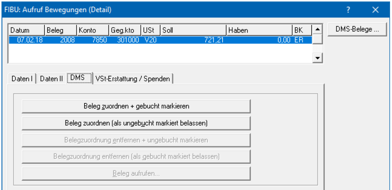
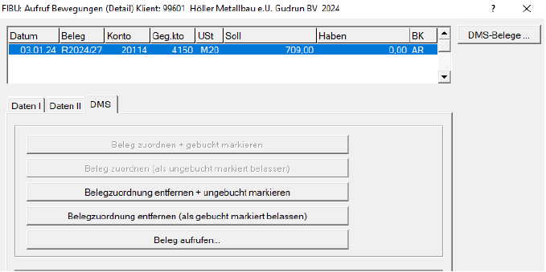

# Belege nachträglich zuordnen oder entfernen

## Belege im Bereich *Ungebuchte Belege* nachträglich einer Buchung zuordnen

Wenn Sie die Buchungen in der FIBU bereits durchgeführt haben und den
Beleg im Nachhinein der Buchung zuordnen möchten gehen Sie bitte
folgendermaßen vor:

Wählen Sie das gewünschte Konto über *Aufruf / Konten aus*. Mit der
rechten Maustaste auf die entsprechende Buchung wählen Sie den Eintrag
*DMS-Belege zuordnen* oder die Tastenkombination *Umschalt F7*. Es
werden nun in einem 2. Fenster die vorhandenen, ungebuchten Belege
angezeigt. Wählen Sie hier den gewünschten Beleg aus und klicken in der
FIBU/EA auf den Eintrag *Beleg zuordnen + gebucht markieren*. Somit wird
dieser Beleg bei dieser Buchung (und auch bei der oder den
Gegenbuchungen) zugeordnet und im Modul Belege im RZL Board als gebucht
markiert.

Weitere Zuordnungsmöglichkeiten (z.B., wenn bereits ein Beleg zugeordnet
ist) finden Sie bei der Buchung mit der rechten Maustaste über *Aufruf /
Detail* im Registerblatt *DMS*.

-   Soll der Beleg bei mehreren Buchungen zugeordnet werden, wählen Sie
    *Beleg zuordnen* *(als ungebucht markiert belassen)* und erst bei
    der letzten Buchung den Eintrag *Beleg zuordnen + gebucht
    markieren*.

-   *Belegzuordnung entfernen + ungebucht markieren:* Der bereits
    zugeordnete Beleg wird von dieser Buchung gelöscht und steht wieder
    zur Verbuchung oder zur Zuordnung zur Verfügung.

-   *Belegzuordnung entfernen (als gebucht markiert belassen):* Der
    zugeordnete Beleg wird von dieser Buchung gelöscht, bleibt aber als
    gebucht markiert und kann somit nicht einer anderen Buchung
    zugeordnet werden.

## Belege im Bereich *gebuchte Belege* nachträglich entfernen und einen neuen Beleg zuordnen

Wenn Sie die Buchungen mit Belegen in der FIBU bereits durchgeführt haben und den Beleg im Nachhinein von der Buchung entfernen möchten gehen Sie bitte folgendermaßen vor:   
Wählen Sie das gewünschte Konto über *Aufruf / Konten* aus. Mit der rechten Maustaste auf die entsprechende Buchung klicken und *Aufruf Detail* oder die Tastenkombination *Umschalt F2*. Wählen Sie das Registerblatt **DMS** aus. Klicken Sie in der FIBU/EA auf den Eintrag *Beleg entfernen + ungebucht markieren*. Es öffnet sich in einem 2. Fenster die vorhandenen, ungebuchten Belege. Wählen Sie nun den gewünschten neuen Beleg aus, welchen Sie der Buchung anhängen möchten und klicken in der FIBU/EA auf den Eintrag *Beleg zuordnen + gebucht markieren*. Somit wird dieser Beleg bei dieser Buchung (und auch bei der oder den Gegen-buchungen) zugeordnet und im Modul Belege im RZL Board als gebucht markiert.

