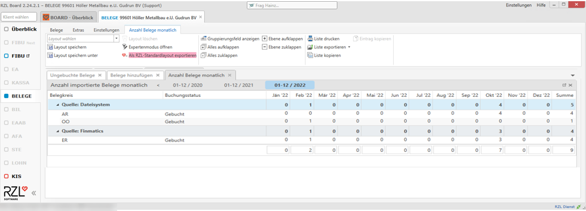

# Anzahl Belege anzeigen

-   **Anzahl Belege monatlich**

In dieser Anzeige wird angezeigt, wieviele Belege pro Monat, Belegkreis
und Quelle (z.B. Dateisystem, Klientenportal, Finmatics, …) hinzugefügt
wurden.  
  

-   **Anzahl Belege jährlich**

In dieser Anzeige wird angezeigt, wieviele Belege pro Jahr (bzw. in
Summe), Belegkreis und Quelle (z.B. Dateisystem, Klientenportal,
Finmatics, …) hinzugefügt wurden.  
  
