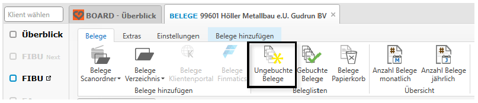
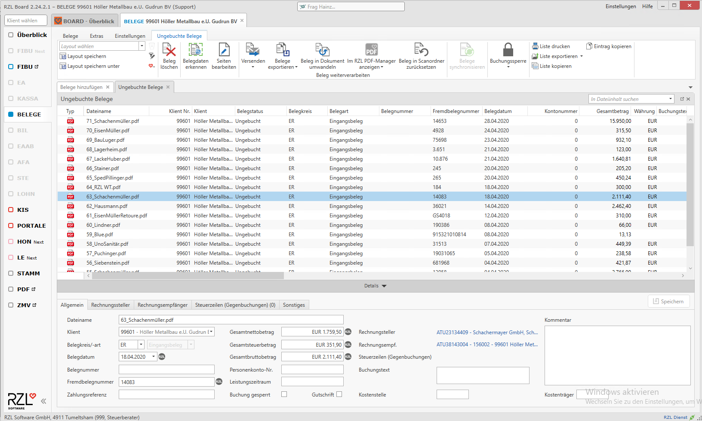
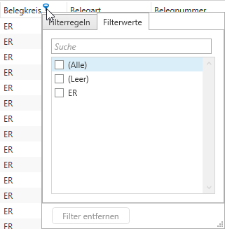
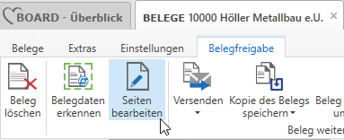
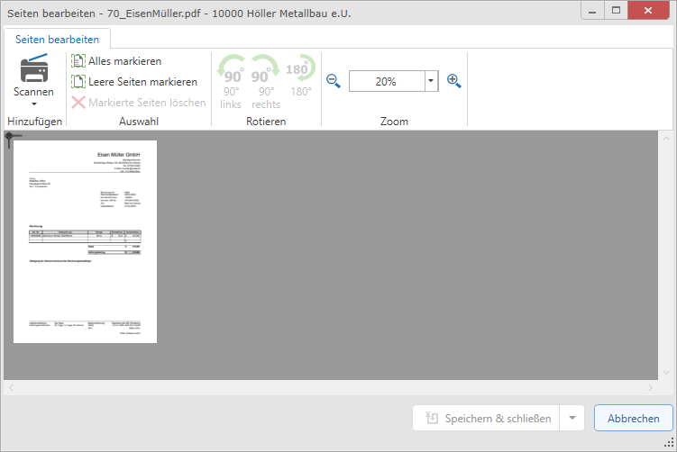
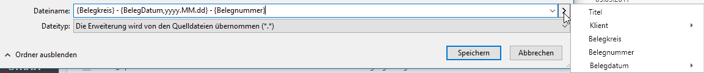

# Belegansichten nach dem Hinzufügen der Belege

Über den Menüeintrag Belege finden Sie die Beleglisten *Ungebuchte*
Belege / *Gebuchte Belege.*

## Ungebuchte Belege

Diese Belege wurden beim Hinzufügen dem Klienten zugewiesen und warten
auf die Verbuchung in der RZL FIBU in der Liste der ungebuchten Belege.
Solange Belege noch nicht gebucht wurden und somit in diese Liste
angezeigt werden, können die Belege und Belegdaten jederzeit verändert
werden. Die Möglichkeiten der Bearbeitung finden Sie nachfolgend.

**Spalten filtern**

Pro Spalte haben Sie Möglichkeit, die Daten zu filtern. Klicken Sie dazu
in der Spaltenüberschrift auf das blaue Filtersymbol:  

**Layout speichern / speichern unter**

In Listenansichten im RZL Board gibt es die Möglichkeit z.B. Spalten
ein- und auszublenden, Spaltenpositionen zu verändern und Filter pro
Spalte zu setzen. Diese Einstellungen und somit die aktuelle Ansicht
kann über *Layout speichern* abgespeichert werden.

Somit können Sie sich beim nächsten Mal dieselbe Ansicht über das
Dropdown *Layout wählen* anzeigen lassen. Wenn Sie die geladene Ansicht
nochmals verändert haben, können Sie entweder die bestehende Ansicht
überspeichern (*Layout speichern*) oder wieder ein neues Layout anlegen
(*Layout speichern unter*). Über den Expertenmodus können noch
detailliertere Filterfunktionen genutzt werden. Diese Layouts sind pro
Liste personenbezogen gespeichert.

**Beleg löschen**

Der markierte Beleg wird aus der Ansicht der ungebuchten Belege gelöscht
und in die Ansicht *Belege Papierkorb* verschoben.

**Belegdaten erkennen**

Auch nach dem Hinzufügen von Belegen kann in der Liste der ungebuchten
Belege eine Belegdatenerkennung ausgeführt werden. Dies kann z.B.
genutzt werden, wenn sich eine Schablone verändert hat und andere
Rechnungen vom selben Rechnungsaussteller nochmals die dieser
neuen/geänderten Schablone ausgelesen werden sollen.

**Seiten bearbeiten**

Bei Belegen, die bereits in die Belegverarbeitung hinzugefügt wurden und
somit in der Ansicht der ungebuchten Belege sichtbar sind, können Sie
Seiten im Nachhinein noch bearbeiten. Klicken Sie dazu auf die Funktion
*Seiten bearbeiten* in der Menüleiste.

Es öffnet sich dabei ein eigener Dialog mit folgenden Möglichkeiten:

-   Seiten aus RZL Quellen (Scanordner, Verzeichnis, Klientenportal,
    Finmatics) im RZL Board per Drag & Drop anhängen.

-   Seiten aus externen Quellen, z.B. vom Windows-Explorer oder MS
    Outlook mittels Drag & Drop anhängen.

-   Seiten aus der Ansicht *Seiten bearbeiten* z.B. in einen Scanordner
    im RZL Board rausziehen.

-   Seiten bearbeiten für zwei Belege öffnen, um diese im Nachhinein
    zusammenzufügen.

-   Die Reihenfolge der Seiten verändern bzw. Seiten Löschen.

-   Einschränkung: wenn bereits eine Freigabe-Aktion mit dem Modul
    Belegfreigabe getätigt wurde, können Sie bestehende Seiten nicht
    löschen.

<!-- -->

**Versenden**

Beleg per E-Mail versenden. Die bei diesem Klienten hinterlegten
E-Mail-Adressen werden vorgeschlagen. Optional kann auch ein Dateiname
auf Basis der Belegdatenfelder generiert werden.

**Kopie des Belegs speichern**

Die Datei nochmals in einen bestimmten Ordner abspeichern. Dabei kann
auf Basis der Belegdaten ein Dateiname generiert werden. Optional können
hier die Belegdaten mittels einer XML-Datei mitexportiert werden. Dies
kann genutzt werden, um den Beleg mit Belegdaten in einer anderen
Installation wieder zu importieren.  

**Beleg in Dokument umwandeln**

Falls Sie das RZL KIS mit Dokumentenverwaltung nutzen, können Sie die
Datei (wenn es sich nicht um einen Beleg handelt) in die
Dokumentenablage ins KIS verschieben.

**Im RZL PDF-Manager anzeigen**

Der Beleg wird im RZL PDF-Manager geöffnet und kann dort
weiterverarbeitet werden.

**Beleg in Scanordner zurücksetzen**

Der markierte Beleg wird in den ausgewählten Scanordner zurückgesetzt.

-   Belege synchronisieren

Bei aktivierter Belegsynchronisation kann diese hier manuell angestoßen
werden.

-   Buchungssperre

Sie können den Beleg für die Verbuchung in der FIBU / EA sperren. Erst
wenn die Sperre wieder aufgehoben wurde, können Sie den Beleg buchen.

-   Liste drucken / exportieren / kopieren

Die angezeigte Liste kann mit diesen Funktionen weiterverarbeitet
werden.

## Gebuchte Belege

Anzeige der bereits gebuchten Belege mit den Buchungsinformationen des
tatsächlichen Buchungssatzes. Details dazu finden Sie in einem eigenen
Kapitel weiter unten.
