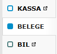
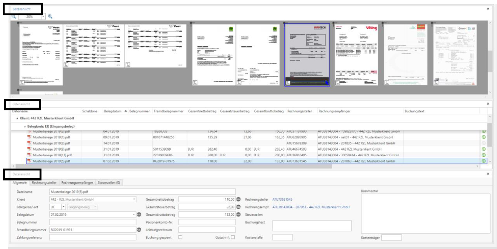
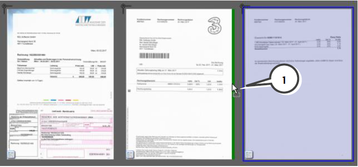
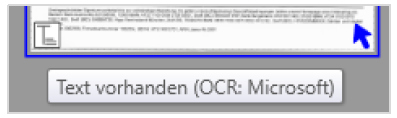

## Belegbearbeitung und -aufbereitung

## Belege hinzufügen

-   Klient öffnen links oben im Feld Klient wählen (Nr. oder Name
    eingeben).

-   
    Klick auf *BELEGE* in der
    Menüleiste.

-   In dieser Ansicht haben Sie nun Zugriff auf Scanordner, das RZL
    Klientenportal, auf die Beleglisten und alle weiteren Funktionen der
    RZL Belegverarbeitung.

!!! info "Tipp"
    Wenn Sie Belege für verschiedene Klienten aus einem Scanordner
    hinzufügen möchten, starten Sie den Bereich *BELEGE* im Bereich *BOARD*
    ohne vorher einen Klienten zu öffnen. Für den Zugriff auf das
    Klientenportal muss allerdings immer die Klientenansicht geöffnet
    werden.

Es bestehen unterschiedliche Möglichkeiten, die Belege in die RZL
Belegverarbeitung hinzuzufügen:

1.  **Belege Scanordner:** Über den (persönlichen) Scanordner, der in
    den Einstellungen bzw. hier im Dropdown angelegt wurde. Wird der
    Button im oberen Bereich angeklickt, wird automatisch der zuletzt
    verwendete Scanordner geöffnet.  
    WICHITG: In einem Scanordner wird automatisch eine
    Hintergrund-OCR-Erkennung durchgeführt!

2.  **Belege Verzeichnis:** Durch manuelle Anwahl eines beliebigen
    anderen Laufwerkordners (lokal oder Netzwerk). Die zuletzt
    verwendeten Ordner bleiben gespeichert.  
    WICHTIG: keine Hintergrund OCR-Erkennung!

3.  **Belege Klientenportal:** Direkter Zugriff auf Belege, die von
    Klienten auf das RZL Klientenportal hochgeladen wurden. Die Anzahl
    der abzuholenden Belege wird im Symbol angezeigt.

4.  **Belege Finmatics:** Direkter Zugriff auf Belege von Finmatics, die
    von Klienten über Finmatics hochgeladen wurden. Die Anzahl der
    abzuholenden Belege wird im Symbol angezeigt.

5.  **Drag & Drop:** Die Übertragung mittels Drag & Drop in die
    Seitenansicht der Belegverarbeitung. (z.B. aus E-Mail Anhängen oder
    aus dem Windows-Explorer)

### Tipps zur Bedienung der Oberfläche

Beim Hinzufügen von Belegen gibt es drei Bereiche (Seitenansicht,
Listenansicht, Detailansicht), in denen verschiedenen Informationen
angezeigt und verschiedene Funktionen zur Verfügung stehen. Diese drei
Bereiche können in der Menüleiste mit der Funktion Vordefinierte
Ansichten unterschiedlich platziert werden.

**Vordefinierte Ansichten:**

Alle drei Bereiche können
auch manuell mit gedrückter linker Maustaste auf die Überschrift
ausgedockt und in einem extra Fenster angezeigt werden (z.B. maximiert
auf einem 2. Bildschirm) oder an jeder beliebigen Position eingedockt
werden.

Fixieren/Verbergen der jeweiligen Ansicht:

!!! info "Tipp"
    Die Menüleiste kann per Doppelklick auf die Überschrift des Tabs
    aus-/eingeblendet werden.
 

**Seitenansicht:** Die Belege werden in der Vorschau angezeigt.

-   Ändern der Darstellung mit + bzw. - Symbol oder Strg + Mausrad.

-   Anzeigegröße der Vorschaubilder:

    -   Tatsächliche Größe (Die Vorschau der Belege wird mit der
        tatsächlichen Größe der PDFs bzw. Bilder dargestellt)

    -   Gleiche Breite (Alle Belege werden gleich breit dargestellt)

    -   Gleiche Höhe (Alle Belege werden gleich hoch dargestellt)

-   Mit Klick auf den Beleg mit der mittleren Maustaste (Mausrad) öffnet
    sich die Belegvorschau, bis das Mausrad wieder losgelassen wird.

-   Durch einen Doppelklick auf einen Beleg öffnet sich die Belegansicht
    (separates Fenster).

-   Mit der rechten Maustaste können im Kontextmenü weiteren Optionen
    angewählt werden.

-   Die Belege werden gruppiert nach Klient und Belegkreis angezeigt und
    können auf- und zugeklappt werden.

**Listenansicht**: Anzeige der Belege in einer Liste inklusive
Belegdaten.

-   Sortierung mittels Anwahl der Überschrift möglich.

-    Alle für den
    Buchungsvorschlag notwendigen Felder wurden in der
    Belegdatenerkennung ausgelesen.

-    Nicht ausgelesene, aber
    für einen vollständigen Buchungsvorschlag notwendige Felder werden
    gelb markiert, wenn mit der Maus das graue Symbol fokussiert wird.

**Detailansicht**: Anzeige der Daten von markierten Belegen.

-   Die Detailansicht kann entweder horizontal unten oder vertikal
    rechts angezeigt werden.

-   Anzeige der Details zum aktuell markierten Beleg.

-   Ändern von Belegdaten für einen oder mehreren markierten Belegen.

-   Buchungssperre von Belegen mit der Option *Buchung gesperrt.*

!!! warning "Hinweis"
    Die Reihenfolge, Markierung und Anzahl der Belege ist in der Seiten- und
    Listenansicht immer synchron.

### Belege/Seiten bearbeiten

In der Seitenansicht werden die Belege für die Weiterverarbeitung
aufbereitet. Folgende Möglichkeiten stehen zur Verfügung:

**Einzelseiten markieren**

Seite mit der linken Maustaste anwählen

**mehrseitigen Beleg markieren**

Beleg mit Klammer-Symbol im linken oberen Randbereich anklicken.

**mehrere Belege markieren**

    -   Belege außerhalb der Vorschaubilder mit gedrückter linker
        Maustaste und ziehen

    -   Belege mit Strg- bzw. Shift-Taste und linker Maustaste
        markieren.

**Gruppe markieren**

Alle Belege innerhalb einer Gruppe mit Klick auf die Gruppenüberschrift
markieren

**mehrseitige Belege auftrennen**

    -   Seiten auftrennen: Es werden die markierten Seiten in
        Einzelseiten aufgetrennt

    -   Belege auftrennen:

        -   Automatisch: es wird versucht, das gesamte Dokument aufgrund
            verschiedener Kriterien in die richtigen Einzelbelege
            aufzutrennen

        -   Nach jeder Seite: das Dokument wird in Einzelseiten
            aufgetrennt, mehrseitige Belege müssen manuell wieder
            zusammengefügt werden

        -   Nach/Vor markierten Seiten: Mit der Funktion Seiten mit Text
            markieren können bestimmte Seiten mit einem bestimmten
            Inhalt markiert werden. Anschließend kann z.B. immer vor der
            markierten 1. Seite eines Beleges ein Schnitt gemacht werden

    -   per Drag&Drop Einzelseiten herausziehen

**Einzelseiten zusammenführen**

    -   per Drag&Drop zusammenführen

    -   Seiten markieren und mit rechter Maustaste Seiten zusammenführen
        verbinden

**Belege drehen**
Seite markieren und mit der rechten Maustaste 90° rechts/links,
180°drehen anwählen

**leere Seiten löschen**
rechte Maustaste Leere Seiten markieren und Entf-Taste oder rechte
Maustaste Löschen anwählen

**Beleg sichern**
Beleg markieren und mit rechter Maustaste Beleg ins Dateisystem
exportieren speichern

**Beleg drucken**
Beleg markieren und mit rechter Maustaste Beleg drucken

**Beleg im RZL PDF-Manager anzeigen**
Beleg markieren und mit rechter Maustaste Beleg(e) im RZL PDF-Manager
anzeigen.

**Beleg per Mail versenden**
Beleg markieren und mit rechter Maustaste Beleg(e) versenden

**Beleg duplizieren**
Beleg markieren und mit rechter Maustaste Beleg(e) duplizieren. Derselbe
Beleg steht nun ein zweites Mal zur Verfügung.

**Änderungen zurücksetzen**
Alle Änderungen, die bisher durchgeführt wurden, werden rückgängig
gemacht und der Original-Zustand der Dateien im Scanordner wird
wiederhergestellt.

### Belege zusammenführen

-   Zusammenführen mit Hilfe der rechten Maustaste und Kontextmenü:

Nach Anwahl der rechten Maustaste und des Eintrags Zusammenfügen werden
die aktuell markierten Belege zusammengeführt.

-   Zusammenführen durch das Ziehen mit der Maus:

Sie können Belege sehr einfach durch Ziehen mit der Maus per Drag & Drop
zusammenführen.

### OCR-Erkennung

Das Symbol *Text vorhanden* (links unten am Beleg) zeigt in der
Seitenansicht mittels Tooltip die Herkunft des Volltextes an.
Zusätzlich wird dies pro Beleg auch in einer eigenen Spalte in der
Listenansicht angezeigt.

Folgende Möglichkeiten gibt es:

1.  **OCR: Original:**

Der im PDF eingebettete und mitgelieferte Volltext wird verwendet.

-   Belege, die aus der Fakturierung direkt als PDF ausgegeben wurden ⇨
    Originaltext ist im PDF enthalten.

-   Belege, die gescannt wurden und der Volltext mittels OCR-Erkennung
    ergänzt wurde (z.B. durch die Scansoftware vom Scanner).

!!! info "Tipp"
    Über die *benutzerdefinierte Belegdatenerkennung* kann mit der
    Funktion *RZL Texterkennung erzwingen* jederzeit der Originaltext
    verworfen und vom Modul Belege mittels Microsoft oder tessercat-OCR
    neu ausgelesen werden.

1.  **OCR-Erkennung direkt im Modul Belege im RZL Board**

Falls die Belege keinen OCR-Volltext enthalten, wird die
OCR/Texterkennung erst direkt im Modul Belege durchgeführt. Die
Einstellungen finden Sie im Menüpunkt *Belege / Einstellungen /
Texterkennung (OCR)*. Für die OCR-Volltext-Erkennung im Modul Belege
setzt RZL (je nach gewählter Einstellung) folgende Fremdsoftware ein:

-   Microsoft OCR-Erkennung (nur mit Windows 10 oder 11)

-   Tesseract-OCR von Google (alle Betriebssysteme)

### Belegansicht öffnen

Bei zwei zur Verfügung stehenden Bildschirmen kann zusätzlich zum RZL
Board durch Doppelklick auf einen Beleg ein extra Belegfenster angezeigt
werden, in dem der jeweils markierte Beleg (über die Seiten- oder
Listenansicht) über den ganzen Bildschirm inkl. der Belegdaten angezeigt
wird.

!!! warning "Hinweis"
    Dieses extra Belegfenster kann beliebig verschoben werden und während
    der Bearbeitung jederzeit geöffnet bleiben!

Wird mit gedrückter linker Maustaste der Cursor über einen Wert gezogen,
wird der tatsächlich erkannte Text unterhalb des Mauszeigers angezeigt.

Folgende Funktionen stehen in der Belegansicht zur Verfügung:

-   Belegdaten speichern

Werden in der rechten Leiste Belegdaten verändert, können diese hier
gespeichert werden.

-   Drucken

Der Beleg kann ausgedruckt werden

-   Kopie speichern

Eine Kopie des Beleges kann extern im Dateisystem gespeichert werden

-   Versenden

Der Beleg kann per E-Mail versendet werden. Optional kann hier auf Basis
der Belegdaten mit Platzhaltern ein Dateiname generiert werden.

-   Im RZL PDF-Manager anzeigen

Der Beleg wird im RZL Manager angezeigt und kann dort weiterverarbeitet
werden.

-   Markierten Text kopieren

Ein am Beleg markierter Text kann in die Zwischenablage gelegt werden.

-   Zoom

Die Darstellung des Beleges kann angepasst werden (Vergrößern /
Verkleinern / fixe Zoomstufe).

-   Navigation

Mit diesen vier Schaltflächen können Sie zum vorherigen/nächsten Beleg
wechseln bzw. innerhalb eines mehrseitigen Beleges die Seiten
durchblättern.

-   Textansicht anzeigen

Der Beleg kann durch Klick auf diese Funktion vollständig in der
Textansicht/OCR-Ansicht angezeigt werden.

*Normalanzeige vs. Text/OCR-Anzeige*

-   PDF Anmerkungen anzeigen

Im Adobe Reader erfasste Textkommentare werden angezeigt, wenn diese
Option aktiviert ist.

-   Belegdaten markieren

Ausgelesene Belegdaten werden am Beleg gelb markiert angezeigt.

-   Alle Belegfelder anzeigen

In der Belegdaten-Leiste rechts werden je nach Einstellung mehr oder
weniger (nur die wichtigsten) Belegdatenfelder angezeigt.

-   Kommentar anzeigen

Ein im Feld Kommentar erfasster Text wird direkt am Beleg angezeigt.

-   Belegdaten erkennen

Für den soeben geöffneten Beleg die Belegdatenerkennung durchführen.

### Belegdaten erkennen

Der nächste Schritt ist die Belegdatenerkennung. Wählen Sie dazu oben in
der Leiste *„Belegverarbeitung“* den Eintrag *„Belegdaten erkennen“*,
wenn alle Belege erkannt werden sollen oder *„Ausgewählte Belegdaten
erkennen“*, wenn die Belegdatenerkennung nur für die markierten Belege
durchgeführt werden soll. Die Funktionen sind alternativ auch mit der
rechten Maustaste erreichbar.

!!! warning "Hinweis"
    **OCR-Erkennung ≠ Belegdatenerkennung**

    Bei der OCR-Erkennung wird der gesamte vorhandene Text jeder Seite
    ausgelesen, die Beleg­daten­erkennung nutzt anschließend diesen
    ausgelesenen Text, um bestimmte Daten zu finden (Datum, Belegnummer,
    Betrag, …). Wird also ein bestimmter Wert von der OCR-Erkennung nicht
    erkannt/ ausgelesen, kann die RZL Belegdatenerkennung oder auch eine
    Schablone diesen Wert nicht finden.

Bei der Belegdatenerkennung werden folgende Schritte durchgeführt:

-   Die Texterkennung (OCR-Erkennung) wird durchgeführt, wenn diese noch
    nicht im Hintergrund ausgeführt wurde (Funktion in den Stammdaten
    des Scanordners unbedingt aktivieren).

-   Die RZL Belegdatenerkennung versucht auf Basis des vorhandenen
    Textes, mit verschiedensten Logiken in den verschiedenen Feldern,
    Belegdaten automatisch zu finden.

-   Zusätzlich werden die vom Benutzer angelegten Regeln, die in den
    Belegschablonen abgespeichert sind anhand des Erkennungsmerkmals
    gesucht und angewendet.

-   Wenn am Beleg eine UID-Nummer gefunden wird, wird über FinanzOnline
    der Name und die Anschrift ausgelesen und bspw. bei ER im Feld
    Rechnungssteller angezeigt.

!!! warning "Hinweis"
    Über die Funktion „*Belegdaten erkennen*“ werden jedes Mal alle Belege
    neu ausgelesen. Das heißt, falls neue Regeln in einer Schablone angelegt
    wurden, die auch für andere Belege passen, dann wird die neue Schablone
    bei neuerlichem Klick auf diese Funktion auch bei den anderen Belegen
    verwendet.

Die Ergebnisse der Belegdatenerkennung sind am besten in der
Listenansicht ersichtlich (bzw. für einen einzelnen Beleg auch über die
Detailansicht).

Die letzte Spalte zeigt zusätzlich an, ob alle Felder, die für den
Buchungsvorschlag notwendig sind, ausgelesen wurden (grünes Symbol) oder
ob Felder fehlen (graues Symbol). Wenn Sie die Maus auf ein graues
Symbol stellen, sehen Sie fehelende Werte gelb eingefärbt.

!!! warning "Hinweis"
    Die Belege könnten auch bei fehlenden Einträgen abgeschlossen und
    gebucht werden. Die fehlenden Werte müssen (wie auch ohne dem Modul
    Belegverarbeitung) in der Buchhaltung bzw. EA-Rechnung beim Buchen
    ergänzt werden.

Sie können fehlenden Daten durch Anlage einer neuen Belegschablone
ergänzen, damit das entsprechende Feld in Zukunft immer richtig
ausgelesen werden kann. Details dazu weiter unten.

!!! warning "Hinweis"
    Sie können sämtliche Änderungen, die Sie bei den Belegen durchgeführt
    haben wieder rückgängig machen, indem Sie mit der rechten Maustaste auf
    eine graue Fläche klicken und die Funktion „Änderungen zurücksetzen“
    aufrufen. Somit stehen die Belege wieder so zur Verfügung, wie die
    Dateien ursprünglich in den Scanordner gespeichert wurden.

#### Benutzerdefinierte Belegdatenerkennung

Mit Hilfe der *Benutzerdefinierten Belegdatenerkennung* können die
Logiken der Belegdatenerkennung einmalig eingestellt/übersteuert werden
bzw. der mitgelieferte Text verworfen und die OCR-Erkennung mit der
gewünschten Software neu durchgeführt werden. Zusätzlich können Sie die
RZL Belegdatenerkennung erzwingen (manuell oder aus Fremdsystemen
übernommene Werte werden überschrieben).

Dies sind keine Einstellungen für die „normale“ Belegdatenerkennung,
sondern können nur über benutzerdefiniert immer einmalig ausgeführt
werden.

### Name/Anschrift über UID-Nummer auslesen

Mit dieser Funktion werden bei Eingangsbelegen die Daten des Lieferanten
und bei Ausgangsbelegen die Daten des Kunden ausgelesen. Mit Hilfe der
ausgelesenen UID-Nummer des Lieferanten oder Kunden wird über Finanz
Online der Name und die Anschrift ausgelesen und in das entsprechende
Feld übernommen. Somit haben Sie auch in der Liste der *ungebuchten
Belege / Belegfreigabe* eine bessere Überschrift von wem oder an wen die
Rechnung ging.

Ausgelesene UID-Nummern werden für eine gewisse Zeit
zwischengespeichert, sodass bei denselben Lieferanten nicht jedes Mal
über Finanz Online abgefragt werden muss.

Damit diese Funktion genutzt werden kann, muss entweder in der ZMV
(Allg. Dateien / Stammmdaten Absender / Online Dienste) oder im KIS
(Verwaltung / FinanzOnline-Zugänge) ein Finanz Online Webservice
Benutzer hinterlegt sein.

Diese Funktion kann optional auch deaktiviert werden (*BELEGE /
Einstellungen / Grundeinstellungen*).

### Belege ins RZL Board übernehmen

Der letzte Schritt nach der Belegdatenerkennung ist das endgültige
Hinzufügen der Belege ins RZL Board (ins Dokumenten-Management-System).
Wählen Sie dazu oben in der Leiste *„Belegverarbeitung“* den Eintrag
*„Alle übernehmen“*, wenn alle vorhandenen Belege übernommen werden
sollen oder *„Auswahl übernehmen“*, wenn nur die markierten Belege ins
RZL Board übernommen werden sollen. Die Belege stehen dann im Modul
Belege als ungebucht zur Verbuchung in der FIBU/EA bereit.

 
Nach erfolgreicher Übernahme werden die Dateien aus dem Scanordner gelöscht.

Bei der Belegübernahme werden die Belege geprüft, ob exakt dieselbe
Datei in den letzten 30 Tagen bereits hinzugefügt wurde. Ist dies der
Fall ist folgende Meldung zu bestätigen um den Beleg nochmals zu
übernehmen. Mit Abbrechen wird nichts übernommen und der Beleg kann
bspw. aus dem Scanordner gelöscht werden.

### Detailbeschreibung aller Funktionen in der Leiste „Belege hinzufügen“

-   Neue Klientengruppe

Es wird ein neuer Bereich für einen weiteren Klienten angelegt. In
diesen Bereich können dann Belege per Drag & Drop gezogen werden (z.B.,
wenn Belege für mehrere Klienten im Scanordner vorhanden sind).

-   Neue Belegkreisgruppe

Es wird ein neuer Bereich für einen weiteren Belegkreis innerhalb des
Klienten angelegt. In diesen Bereich können dann Belege per Drag & Drop
gezogen werden (z.B. wenn Belege für mehrere Belegkreise im Scanordner
vorhanden sind).

-   Vordefinierte Ansichten

Die drei Bereiche (Seiten-, Listen- und Detailansicht) können
unterschiedlich platziert werden.

-   Live-Sortierung

Bei aktivierter Funktion werden Belege sofort nach dem aktuell
aktiviertem Sortierkriterium sortiert, wenn sich Belegdaten verändern.

-   Seitenansicht ausblenden

Bei vielen Belegen kann das Laden der Seitenansicht einige Zeit dauern,
daher kann optional die Seitenansicht ausgeblendet werden (ab 500 Seiten
automatisch).

-   Gruppenübersicht einblenden

In der Seitenansicht wird links eine Zusammenfassung der vorhandenen
Klienten und Belegkreise mit der Summe der vorhandenen Belege angezeigt.
Diese Ansicht kann auch verwendet werden, um bspw. Belege per Drag&Drop
in einen anderen Bereich (Klient oder Belegkreis) zu verschieben. Dieser
Bereich kann jederzeit ein- und ausgeblendet werden.

-   Alles markieren

Alle Belege werden markiert.

-   Leere Seiten markieren

Es werden alle leeren Seiten markiert, damit diese gesammelt gelöscht
werden können.

-   Markierte Seiten löschen

Aktuell markierte Seiten werden gelöscht.

-   Belege auftrennen

Markierte Belege in Einzelseiten auftrennen.

-   Automatisch: es wird versucht, das gesamte Dokument aufgrund
    verschiedener Kriterien, in die richtigen Einzelbelege aufzutrennen

-   Nach jeder Seite: das Dokument wird in Einzelseiten aufgetrennt,
    mehrseitige Belege müssen manuell wieder zusammengefügt werden

-   Nach/Vor markierten Seiten: Mit der Funktion Seiten mit Text
    markieren können bestimmte Seiten mit einem bestimmten Inhalt
    markiert werden. Anschließend kann z.B. immer vor der markierten 1.
    Seite eines Beleges ein Schnitt gemacht werden

-   Belegdaten erkennen

Wenn alle Belege einem Klienten und einem Belegkreis zugeordnet sind,
kann diese Funktion ausgeführt werden. Zwei Aktionen werden ausgeführt:

1.  Es wird die Texterkennung (OCR-Erkennung) durchgeführt (wenn noch
    nicht im Hintergrund bereits erledigt) und es wird die

2.  *Belegdatenerkennung* ausgeführt. Dabei werden die Werte anhand der
    verschiedenen Möglichkeiten ausgelesen (QR Code, RZL
    Belegdatenerkennung, Schablonen …) und beim Beleg gespeichert.

-   Ausgewählte Belegdaten erkennen

Selbe Funktion wie Belegdaten erkennen – gilt nur für markierte Belege.

-   Benutzerdefinierte Belegdatenerkennung

Für die Belegdatenerkennung können über benutzerdefiniert folgende
zusätzliche Funktionen für alle (*Ausführen (alle))* oder nur für
markierte Belege (*Ausführen (nur Auswahl))* ausgeführt werden:

**Texterkennungs-Software:** 
Sie können einmalig die in den Einstellungen festgelegte OCR-Engine übersteuern und die hier eingestellte verwenden.

**RZL Texterkennung erzwingen:**
Wurde beispielsweise die OCR/Texterkennung bereits vom Scanner durchgeführt, führt das Modul Belege keine Texterkennung mehr durch, sondern verwendet den
mitgelieferten Text. Mit dieser Funktion kann der Text vom Scanner
verworfen und mit der oben eingestellten OCR-Engine neu ausgelesen
werden. Dies kann z.B. verwendet werden, um die Qualität zu
vergleichen.

**QR-Codes auslesen (Registrierkassa/BCD/Stuzza):**
Standardmäßig wird
bei der Belegdatenerkennung (nicht benutzerdefiniert) als erstes ein
ev. vorhandener QR Code ausgelesen. Soll dies vermieden werden, muss
diese Option deaktiviert werden.

**Schablonensystem verwenden:**
Diese Option entscheidet, ob die
benutzerdefinierten Regeln, die einer Schablone abgespeichert sind,
angewendet werden.

    -   Bereits zugeordnete Schablone belassen: Falls bei Belegen
        bereits eine Schablone zugeordnet ist, bleibt diese auf jeden
        Fall zugeordnet auch wenn das Modul Belege anhand des
        Erkennungsmerkmals eine andere Schablone finden würde.

    -   Schablone: Wird hier manuell eine Schablone ausgewählt, wird
        diese bei Ausführung der benutzerdefinierten Belegdatenerkennung
        unabhängig vom Erkennungsmerkmal verwendet.

        -   RZL Erkennungslogik verwenden: Als letztes wird die von RZL
            entwickelte Logik verwendet, um Belegdaten auszulesen (wenn
            kein QR-Code, Schablone usw. vorhanden ist).

        -   RZL Belegdatenerkennung erzwingen: Manuell erfasste oder aus
            Fremdsystemen übernommene Werte werden überschrieben.

<!-- -->

**Alle übernehmen**

Alle vorhanden Belege werden ins Modul Belege übernommen und stehen als
ungebucht zur Verbuchung in der FIBU/EA bereit. Nach erfolgreicher
Übernahme werden die Dateien aus dem Ordner gelöscht.

**Auswahl übernehmen**

Nur markierte Belege werden ins Modul Belege in die Ansicht *Ungebuchte
Belege* bzw. *Belegfreigabe* übernommen. Nach erfolgreicher Übernahme
werden die Dateien aus dem Ordner gelöscht.
