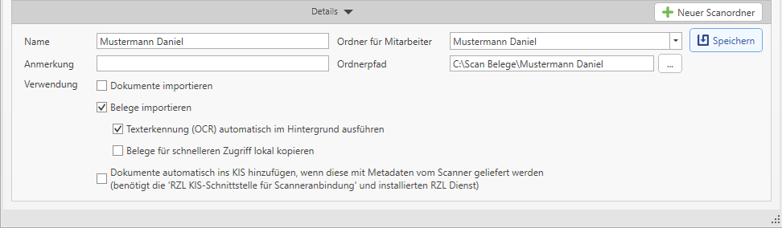

## Die Digitalisierung der Belege

### Scanordner vor der erstmaligen Nutzung einrichten

Bevor Sie mit dem Scannen beginnen, legen Sie **für jeden Mitarbeiter**
einen eigenen Scanordner im Netzwerk und im Modul Belege an. Die Anlage
befindet sich im Bereich *BELEGE* unter *Einstellungen / Scanordner*
oder direkt im Bereich *Belege hinzufügen* im Dropdown des Buttons
*Belege Scanordner.* Zusätzlich sollten Sie diese Ordner beim Scanner in
einem Profil pro Mitarbeiter hinterlegen.

**Name:** Sie können hier einen Namen für jeden Scanordner vergeben, der
dann im Bereich *Belege hinzufügen / Belege Scanordner* angezeigt wird.

**Ordner für Mitarbeiter:** Scanordner können Sie einem Mitarbeiter
zuordnen, somit sieht der jeweilige Mitarbeiter nur seine eigenen und
etwaige öffentliche (kanzleiweite) Scanordner.

**Anmerkung:** Notiz zu diesem Scanordner.

**Ordnerpfad:** Im *Ordnerpfad* wird der am Laufwerk angelegte
Scanordner hinterlegt.

**Dokumente/Belege importieren:** Je nach Aktivierung steht dieser
Scanordner in der RZL KIS-Dokumentenverwaltung bzw. in der RZL Board
Belegverarbeitung zur Verfügung.

**Texterkennung (OCR) automatisch im Hintergrund ausführen:** Diese
Option steht nur dann zur Verfügung, wenn in den Einstellungen zur
Texter-kennung „Nur bei ausgewählten Scanordnern“ ausgewählt wurde.
Grundsätzlich empfehlen, Texterkennung im Hintergrund generell zu
aktivieren. Somit wird die Texterkennung (OCR-Erkennung) vollautomatisch
im Hintergrund ausgeführt, sobald neue Belege in einem Scanordner
vorhanden sind und das RZL Board gestartet ist.

**Belege für schnelleren Zugriff lokal kopieren:** Bei Aktivierung
dieser Option werden die Belege für die Bearbeitung lokal
zwischengespeichert und die Zugriffe auf den Scan-Ordner auf ein Minimum
reduziert. Diese Einstellung ist bei einer langsamen oder instabilen
Verbindung zum Scan-Ordner zu empfehlen.

### Tipps zum Scanvorgang

**Papierbelege aufbereiten**

Die Papierbelege sollten Sie bzw. Ihre Klienten ohne Klammern bzw.
Heftung im Ordner sortiert ablegen. Sie müssen somit nur mehr die
gesamten Rechnungen in den Scanner einlegen und per Stapeleinzug
scannen.

Wir empfehlen standardmäßig doppelseitig zu scannen, da die gescannten
Leerseiten im RZL sehr einfach automatisch entfernt werden können.

**Qualität**

Eine optimale Scanqualität liefert gute Ergebnisse bei der
OCR-/Belegdaten-erkennung. Wir empfehlen 300 dpi.

**Dateiformat**

Als Ausgabeformat sollte PDF gewählt werden. Ob die Belege in
Einzelseiten oder als Gesamtdokument gescannt werden, ist nicht
relevant, da die Seiten in der RZL Belegverarbeitung auf Knopfdruck
aufgeteilt bzw. zusammengefügt werden können.

### Einstellungen zur OCR-Erkennung bei gescannten Belegen

Um aus den gescannten PDF-Belegen Werte auslesen zu können, wird das
Bild mittels OCR/Texterkennung in einen verwertbaren Text umgewandelt.
Den Einstellungsdialog für die Texterkennung (OCR) finden Sie im Menü
*Belege / Einstellungen / Texterkennung (OCR).*

Folgende Möglichkeiten stehen zur OCR-Erkennung im RZL Board zur
Verfügung:

> Texterkennungs-Software (OCR-Engine)

1.  Automatisch:  
    Die von RZL aktuell empfohlene Software wird verwendet  
    (derzeit unter Windows 10 bzw. 11: Microsoft OCR, sonst Google
    Tesseract 4.1.1)

2.  Microsoft:  
    Diese Einstellung wird nur empfohlen, wenn alle Mitarbeiter Windows
    10 oder 11 verwenden, da Microsoft OCR unter Windows 7 nicht zur
    Verfügung steht.

3.  Tesseract 4.1.1 (Google)

> Für die Texterkennung im Hintergrund ausschließlich Microsoft OCR
> verwenden.

1.  Mit dieser Einstellung wird die Hintergrund-Texterkennung innerhalb
    einer Installation nur auf PCs durchgeführt, die Windows 10 oder 11
    installiert und somit Microsoft OCR verwenden können. Somit ist
    sichergestellt, dass Belege nicht mit verschiedenen OCR-Engines
    ausgelesen werden.

> Texterkennung (OCR) bei Scanordnern im Hintergrund ausführen

1.  Alle Scanordner:  
    Texterkennung wird bei allen angelegten Scanordner im Hintergrund
    ausgeführt, die Einstellung steht in den Stammdaten der Scanordner
    somit nicht mehr zur Verfügung.

2.  Nur bei ausgewählten Scanordnern:  
    Pro Scanordner kann definiert werden, ob eine
    Hintergrund-Texterkennung durchgeführt werden soll.

3.  Bei keinem Scanordner:  
    Hintergrund-Texterkennung wird generell nicht durchgeführt. Die
    Option steht in den Stammdaten der Scanordner somit nicht zur
    Verfügung.

> Texterkennung (OCR) bei Klientenportal-Belegen bzw. Finmatics-Belegen
> im Hintergrund ausführen.

1.  Mit dieser Option wird im Hintergrund über alle Klienten alle 10
    Minuten überprüft, ob neue Belege vom Klientenportal oder von
    Finmatics zur Verfügung stehen. Diese Belege werden dann automatisch
    im Hintergrund heruntergeladen und die Texterkennung wird
    durchgeführt. Somit erspart man sich diese Zeit später bei der
    Belegdatenerkennung.

    1.  Alle Klienten

    2.  Keine Klienten

> Alternativ zur Texterkennung im RZL Board kann diese auch vorgelagert
> durchgeführt werden. Die RZL Belegverarbeitung führt dann keine
> Texterkennung mehr durch, sondern verwendet den mitgelieferten Text.
>
> Der Scanner macht die OCR-Erkennung (Einstellung direkt am Scanner).
>
> Ein anderes vorgelagertes System übernimmt die OCR-Erkennung.
>
> **Erklärung zur OCR-Erkennung:  
>   
> **Verschiedenen OCR-Erkennungen (Scanner, Google oder Microsoft, …)
> können unterschiedliche Ergebnisse liefern. Probieren Sie selbst, wo
> Sie die besten Ergebnisse bekommen.
>
> Wenn die OCR-Erkennung vom Scanner nicht zufriedenstellend ist,
> empfehlen wir diese bei Ihrem Scanner unbedingt zu deaktivieren. Im
> RZL Programm können Sie über die benutzerdefinierte
> Belegdatenerkennung die mitgelieferte, schlechte OCR-Erkennung
> verwerfen und von RZL (Microsoft OCR, tesseract von Google, …) über
> die Funktion RZL Texterkennung erzwingen neu ausführen lassen. Somit
> können Sie die Qualität vergleichen und sich dann für eine Software
> entscheiden.
>
> Grundsätzlich empfehlen wir, wenn möglich, Original-PDF-Belege zu
> verwenden (PDF aus Fakturierung bzw. E-Mail vom Lieferanten), da bei
> Original-PDFs der Text im Normalfall vollständig richtig eingebettet
> geliefert wird und somit keine OCR-Erkennung mehr notwendig ist.