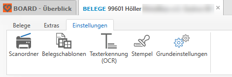
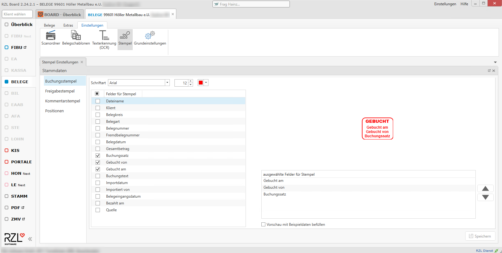
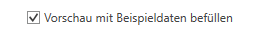
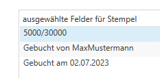
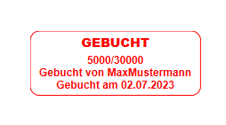
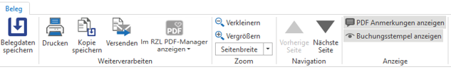
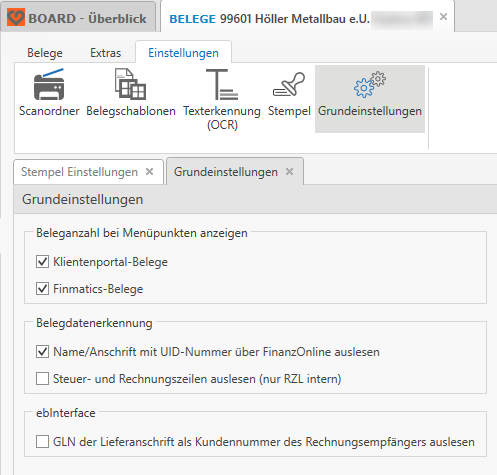

# Grundeinstellungen zur Belegverarbeitung

Im Bereich *Einstellungen* finden Sie folgende Möglichkeiten:

**Scanordner**

Bevor Sie mit dem Scannen beginnen, legen Sie für jeden Mitarbeiter
einen eigenen Scanordner im Netzwerk und im RZL Board an. Die Anlage
befindet sich im Bereich BELEGE unter Einstellungen / Scanordner oder
direkt im Bereich Belege hinzufügen im Dropdown des Buttons Belege
Scanordner. Zusätzlich sollten Sie diese Ordner beim Scanner in einem
Profil pro Mitarbeiter hinterlegen.

- *Name:*  
Sie können hier einen Namen für jeden Scanordner vergeben,
der dann im Bereich *Belege hinzufügen / Belege Scanordner*
angezeigt wird.

- *Ordner für Mitarbeiter:*  
Scanordner können Sie einem Mitarbeiter
    zuordnen, somit sieht der jeweilige Mitarbeiter nur seine eigenen
    und etwaige öffentliche (kanzleiweite) Scanordner.

- *Anmerkung:*  
Notiz zu diesem Scanordner.

- *Ordnerpfad:*  
Im Ordnerpfad wird der am Laufwerk angelegte
    Scanordner hinterlegt.

- *Dokumente / Belege importieren:*  
Je nach Aktivierung steht
    dieser Scanordner in der RZL KIS-Dokumentenverwaltung bzw. in der
    RZL Board Belegverarbeitung zur Verfügung.

- *Texterkennung (OCR) automatisch im Hintergrund ausführen:*  
Diese Option steht nur dann zur Verfügung, wenn in den Einstellungen zur
    Texterkennung n*ur bei ausgewählten Scanordnern* ausgewählt wurde.
    Grundsätzlich empfehlen wir, Texterkennung im Hintergrund generell
    zu aktivieren. Somit wird die Texterkennung (OCR-Erkennung)
    vollautomatisch im Hintergrund ausgeführt, sobald neue Belege in
    einem Scanordner vorhanden sind und das RZL Board gestartet ist.

- *Belege für schnelleren Zugriff lokal kopieren:*  
Bei Aktivierung
    dieser Option werden die Belege für die Bearbeitung lokal
    zwischengespeichert und die Zugriffe auf den Scan-Ordner auf ein
    Minimum reduziert. Diese Einstellung ist bei einer langsamen oder
    instabilen Verbindung zum Scan-Ordner zu empfehlen.

**Belegschablonen**  
Die bisher angelegten Belegschablonen werden in einer Liste angezeigt.
Sie können hier Schablonen löschen oder auch umbenennen. Außerdem finden
Sie hier Informationen, wann die Schablone von wem erstellt wurde und
wann sie von wem zuletzt geändert wurde. Schablonen können auch
exportiert und importiert werden.

**Texterkennung (OCR)**  
Siehe Kapitel *Einstellungen zur OCR-Erkennung bei gescannten Belegen*

**Stempel**  
In diesem Menü können Sie den Buchungsstempel für *Gebuchte
Belege* konfigurieren. Sie können festlegen, welche Felder am Stempel
*Gebucht* in welcher Reihenfolge angezeigt werden sollen.  
  

-   **Dateiname:** Name, unter welcher die Datei gespeichert ist

-   **Klient:** Nummer und Name des Klienten

-   **Belegkreis:** zB ER, AR, KA, …

-   **Belegart:** Eingangsbeleg, Ausgangsbeleg …

-   **Belegnummer:** fortlaufende Nummer

-   **Fremdbelegnummer:** Rechnungsnummer des Beleges

-   **Belegdatum:** Datum des Beleges

-   **Gesamtbetrag:** Bruttobetrag

-   **Buchungssatz:** Soll/Haben

-   **Gebucht von:** Name des Erfassers

-   **Gebucht am:** Datum der Erfassung

-   **Buchungstext:** erfasster Text beim Buchen

-   **Kommentar:** Vermerk der beim Beleg erfasst wird

-   **Importdatum:** wann der Import stattgefunden hat

-   **Importiert von:** von dem der Import durchgeführt wurde

-   **Belegeingangsdatum:** Buchungsdatum

-   **Bezahlt am:** Datume der durchgeführten Zahlung

-   **Quelle:** ect. …

Im Feld links *ausgewählte Felder für Stempel* kann die Reihenfolge der
ausgewählten Felder geändert werden.

Setzt man den Haken *Vorschau mit Beispieldaten befüllen* wird ein
Musterstempel mit Beispieldaten befüllt.

Rufen Sie einen bereits gebuchten in der FIBU auf, können Sie in der
Menüleiste entscheiden, ob der Buchungsstempel sichtbar angezeigt wird.

Beim Export eines Beleges als PDF wird der Stempel und der Kommentar
nicht exportiert und angezeigt.

**Grundeinstellungen**

-   **Klientenportal-Belege:** Mit dieser Option wird beim Öffnen eines
    Klienten in der Menüleiste angezeigt, wie viele Belege vom
    Klientenportal noch abzuholen sind.

-   **Finmatics Belege:** Mit dieser Option wird beim Öffnen eines
    Klienten in der Menüleiste angezeigt, wie viele Belege von Finmatics
    noch abzuholen sind.

-   **Name/Anschrift mit UID-Nummer über FinanzOnline auslesen:** Mit
    dieser Option wird bei einer Belegdatenerkennung der Name und die
    Anschrift des Rechnungsaussteller (bei Eingangsbelegen) bzw. des
    Rechnungsempfängers (bei Ausgangsbelegen) über die UID-Nummer bei
    FinanzOnline ausgelesen. Somit haben Sie später in der Liste der
    *ungebuchten Belege* eine bessere und schnellere Übersicht über die
    Belege.  
    Die einmal vorgekommenen UID-Nummern werden für eine gewisse Zeit
    zwischengespeichert, damit bei Lieferanten, die häufig vorkommen,
    nicht jedes Mal bei FinanzOnline abgefragt werden muss.

-   **GLN der Lieferanschrift als Kundennummer des Rechnungsempfängers
    auslesen:** dies ist eine spezielle Funktion beim Import von
    ebInterface XML-Rechnungen. Dies kann genutzt werden, um später in
    der FIBU auf Basis dieser GLN-Nummer Buchungsvorschläge zu
    generieren.

# Zusatzmodul Belegfreigabe

Siehe Kurzanleitung *RZL Modul Belegfreigabe* unter *Hilfe /
Kurzanleitungen.*
