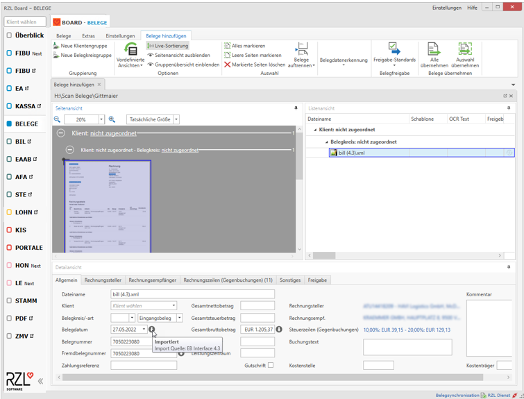
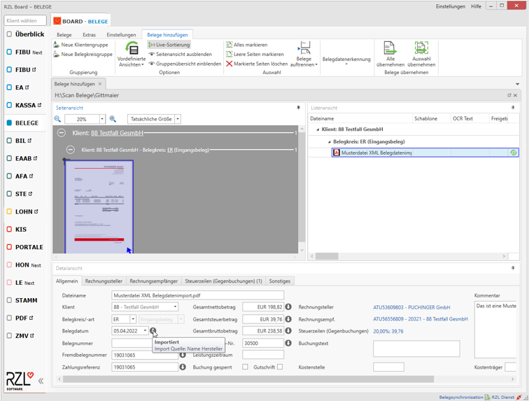

# Möglichkeiten zum Belegimport

## ebInterface

XML-Rechnungen im ebInterface Format können über einen Scanordner oder
auch über das Klientenportal verarbeitet werden. Da es sich hier um ein
strukturiertes Rechnungsformat handelt, werden die in der Datei
vorkommenden Belegdaten sofort ohne Belegdatenerkennung beim Beleg
angezeigt. RZL unterstützt die Formate 4.1 und 4.3.

Weitere Details dazu finden Sie Online unter:  
<https://www.wko.at/service/netzwerke/ebinterface-aktuelle-version-xml-rechnungsstandard.html>

## Extras / Beleg mit XML importieren

Über diesen Menüpunkt können Belege, die aus anderen RZL Installation
mit Belegdaten exportiert wurden wieder importiert werden. Dies kann
genutzt werden, um Belege von einer auf eine andere Installation zu
übertragen.

Details dazu finden Sie in einer eigenen Kurzanleitung *Belege mit
XML-Belegdaten exportieren und in andere Installation importieren.*

## Modul XML Belegdatenimport Schnittstelle

RZL bietet ein eigenes XML-Format an, um Belege mit Belegdaten aus
Fremdsystem in die RZL Belegverarbeitung zu übernehmen. Eine
Beschreibung zum RZL XML-Format kann jederzeit kostenlos bei RZL
angefordert werden (<Software@rzl.at>). Zum Import von Belegen mit
Belegdaten im XML-Format muss dann ein entsprechendes Modul bei RZL
lizenziert sein.  
  
Diese Belege können dann entweder über einen Scanordner oder auch über
den oben beschriebenen Menüpunkt *Belege mit XML importieren* übernommen
werden. Somit ist bei RZL zumindest für die Felder, die über die
XML-Datei geliefert werden, keine Belegdatenerkennung mehr notwendig.

Details dazu finden Sie in einer eigenen Kurzanleitung *Belege mit
XML-Belegdaten aus Fremdsystem übernehmen.*

