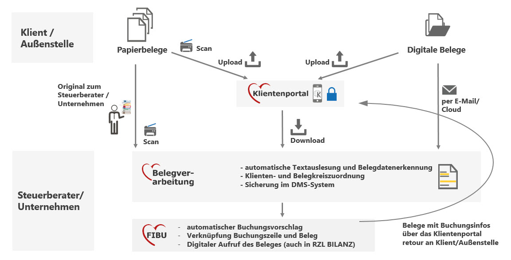

# Vorteile und Nutzen der RZL Belegverarbeitung

-   Hauptziel ist die digitale Speicherung der Belege mit schnellem
    Zugriff über die RZL Programme.

-   Durch die RZL Belegdatenerkennung in Kombination mit
    benutzerdefinierten Regeln werden die Belegdaten ausgelesen und beim
    Buchen vorgeschlagen.

-   Beim Bilanzieren können Sie die Belege direkt im Bilanz-Programm
    aufrufen.

-   Digitalisierte Belege können – ergänzt um verschiedene Buchungsinfos
    – über das RZL Klientenportal bereitgestellt werden.

-   Es kommt daher zu einer Automatisierung und Zeitersparnis.

# Wie kommen Sie als Buchhalter zu den digitalen Belegen?

