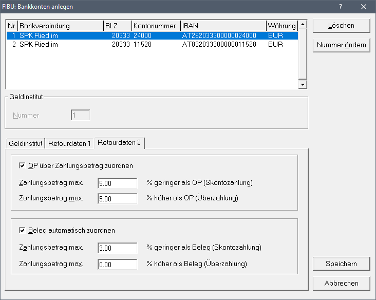
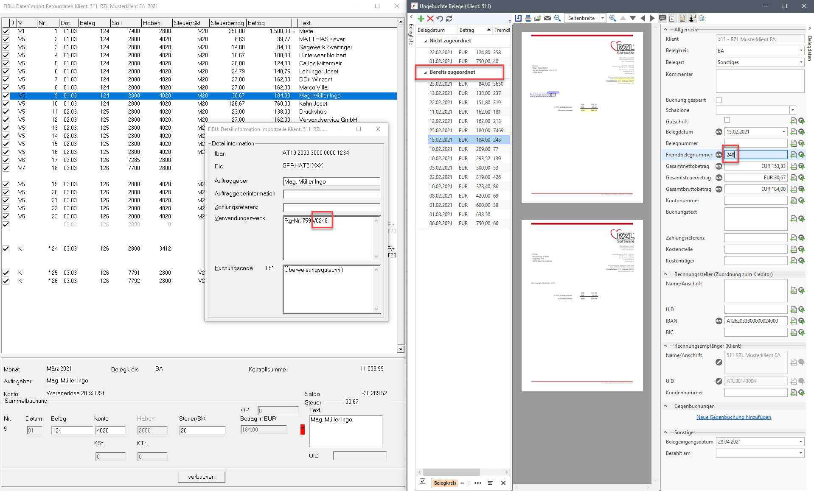

# Buchen eines EA-Rechners mit Belegverarbeitung

Auch ein EA-Rechner kann mit der RZL Belegverarbeitung kombiniert
werden, sodass die Belege z.B. bei den Bankbuchungen angehängt sind.
Folgende Vorgehensweise empfehlen wir zur optimalen Verarbeitung eines
Einnahmen/Ausgaben-Rechners mit der RZL Belegverarbeitung:

Beim Buchen eines CAMT-Kontoauszugs gibt es die Möglichkeit, Belege
automatisiert den Bankbuchungen aufgrund verschiedener Kriterien
zuordnen zu lassen.

Damit diese automatische Zuordnung durchgeführt wird, muss die Option
*Beleg automatisch zuordnen* in den Stammdaten des Bankkontos im
Registerblatt *Retourdaten 2* aktiviert werden.

Beim Einstieg in den Retourdatendialog muss die Option *DMS-Belege
zuordnen* aktiviert werden.

Die automatische Zuordnung wird mittels folgender Möglichkeiten in
dieser Reihenfolge versucht:

-   Der **Betrag** stimmt zwischen Belegdaten und Bankbuchung überein
    (bzw. mit eingestellter maximaler Abweichung, z.B. für Skonti) und
    die ausgelesene **Zahlungsreferenz** am Beleg entspricht der
    **Zahlungsreferenz** der Bankbuchung.

-   Der **Betrag** stimmt überein (bzw. mit eingestellter maximaler
    Abweichung, z.B. für Skonti) und der ausgelesene **IBAN** am Beleg
    entspricht dem **IBAN** der Bankbuchung.

-   Der **Betrag** stimmt überein (bzw. mit eingestellter maximaler
    Abweichung, z.B. für Skonti) und die ausgelesene **Belegnummer** am
    Beleg entspricht der **Zahlungsreferenz** der Bankbuchung.

-   Der **Betrag** stimmt überein (bzw. mit eingestellter maximaler
    Abweichung, z.B. für Skonti) und die ausgelesene **Belegnummer** am
    Beleg wird als **Teil des Verwendungszwecks** der Bankbuchung
    gefunden.

