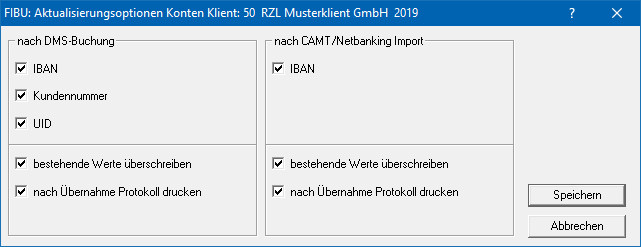
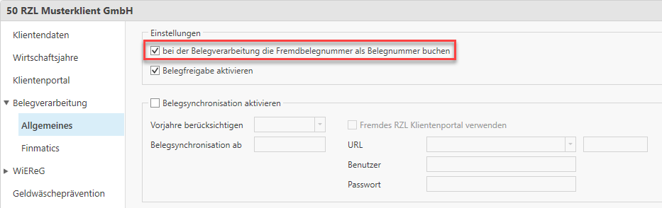
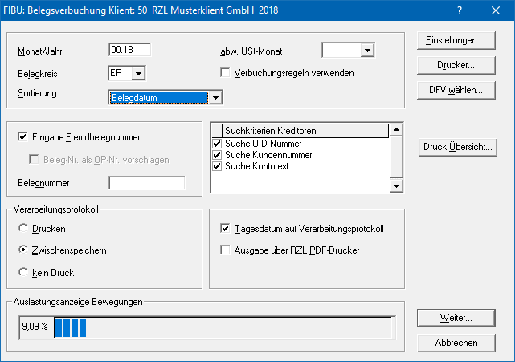
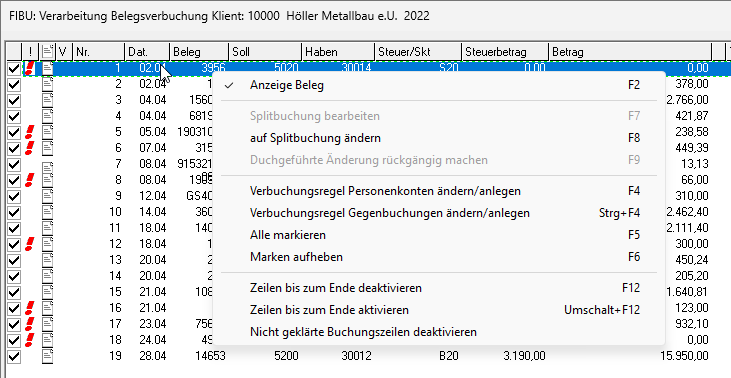
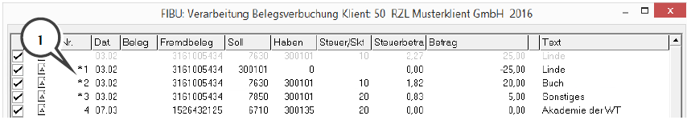
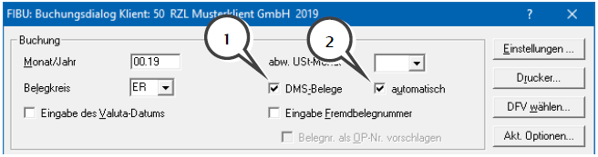
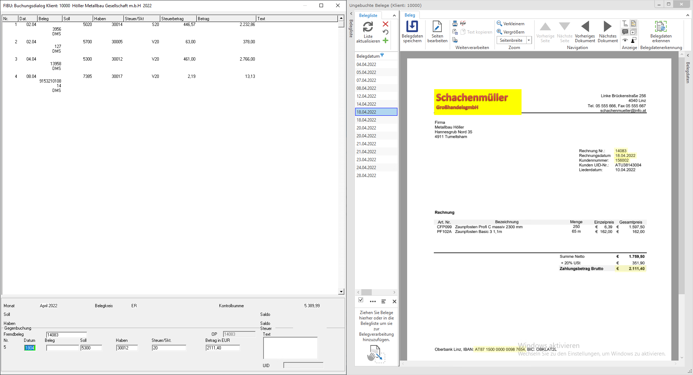
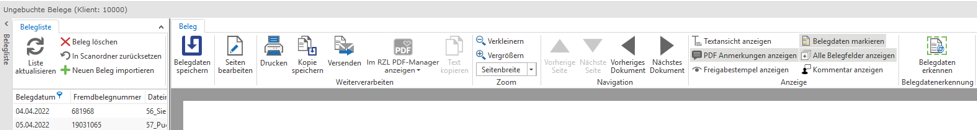
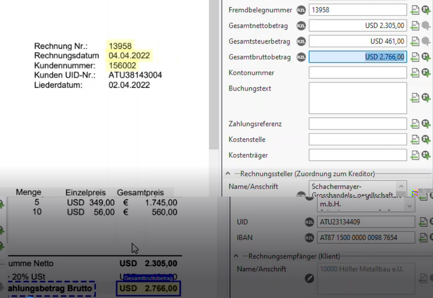

# Buchen mit digitalen Belegen in RZL FIBU

## Allgemein

Durch Lizenzierung der *RZL FIBU/EA Belegverarbeitung* oder alternativ
durch Lizenzierung und Anpassung der *RZL Schnittstelle für die
Belegverarbeitung über Fremd-DMS* (Details auf Anfrage) besteht die
Möglichkeit, gescannte Belege mit Buchungen in den RZL Programmen zu
verknüpfen.

Innerhalb der Buchhaltung bzw. EA-Rechnung können Belege mit oder ohne
Kontierungsvorschlag (bzw. nach gesonderter Vereinbarung auch aus einem
von RZL autorisierten Fremd-Dokumentmanagement-System in die RZL FIBU/EA
– Details auf Anfrage) importiert werden.

Voraussetzung für die Belegverbuchung ist somit die vorherige Übernahme
der Belege in das Modul Belege im RZL Board (bzw. in das jeweilige
autorisierte Fremd-DMS). Die Belege werden mit der jeweiligen Buchung
verknüpft.

## Buchen mit digitalen Belegen

### Aktualisierungsoptionen für Personenkonten

Für den Buchungsvorschlag bei Eingangs- und Ausgangsrechnungen ist die
UID-Nr. bzw. die Kundennummer in den Stammdaten der Kreditoren bzw.
Debitoren sehr wichtig. Damit diese Daten nicht manuell eingepflegt
werden müssen, können Sie pro Klient die automatische Aktualisierung der
Kontenstammdaten aktivieren.

Öffnen Sie dazu in der FIBU den Menüpunkt *Stamm / Konten/
Aktualisierungsoptionen*. Hier können Sie im Bereich *nach DMS-Buchung*
aktivieren, dass nach dem Buchen von digitalen Belegen die Daten (IBAN,
Kundennummer, UID) vom Beleg in die Kontenstammdaten übernommen werden
sollen.

### Buchen der Fremdbelegnummer bei Eingangsrechnungen

Standardmäßig wird bei ER die Belegnummer als Fremdbelegnummer
ausgelesen und auch in diesem Feld in der Buchungszeile vorgeschlagen.
Somit können Sie das Feld Belegnummer für die laufende Nummerierung
verwenden.

Wenn Sie stattdessen *bei der Belegverarbeitung* die *Fremdbelegnummer
als Belegnummer buchen* möchten, können Sie in den Klienten-Stammdaten
im RZL Board im Bereich *Belegverarbeitung / Allgemeines* pro Klient
diese Option aktivieren.

### Belegsverbuchung aus DMS-System (Anzeige alle ungebuchten Belege)

Im Rahmen dieser Variante der Belegverbuchung werden im Buchungsdialog
sofort alle Buchungsvorschläge für alle ungebuchten Belege angezeigt und
der Beleg der markierten Buchung kann mit Hilfe der *F2-Taste*
aufgerufen werden. Es erfolgt kein Aufruf einer eigenen Liste mit den
Belegen.

Über *Buchen / Belegsverbuchung aus DMS-System* kommen Sie in den
Buchungsvordialog.

Die Buchungen werden mit der Sortierung *Standard* in der Reihenfolge
angezeigt, wie die Belege ins Modul Belege übernommen wurden (nach
Importdatum). Alternativ können folgende andere Sortierkriterien
ausgewählt werden (z.B. nach Belegdatum, Belegnummer, …)

Über *Verbuchungsregel* verwenden werden die Buchungen auf Basis der
Verbuchungsregeln vorgeschlagen. Voraussetzung ist, dass das Programm
das Personenkonto auf Basis der übergebenen UID-Nummer, Kundennummer
oder dem Namen inkl. Adresse) aus dem DMS-System ermitteln kann.

Über *Druck Übersicht* können Sie sich eine Übersicht über die zu
verbuchenden Belege ausdrucken.

Über *Weiter* gelangen Sie in den Buchungsdialog. Hier wird für jeden
Beleg mit den, über die Belegdatenerkennung ausgelesenen, Daten ein
Buchungsvorschlag erstellt. Die Zuordnung zum Kreditor/Debitor erfolgt
anhand der ausgelesenen UID-Nummer, der Kundenummer oder dem Namen inkl.
Adresse. Wenn eine Verbuchungsregel angelegt ist, wird auch das
Gegenkonto vorgeschlagen. Ohne Verbuchungsregel schlägt das Programm das
Gegenkonto der letzten Buchung vor.

Fehlende Daten (wie z.B. Kontonummern) müssen noch ergänzt werden. Diese
Zeilen werden mit einem roten Rufzeichen dargestellt.

Mit der rechten Maustaste finden Sie pro Zeile folgende Optionen:  
  

-   **Anzeige Beleg (F2)**

Belegfenster wird eingeblendet. Je nach markierter Buchungszeile wird
der dazugehörige Beleg angezeigt. Dieses Fenster kann geöffnet bleiben.

-   **Splitbuchung bearbeiten (F7)**

Wenn über die Belegdaten mittels Steuerzeilen schon eine Splitbuchung
vorgeschlagen wird, kann diese bearbeitet und verändert werden.

-   **Auf Splitbuchung ändern (F8)**

Eine Gegenbuchung kann in ein Splitbuchung umgewandelt werden. Wenn Sie
eine Buchungszeile mit Hilfe einer Splitbuchung aufteilen, wird die
Original-Buchung grau dargestellt und die Zeilen der Splitbuchung werden
mit einem Sternchen (**1**) gekennzeichnet.

-   **Durchgeführte Änderung rückgängig machen (F9)**

Eine Aufteilung in eine Splitbuchung kann wieder rückgängig gemacht
werden.

-   **Verbuchungsregel Personenkonten ändern/anlegen**

Auf einem Personenkonto kann eine einfache Verbuchungsregel für dieses
Konto hinterlegt werden. Wenn dann das Personenkonto gefunden wird, wird
die Buchung aufgrund der Verbuchungsregel vorgeschlagen.

-   **Verbuchungsregel Gegenbuchen ändern/anlegen**

Siehe Kapitel *Regeln für Steuerzeilen (Gegenbuchungen) anlegen*

-   **Zeilen bis zum Ende deaktivieren (F12)**

Buchungszeilen ab der aktuellen Zeile können für die Verbuchung
deaktiviert werden. Diese Belege bleiben somit als ungebucht erhalten
und werden nächstes Mal wieder vorgeschlagen.

Nach vollständiger Kontierung aller Zeilen können Sie durch Anwahl der
Schaltfläche *Verbuchen* – im Verarbeitungsdialog ganz unten – die
Zeilen tatsächlich buchen (bis dahin kann jede Zeile beliebig abgeändert
werden).

!!! warning "Hinweis"
    Die Durchbestätigung jeder einzelnen Buchungszeile ist in dieser
    Variante nicht notwendig. Sofern der Buchungsvorschlag komplett ist,
    können die Buchungen sofort verbucht werden. Die Buchungen werden nicht
    in einen Stapel gelegt sondern sind sofort gebucht und somit
    finalisiert.

### "Normales Buchen“ mit Belegverarbeitung - Buchungsvorschläge einzeln

Innerhalb des *normalen Buchens (Buchen oder Stapelbuchen)* können Sie
ebenfalls die Belegverbuchung mit Buchungsvorschlag nützen. Hier werden
nicht alle Buchungssätze sofort im Dialog angezeigt, sondern die
Buchungen werden einzeln vorgeschlagen und ergänzt/bestätigt. Eine Liste
mit den noch nicht gebuchten Belegen wird zusätzlich zum Buchungsdialog
aufgerufen.

!!! warning "Hinweis"
    Bei nur einem Bildschirm: Pinnen Sie sich das FIBU-Fenster an die linke
    Seite des Bildschirms (bevor Sie ins Buchen einsteigen) und das
    Belegfenster an die rechte Seite. Somit haben Sie jederzeit alles im
    Blick.

Wenn Sie Belege buchen möchten, aktivieren Sie bitte das Feld
*DMS-Belege* (**1**). Sie können nachfolgend beim Buchen im
***Datumsfeld mit der F6-Taste*** den Buchungsvorschlag aufrufen und
die beim Beleg ausgelesenen Werte werden in die Buchungszeile
eingetragen.

Die Aktivierung des Feldes automatisch (**2**) bedeutet, dass Sie nur
beim 1. Beleg die *F6-Taste* anwählen müssen und für die nachfolgenden
Belege der Buchungsvorschlag automatisch eingetragen wird. Wenn Sie das
Feld *automatisch* (**2**) deaktivieren, müssen Sie die *F6-Taste* im
*Datumsfeld* für den Buchungsvorschlag bei jedem Beleg einzeln anwählen.

!!! warning "Hinweis"
    Wird während dem Buchen manuell ein anderer Beleg markiert müssen Sie
    die Funktion F6 im Datumsfeld nochmals ausführen.

Der aktuell in der Belegliste markierte Beleg wird beim Erfassen einer
Buchung dem Buchungssatz hinterlegt, als gebucht markiert und in der
Belegverarbeitung im RZL Board die Buchungsdaten gespeichert.

Damit die erkannten Belegdaten vorgeschlagen werden, muss bei der ersten
Buchung im Feld *Datum* der **Buchungsvorschlag** **mit der F6-Taste**
generiert werden. Die von der Belegdatenerkennung ausgelesenen Werte
werden somit automatisch in die Buchungszeile übernommen, können
anschließend jederzeit abgeändert bzw. ergänzt werden.

Das Personenkonto wird auf Basis der ausgelesenen UID-Nummer,
Kundenummer oder des IBANs ermittelt. Voraussetzung dafür ist, dass am
Konto die Daten hinterlegt sind. Wenn ein Personenkonto ermittelt wurde,
wird das zuletzt verwendete Gegenkonto des Personenkontos als Gegenkonto
verwendet.

Wenn der Buchungssatz dann abgeschlossen ist (im Buchungsdialog oben
aufscheint) wird der verknüpfte Beleg aus der Liste der *ungebuchten*
Belege herausgelöscht und als gebucht markiert. Anschließend wird
automatisch der nächste Beleg markiert und die Werte wieder in die
Buchungszeile eingetragen (mit der Funktion automatisch im Vordialog).

!!! warning "Hinweis"
    Sie haben direkt im Buchungsdialog beim Belegfenster immer noch die
    Möglichkeit, neue Regeln anzulegen oder die bestehende Schablone bzw.
    Regel anzupassen. Klappen Sie dazu einfach die *Belegdaten* ganz rechts
    auf.

**Zusätzliche Funktionen im Belegfenster beim Buchen**

-   **Liste aktualisieren**

Die Beleg-Einträge in der Liste werden neu geladen.

-   **Beleg löschen**

Beleg wird aus der Ansicht der ungebuchten Belege in den Papierkorb
verschoben

-   **In Scanordner zurücksetzen**

Beleg wird in den gewünschten Scanordner zurückgesetzt und aus den
ungebuchten Belegen gelöscht.

-   **Neuen Beleg importieren**

Ein Link zum RZL Board um neue Belege hinzuzufügen.

-   **Belegliste sortieren**

Sie können durch Rechtsklick auf eine Spalte die Belegliste nach jeder
beliebigen Spalte sortieren. Mit der Umschalt-Taste kann noch ein
zweites Feld zur Sortierung hinterlegt werden, wenn im ersten sortieren
Feld Belege mit gleichem Wert vorhanden sind. Die Spalten können je nach
Bedarf mit der rechten Maustaste ein- oder ausgeblendet werden.

-   **Belegliste filtern**

Sie können jede Spalte mit dem blauen Filtersymbol in der Überschrift
filtern.  
Unterhalb der Belegliste finden Sie initial immer den aktuell
hinterlegten Filter auf Basis der Einstellungen im Buchungsvordialog:

Dieser Filter kann mit der Checkbox links deaktiviert werden, um alle
vorhandenen, ungebuchten Belege anzuzeigen (unabhängig von Datum und
Belegkreis). Mit dem x-Symbol wird der Filter für den aktuellen
Buchungsvorgang zur Gänze entfernt.

-   **Belegdaten speichern**

Werden Belegdaten verändert, können diese hier gespeichert werden.

-   **Seiten bearbeiten**

Diese Funktion kann nicht nur in der Ansicht der ungebuchten Belege,
sondern auch direkt beim Buchen in der Belegliste genutzt werden (z.B.
um weitere Seiten hinzuzufügen).

-   **Belege per Drag&Drop hinzufügen**

Sie können bspw. Belegdateien aus dem Windows-Explorer per Drag&Drop in
die Belegliste ziehen. Entweder direkt in die Liste der Belege oder in
das extra dafür vorgesehene Feld (Ziehen Sie Belege hierher oder in die
Belegliste um sie zur Belegverarbeitung hinzuzufügen.)

**Zusätzliche Buchungsfunktionen**

**Im Textfeld einer Buchung:**

-   **DMS-Beleg weiter Buchen (Umschalt + F8)**

Mit dieser Funktion kann ein weiterer Buchungssatz zum selben Beleg
erfasst werden. Die Funktion kann beliebig oft wiederholt werden. Der
letzte Buchungssatz muss dann ohne diese Funktion abgeschlossen
werden, damit der Beleg in der Belegverarbeitung von der Liste der
ungebuchten und die Liste der gebuchten Belege verschoben wird.

-   **DMS-Verbindung aufheben (Umschalt + F7)**

Der Buchungssatz wird abgeschlossen, ohne dass ein digitaler Beleg
dieser Buchung angehängt wird.

**In den Stammdaten eines Personenkontos:**

-   **Kein Buchungsvorschlag**

Wenn das Personenkonto gefunden wird, wird mit dieser Option nie ein
Gegenkonto vorgeschlagen.

-   **Verbuchungsregel**

Wenn das Personenkonto gefunden wird, wird die Buchung aufgrund der
Verbuchungsregel vorgeschlagen.

### Unterschiede der Buchungsvarianten

Vorteile Variante 1 („normaler“ Buchungsdialog):

-   Buchen im Stapel

-   Mehrere Buchungen zu einem Beleg

-   Beleg löschen während dem Buchen direkt in der FIBU / EA

Vorteile Variante 2 (Belegverarbeitung aus DMS-System):

-   Für alle verfügbaren, ungebuchten Belege wird sofort ein
    Buchungsvorschlag angezeigt. Somit hat man eine Übersicht über die
    Qualität der Buchungsvorschläge.

-   Bereits vollständige Buchungsvorschläge müssen nicht mehr
    „durchgeklickt“ werden.

-   Splitbuchungen werden vorgeschlagen: Sind beim Beleg mehrere
    Steuerzeilen vorhanden, werden diese nur bei dieser Buchungsvariante
    verwendet um eine Splitbuchung vorzuschlagen.

### Buchen von Belegen mit Fremdwährung

Bei einer Belegdatenerkennung werden, wenn ein 3-stelliger Währungscode
am Beleg vorhanden ist, Fremdwährungen bei Beträgen ausgelesen. Diese
Informationen werden in weiterer Folge an die FIBU übergeben und beim
Buchungsvorschlag entsprechend verarbeitet. D.h. wenn ein Beleg Beträge
in USD liefert und in der FIBU auf ein Konto in USD gebucht wird, wird
der Betrag im Fremdwährungsfeld vorgeschlagen.

Über den Kurs kann dann der Betrag in EUR berechnet werden oder der
Betrag wird direkt im EUR Feld eingegeben. Eine händische Eingabe des
Kurses ist jederzeit möglich.

Der FW-Wert wird nur dann vorgeschlagen, wenn eines der beiden Konten in
der entsprechenden Währung geführt wird. Ansonsten bleibt das FW-Feld
leer und auch im EUR-Feld wird nichts eingetragen.

### Endkontrolle der gebuchten Belege

Nach Verbuchung aller Belege sollte im Modul Belege im RZL Board bei den
*ungebuchten Belegen* des Klienten kontrolliert werden, ob wirklich alle
Belege tatsächlich in der FIBU gebucht wurden. Es kann beispielsweise
passieren, dass aufgrund eines falsch ausgelesenen Beleg­datums Belege
nicht zum Buchen vorgeschlagen wurden.

In diesem Fall muss das Belegdatum manuell korrigiert werden, damit der
Beleg beim Buchen vorgeschlagen wird. Bei Buchungsvariante 1 kann
alternativ der Filter entfernt werden, damit alle Belege angezeigt
werden.