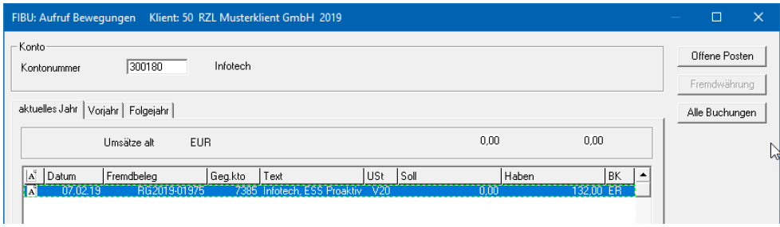
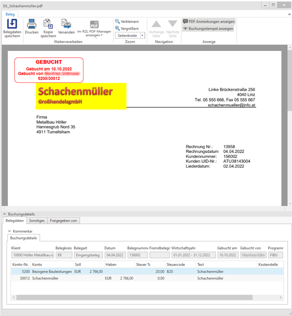
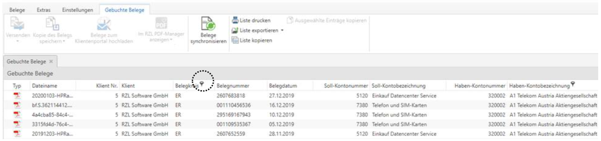
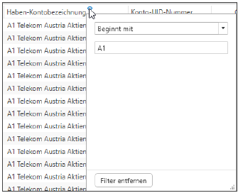
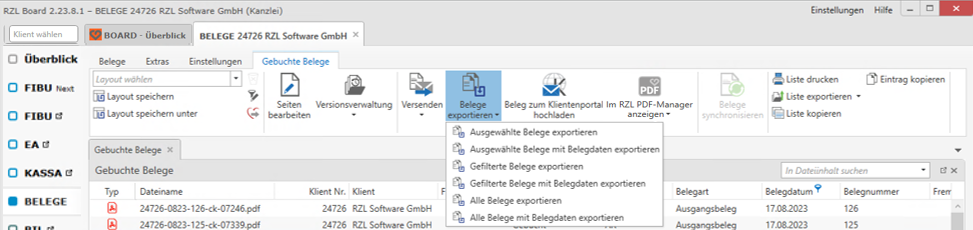
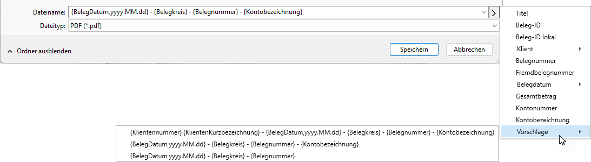
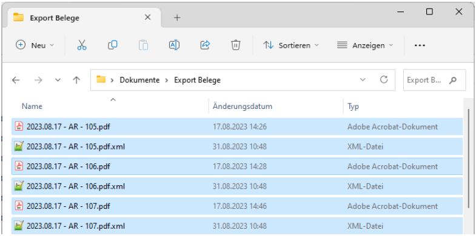

# Gebuchte Belege aufrufen

## Aufruf eines einzelnen Belegs in der RZL Fibu / EA-Rechnung

Über den Kontenaufruf (*Aufruf / Konten)* wird bei jeder Buchung mit
Beleg das Belegsymbol ganz links angezeigt.

Der Beleg einer Buchung kann mit Mausklick auf das Belegsymbol, der
F7-Taste oder mit der rechten Maustaste und *Aufruf DMS-Beleg*
aufgerufen werden.

Der Buchungsstempel ist nur hier im Belegaufruf ersichtlich und kann
optional ausgeblendet werden. Ganz unten werden die Buchungsdetails
angezeigt. Der geöffnete Beleg kann hier durch Anwahl der gewünschten
Schaltfläche gedruckt, gespeichert oder per E-Mail versendet werden.

## Aufruf mehrerer Belege im RZL Board (Dokumenten-Management-System)

Ein großer Vorteil der digitalen Belegablage ist das schnelle Auffinden
von mehreren Belegen mithilfe diverser Sortier- und Filtermöglichkeiten
im RZL Board.

### Filtern einzelner Spalten:

Pro Spalte kann mit Klick auf das Filtersymbol nach den jeweiligen Daten
gefiltert werden. Je nach Feld gibt es entweder Filtervorschläge oder
eine Textsuche (Beginnt mit, enthält, …).

  

### Nach Spalten sortieren:

Mit Klick auf eine beliebige, eingeblendete Spalte können die Daten
aufsteigend oder absteigend sortiert werden.

### Dateien mit strukturiertem Dateinamen exportieren:

Sowohl im klientenübergreifenden Bereich *BOARD / Belege* als auch
innerhalb eines geöffneten Klienten haben Sie im RZL Board in der
Belegverarbeitung die Möglichkeit, Belege bspw. für eine
Betriebsprüfung oder für Mitarbeiter, die keinen Zugriff auf RZL
haben, zu exportieren.
Folgende Funktionen stehen zur Verfügung:

-   Alle markierten Belege exportieren: „Ausgewählte Belege exportieren“

-   Alle Belege, die aufgrund der gesetzten Filter angezeigt werden:
„Gefilterte Belege exportieren“

-   Alle Belege dieses Klienten: „Alle Belege exportieren“

Der Export der Belege ist in allen Ansichten (*Ungebuchte
Belege/Gebuchte Belege*) möglich. Um mehrere Belege zu exportieren,
müssen Sie diese vor Auswahl der Funktion markieren (mittels Strg oder
Umschalt-Taste und Klick auf die gewünschten Belege).

Nach Auswahl der Funktion *Belege exportieren / Belege mit Belegdaten
exportieren* öffnet sich ein Speicherdialog. Dort haben Sie die
Möglichkeit, über die Pfeiltaste Platzhalter für den Dateinamen der
Belege zu vergeben. Ein gesetzter Platzhalter setzt die Belegdaten des
jeweiligen Belegs in den generierten Dateinamen.

Über die Auswahl *Vorschläge* werden von uns ein paar mögliche
Kombinationen von Platzhaltern vorgeschlagen.

Die ausgewählten Platzhalter sollten idealerweise je Beleg eindeutig
sein. Sollte dies nicht der Fall sein, werden Belege mit
gleichlautendem Dateinamen fortlaufend durchnummeriert ((1), (2),
(3),…).

Im gewählten Speicherort finden Sie nach erfolgreichem Export pro
Beleg eine Datei.

Um Belege in einer anderen Installation wieder einspielen zu können,
müssen die Belege mit Belegdaten exportiert werden. Details dazu
finden Sie in der Kurzanleitung *Belege mit XML-Belegdaten exportieren
und in andere Installation importieren.*

