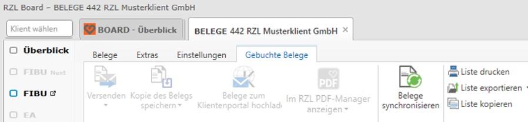
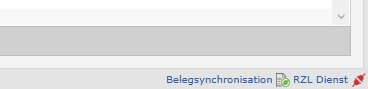

# Automatische Belegsynchronisation zur Belegbox am RZL Klientenportal

## Belegsynchronisation einrichten

Es besteht die Möglichkeit, digitale Belege automatisiert – über die
digitale Belegbox des RZL Klientenportals – dem Klienten Online inkl.
Belegdaten bzw. Buchungsdetails bereitzustellen. Somit hat Ihr Klient
jederzeit Online Zugriff auf die gebuchten Belege.

Zusätzlich kann die Belegsynchronisation auch genutzt werden, um Belege
zwischen verschiedenen RZL Installationen (z.B. Steuerberater und
Klient) zu synchronisieren. Somit entfällt auch der manuelle Upload von
Belegen in die Belegbox am Klientenportal.

Folgende Schritte sind zur Einrichtung notwendig:

-   Einmalige Definition eines *Service-Account-Passwortes* am RZL
    Klientenportal im Bereich *Stammdaten / Portal / Sonstige
    Einstellungen.* Dieses kanzleiweite Passwort dient ausschließlich
    der Synchronisation von Belegen (und Klienten-Stammdaten).

-   Hinterlegung dieses Service-Account-Passwortes im RZL Board im
    Bereich *STAMM / Einstellungen / Klientenportal Synchronisation.*

-   Aktivierung der Checkbox *Belegsynchronisation aktivieren* pro
    Klient im Bereich *STAMM / Klientenportal.* Somit werden die Belege
    automatisch in die Belegbox des Klientenportals geladen und Online
    bereitgestellt.

-   Falls die Belege mit einer 2. Installation synchronisiert werden
    sollen (wenn der Klient mit RZL FIBU und Belegverarbeitung
    arbeitet), muss auf Klientenseite ebenfalls die Belegsynchronisation
    aktiviert werden mit dem zusätzlichen Hakerl bei *Fremdes RZL
    Klientenportal verwenden.* Hier muss dann unter *Zugang fremdes
    Klientenportal* der Klientenportal-Benutzer hinterlegt werden.

Die Synchronisation der Belege wird anschließend mit aktiviert Option
*Automatisch synchronisieren* im Hintergrund alle 10 Minuten ausgeführt
bzw. kann im RZL Board im Bereich *Belege* bei den Beleglisten über die
Funktion *Belege synchronisieren* jederzeit manuell angestoßen werden.

Deaktiviert man die Checkbox *Automatisches synchronisieren* muss die
Belegsynchronisation manuell angestoßen werden. Entweder direkt beim
Klienten in einer der Beleglisten über die Schaltfläche *Belege
synchronisieren* oder für alle Klienten in einer klientenübergreifenden
Belegliste.

!!! warning "Hinweis"
    Nach dem Hereinspielen eines Klienten wird automatisch der Abgleich
    zwischen FIBU und Modul Belege lt. nachfolgendem Punkt *Repairfunktion
    in der Finanzbuchhaltung* durchgeführt – die Belege können somit bei
    beiden Installationen aufgerufen werden.

## Protokoll Belegsynchronisation

In der Ansicht *Extras / Protokoll Belegsynchronisation* finden Sie eine
Aufstellung der Hoch- bzw. Heruntergeladenen Belege über die
Belegsynchronisation.

## Status Belegsynchronisation

{width="300"}

Im RZL Board finden Sie ganz rechts ein kleines Symbol mit dem Status
der Belegsynchronisation. Ein grünes Symbol zeigt an, dass die letzte
Hintergrund-Synchronisation ordnungsgemäß durchgelaufen ist. Ein rotes
Symbol deutet auf zumindest ein Problem bei einem Klienten hin. Klicken
Sie einfach auf den Begriff *Belegsynchronisation*, um das Protokoll zu
öffnen.

Weitere Details zur Belegsynchronisation finden Sie in unserer
[Kurzanleitung](https://rzlsoftware.at/fileadmin/user_upload/PDF_Kurzanleitungen/BELEG/BELEG_Klientenportal_Synchronisation_Belege.pdf) (Menüpunkt *Hilfe / Kurzanleitungen* direkt im jeweiligen RZL Programm).
