# Modul Belege am RZL Klientenportal

Falls in der Steuerberatungs-Kanzlei bzw. bei Firmen für Außenstellen
das web-basierte RZL Klientenportal eingesetzt wird, können die
Mandanten/Mitarbeiter in der Außenstelle selbst – mit Hilfe des optional
zum Klientenportal verfügbaren *Zusatzmoduls „Belege“* – am
Klientenportal nicht nur Dokumente zur Verfügung stellen, sondern auch
die Belege der Buchhaltung bzw. Einnahmen-Ausgaben-Rechnung hochladen
und an die Kanzlei/Zentrale versenden.

Eine allgemeine Beschreibung des RZL-Klientenportals erhalten Sie
innerhalb der RZL-Programme im Programmteil *Hilfe / Handbücher /
Klienten-Portal Kanzlei/Klient*.

Für die Bereitstellung von Belegen über das RZL Klientenportal gehen Sie
bitte wie folgt vor:

*Bitte beachten Sie, dass dafür das Klientenportal Modul „Belege“
lizenziert sein muss!*

## Belege an den Steuerberater bzw. in die Zentrale übermitteln

### Belegkreise für das Klientenportal aktivieren

In den Stammdaten des jeweiligen Klienten im Bereich *Belegverarbeitung
/* *Allgemeines* werden die in der FIBU / EA angelegten Belegkreise
angezeigt. Sie können nun hier steuern, welche Belegkreise der Klient
bzw. die Außenstelle am Klientenportal auswählen kann.

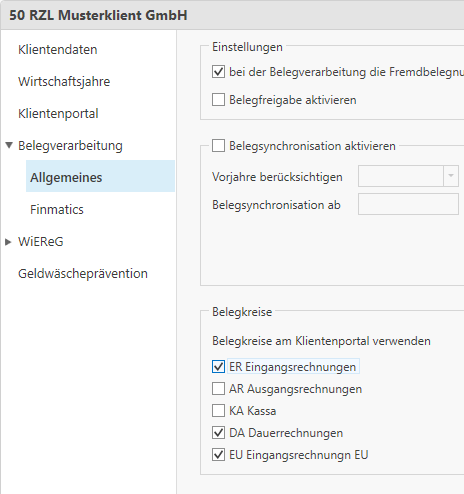

### Belege wie vorhanden übermitteln

Mit der Funktion *Belegbox / Belege übermitteln* können Sie Belege auf
das Klientenportal zur Bereitstellung an den Steuerberater/Zentrale
hochladen. Bei dieser Variante werden die Dateien wie vorhanden
hochgeladen. Falls z.B. der Klient 10 Rechnungen gescannt hat und der
Scanner daraus eine Datei erstellt hat, muss die Auftrennung und
Aufbereitung der Belege in der Kanzlei/Zentrale gemacht werden.

Wählen Sie nun den richtigen Belegkreis aus. Im Feld Datei(en) können
Sie über *Durchsuchen* beliebig viele Dateien von Ihrer Festplatte oder
Ihrem Netzwerk auswählen und hochladen.

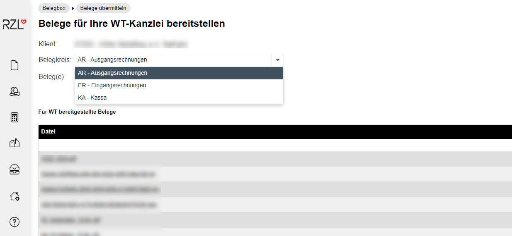

Nach dem Hochladen erhalten Sie eine Bestätigung, wie viele Dateien Sie
hochgeladen haben. Unterhalb werden die Dateien mit dem Dateinamen, der
Kategorie und dem Bereitstellungsdatum angezeigt.

Folgende Möglichkeiten haben Sie nach dem Hochladen:

-   Mit einem Klick auf den Dateinamen können Sie die Datei öffnen.

-   Mit einem Klick auf das grüne Symbol wird die Datei heruntergeladen

-   Mit dem roten X kann die Datei wieder vom Klientenportal gelöscht
    werden.

Die Übermittlung über das RZL Klientenportal bietet folgende Vorteile:

-   SSL verschlüsselte Übertragung der Belege.

-   Keine Beschränkung der Dateigrößen im Gegensatz zur Übermittlung per
    Mail.

-   Abholung der Belege direkt im Modul Belege an der richtigen Stelle.

-   Der Klient bzw. die Außenstelle kann die gescannten Belege bereits
    aufbereiten (Seiten zusammenfassen, Leerseiten löschen, Belegkreis
    zuord­nen, usw.).

### Belege mit dem RZL Scan-Manager übermitteln

Falls Ihr Klient die Belege vor dem Hochladen noch aufbereiten möchte
(Seiten trennen, zusammenfügen, drehen, löschen usw.), kann der RZL
Scan-Manager verwendet werden (*Belegbox / Belegscanmanager* *starten*).

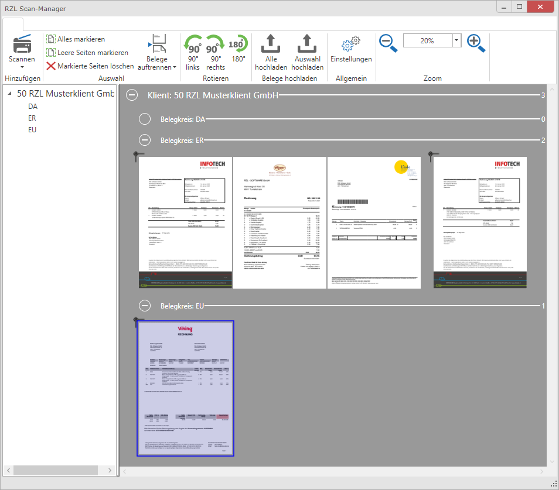

#### Eintragung der Verbindungseinstellungen

Damit Belege über den RZL Scan-Manager hochgeladen werden können müssen
Sie als ersten Schritt nach Anwahl der Schaltfläche *Einstellungen* die
entsprechenden Eintragungen vornehmen.

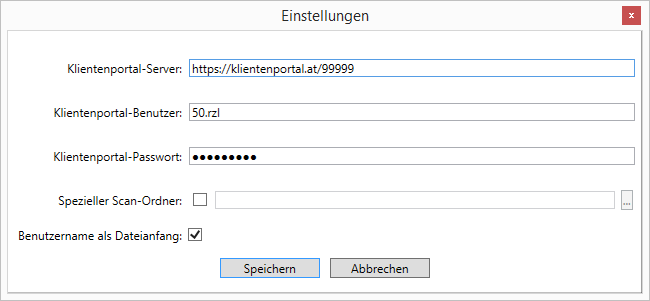

Im Feld *Server* tragen Sie die Adresse ein, wie im Handbuch
Klientenportal *(Hilfe / Handbuch / Klienten-Portal Klient)* Kapitel
Start beschrieben. In den Feldern *Benutzer* und *Passwort* muss Ihr
„normaler“ Log-In – mit dem Sie sich am RZL Klientenportal anmelden –
eingetragen werden.

Wenn Sie nicht direkt im Scanmanager scannen, sondern z.B. mit einem
Netzwerk-Scanner können Sie im Scanmanager hinterlegen, auf welchen
Scan-Ordner zugegriffen werden soll.

Die Funktion *Benutzername als Dateianfang* fügt bei den übermittelten
Dateien den Benutzernamen an den Anfang des Dateinamens (z.B. wird aus
einer Datei mit dem Namen „Beleg Huber“ der Name
„50.rzl\_Beleg\_Huber“).

#### Belege scannen und hochladen

Grundsätzlich besteht die Möglichkeit, die Belege mit einem
angeschlossenen Scanner direkt zu scannen und dann hochzuladen oder
bereits gescannte Belege aus einem Ordner auszuwählen und nur
hochzuladen.

Um Belege jetzt zu scannen klicken wählen Sie links oben den gewünschten
Scanner aus. Angezeigt werden nur Geräte, für welche ein passender
Treiber installiert ist.

Nach Auswahl und Klick auf den gewünschten Scanner wird ein Vordialog
angezeigt, wo der Belegkreis (und ev. der Klient) ausgewählt werden
muss.

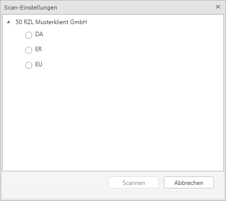

Anschließend wird dann der Dialog des Scanner-Herstellers aufgerufen und
Sie können die Belege einscannen.

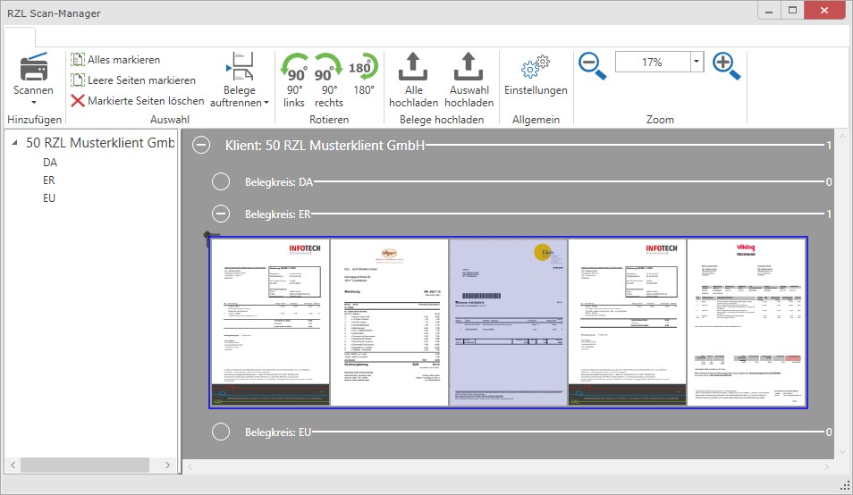

In diesem Beispiel wurden 5 Seiten eingescannt. Mit der Funktion
*Belege* auftrennen können Sie die Seiten in Einzelseiten trennen und
anschließend wieder eventuelle mehrseitige Belege wieder zusammenfügen.
Nutzen Sie dazu entweder die Maus per Drag & Drop oder die rechte
Maustaste um markierte Seiten zusammenzufügen. Zusätzlich können die
Seiten mit der rechten Maustaste gedreht werden.

Wurden Belege beim Scannen einer falschen Belegart zugeordnet können in
diesem Dialog Belege auch in eine andere Belegart gezogen werden.

Weitere Funktionen mit der rechten Maustaste sind:

-   90° rechts oder links, 180° drehen

-   Löschen

-   Seiten zusammenfügen

-   Seiten auftrennen

-   Löschen

-   Beleg auftrennen

-   Beleg ins Dateisystem exportieren

-   Alles markieren

-   Leere Seiten markieren

-   Seite öffnen

-   Datei öffnen

-   Änderungen zurücksetzen

Damit die Belege an Ihre Steuerberatungs-Kanzlei übermittelt werden,
müssen Sie die Schaltfläche *Alle hochladen* oder *Auswahl hochladen*
anwählen.

Nach dem Hochladen kommt eine Bestätigungsmeldung, dass die Belege auf
das Klientenportal hochgeladen wurden.

#### Bereits vorhandene Belege in den RZL Scan-Manager einfügen

Wenn die Belege bereits als Dateien auf der Festplatte oder im Netzwerk
abgespeichert sind, also nicht mehr eingescannt werden müssen, öffnen
Sie den Ordner, in dem die Belege abgespeichert sind.

Ziehen Sie nun mit Hilfe der Maus die gewünschten Belege per Drag & Drop
in den RZL Scan-Manager auf den gewünschten Belegkreis.

### Belege vom Klientenportal ins Modul Belege im RZL Board übernehmen

In der RZL Belegverarbeitung können Sie nach dem Öffnen des jeweiligen
Klienten im Bereich *BELEGE* mit dem Button *Belege Klientenportal* die
Belege beim entsprechenden Klienten aufrufen. Im Symbol wird Anzahl der
Belege angezeigt, die bei diesem Klienten vom Klientenportal abgeholt
werden können.

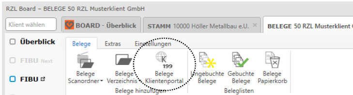

Die Zuordnung zum Klienten und zum Belegkreis ist hier nicht mehr
notwendig, da dies bereits am Klientenportal erledigt wurde. Die
Texterkennung von Klientenportal-Belegen wird wie bei Scanordnern
ebenfalls im Hintergrund durchgeführt (außer Sie haben diese
Einstellungen in den Stammdaten der Texterkennung deaktiviert).

Die weitere Aufbereitung und Bearbeitung erfolgt ident zu einem
„normalen“ Belegverarbeitung mit Scanordner.

Mit der Übernahme der Belege ins Modul Belege werden diese vom
Klientenportal wieder gelöscht.

Beim Löschen eines Beleges in dieser Ansicht wird der Beleg in den
*Belege Papierkorb* abgelegt.

## Automatische Belegsynchronisation zur Belegbox am RZL Klientenportal

### Belegsynchronisation einrichten

Es besteht die Möglichkeit, digitale Belege automatisiert – über die
digitale Belegbox des RZL Klientenportals – dem Klienten Online inkl.
Belegdaten bzw. Buchungsdetails bereitzustellen. Somit hat Ihr Klient
jederzeit Online Zugriff auf die gebuchten Belege.

Zusätzlich kann die Belegsynchronisation auch genutzt werden, um Belege
zwischen verschiedenen RZL Installationen (z.B. Steuerberater und
Klient) zu synchronisieren. Somit entfällt auch der manuelle Upload von
Belegen in die Belegbox am Klientenportal.

Folgende Schritte sind zur Einrichtung notwendig:

-   Einmalige Definition eines *Service-Account-Passwortes* am RZL
    Klientenportal im Bereich *Stammdaten / Portal / Sonstige
    Einstellungen.* Dieses kanzleiweite Passwort dient ausschließlich
    der Synchronisation von Belegen (und Klienten-Stammdaten).

-   Hinterlegung dieses Service-Account-Passwortes im RZL Board im
    Bereich *STAMM / Einstellungen / Klientenportal Synchronisation.*

-   Aktivierung der Checkbox *Belegsynchronisation aktivieren* pro
    Klient im Bereich *STAMM / Klientenportal.* Somit werden die Belege
    automatisch in die Belegbox des Klientenportals geladen und Online
    bereitgestellt.

-   Falls die Belege mit einer 2. Installation synchronisiert werden
    sollen (wenn der Klient mit RZL FIBU und Belegverarbeitung
    arbeitet), muss auf Klientenseite ebenfalls die Belegsynchronisation
    aktiviert werden mit dem zusätzlichen Hakerl bei *Fremdes RZL
    Klientenportal verwenden.* Hier muss dann unter *Zugang fremdes
    Klientenportal* der Klientenportal-Benutzer hinterlegt werden.

Die Synchronisation der Belege wird anschließend mit aktiviert Option
*Automatisch synchronisieren* im Hintergrund alle 10 Minuten ausgeführt
bzw. kann im RZL Board im Bereich *Belege* bei den Beleglisten über die
Funktion *Belege synchronisieren* jederzeit manuell angestoßen werden.

Deaktiviert man die Checkbox *Automatisches synchronisieren* muss die
Belegsynchronisation manuell angestoßen werden. Entweder direkt beim
Klienten in einer der Beleglisten über die Schaltfläche *Belege
synchronisieren* oder für alle Klienten in einer klientenübergreifenden
Belegliste.

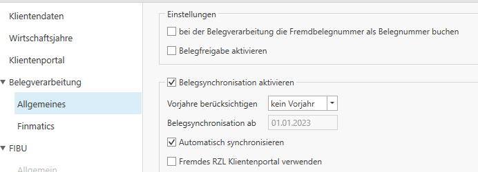

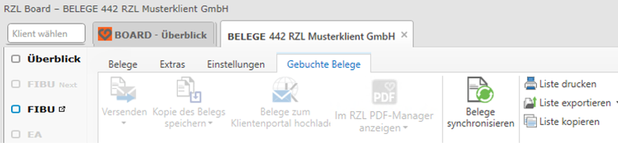

Hinweis

Nach dem Hereinspielen eines Klienten wird automatisch der Abgleich
zwischen FIBU und Modul Belege lt. nachfolgendem Punkt *Repairfunktion
in der Finanzbuchhaltung* durchgeführt – die Belege können somit bei
beiden Installationen aufgerufen werden.

### Protokoll Belegsynchronisation

In der Ansicht *Extras / Protokoll Belegsynchronisation* finden Sie eine
Aufstellung der Hoch- bzw. Heruntergeladenen Belege über die
Belegsynchronisation.

### Status Belegsynchronisation

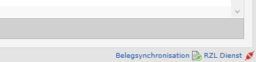

Im RZL Board finden Sie ganz rechts ein kleines Symbol mit dem Status
der Belegsynchronisation. Ein grünes Symbol zeigt an, dass die letzte
Hintergrund-Synchronisation ordnungsgemäß durchgelaufen ist. Ein rotes
Symbol deutet auf zumindest ein Problem bei einem Klienten hin. Klicken
Sie einfach auf den Begriff *Belegsynchronisation*, um das Protokoll zu
öffnen.

Weitere Details zur Belegsynchronisation finden Sie in unserer
Kurzanleitung (Menüpunkt *Hilfe / Kurzanleitungen* direkt im jeweiligen
RZL Programm).

## Gebuchte Belege manuell in die Belegbox des Klienten hochladen

Als Alternative zur automatischen Belegsynchronisation gibt es auch die
Möglichkeit, die Belege manuell in die Belegbox des Klientenportals
**inkl. Buchungsinfos** hochzuladen.

Im Modul Belege werden dazu beim Klienten im Bereich *Gebuchte Belege*
die gewünschten Belege markiert und mit der Funktion *Belege zum
Klientenportal hochladen* (im Ribbon oder mit der rechten Maustaste) am
Klientenportal bereitgestellt.

Tipp

Sortieren Sie die gebuchten Belege nach dem Importdatum, somit wissen
Sie genau, welche Belege zuletzt importiert wurden. Zusätzlich haben Sie
in der Spalte Hochgeladen die Information, welche Belege bereits auf das
Klientenportal übertragen wurden.

Die Klienten/Außenstelle können auf diese digitale Belegbox jederzeit
bequem und ortsunabhängig über Internet (auch für mobile Geräte
optimiert) zugreifen (*Belegbox / gebuchte Belege)* und zum Aufrufen und
Herunterladen von Belegen nutzen.

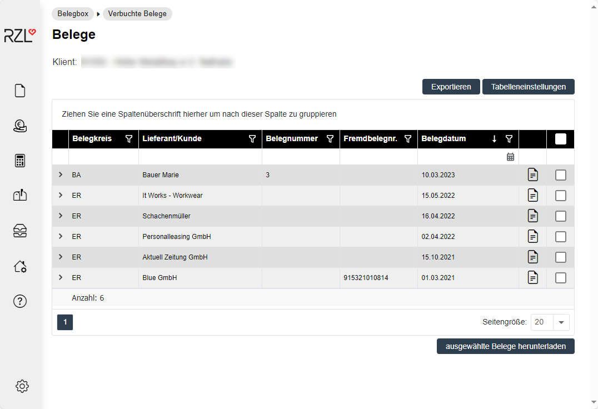

Die Belegliste kann über einfache Such-/Gruppier- und Filterfunktionen
auf die gewünschten Belege/den gewünschten Beleg eingeschränkt werden.

## Übersicht Belege zum Abholen

Ohne geöffnetem Klienten finden Sie im Bereich *BELEGE / Belege / Belege
zum Abholen* eine Übersicht aller Klienten mit der Anzahl der noch
abzuholenden Belege vom Klientenportal oder von Finmatics:

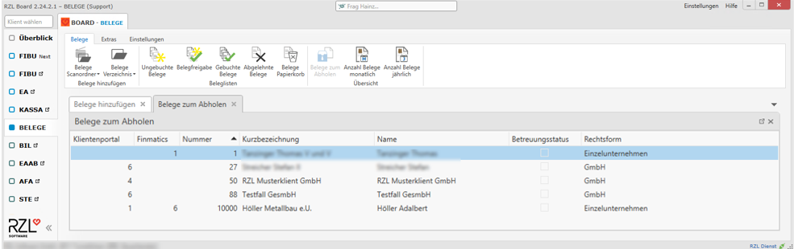