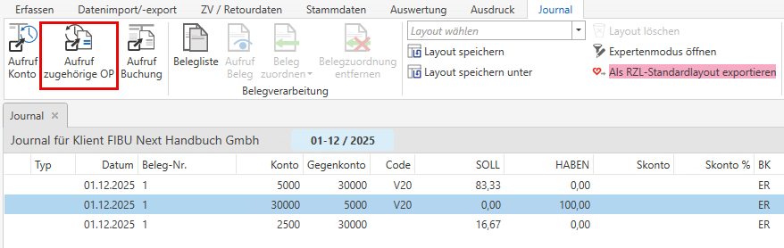
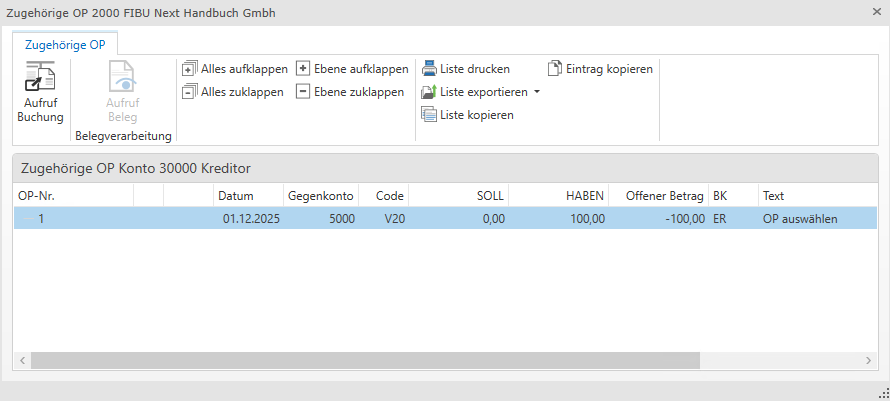

# Journal

## Auswertung Journal

Durch die Anwahl des Menüpunktes *Auswertung / Journal* können Sie das Journal mit sämtlichen Buchungen aufrufen.

!!! info "Tipp"

    Mit den Filter- und Sortierfunktionen in den Spaltenüberschriften können Sie das Journal nach individuellen Vorstellungen einschränken bzw. bearbeiten.

!!! info "Tipp"
    Mit der Spalte *Betrag (Soll/Haben*), welche optional eingeblendet werden kann, können Sie nach Beträgen suchen, ohne eine Einschränkung auf die Soll- oder Haben-Seite. Das heißt, Sie können diese Funktion verwenden, falls Sie nach Beträgen suchen möchten und nicht wissen, ob diese auf der Soll- oder Habenseite gebucht wurden.

## Aufruf zugehörige OP

Wenn eine Buchung markiert ist, die mit einem Offenen Posten gebucht wurde, kann über das Kontextmenü die Funktion ***Aufruf zugehörige OP*** gestartet werden. 

Es öffnet sich ein Fenster ähnlich der Buchungsansicht, das alle zugehörigen OPs anzeigt - inklusive Teil-OPs, egal ob diese bereits ausgeglichen wurden oder nicht.

!!! warning "Hinweis"

    Die Funktion funktioniert ausschließlich für **OP-führende Konten**.