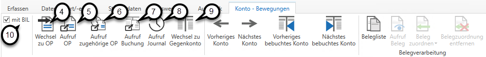

# Konto

## Auswertung Konto

Durch die Anwahl des Menüpunktes *Auswertung / Konto* können Sie die auf diesem Konto erfassten Bewegungen aufrufen.

Geben Sie die gewünschte *Kontonummer* ***(1)*** ein und bestätigen Sie diese mit der *ENTER-Taste. *Anschließend sind alle Bewegungen für das gewählte *Wirtschaftsjahr* ***(2)*** und der Saldo des Kontos ersichtlich.
Stehen Sie mit dem Mauszeiger auf einer Zeile, so sehen Sie per Tooltip ***(3)*** den Kontosaldo bis zur entsprechenden Bewegung.

Über die entsprechenden Schaltflächen im Menü können Sie nach Anwahl einer Buchungszeile zur *Auswertung OP* ***(4)*** wechseln, die Offenen Posten zu diesem Konto aufrufen ***(5)*** oder die zugehörigen Offenen Posten zu der ausgewählten Buchungszeile aufrufen ***(6)***. Die Button *Wechsel zu OP*, *Aufruf OP* und *Aufruf zugehörige OP* sind nur aktiv, wenn es sich um ein Konto handelt, bei dem die OP-Verwaltung aktiv ist. Weiters können Sie die Buchung der ausgewählten Buchungszeile aufrufen ***(7)***, das *Journal* aufrufen ***(8)*** oder zum *Gegenkonto* ***(9)*** wechseln.

Zusätzlich können Sie mit dem Häkchen *mit BIL* ***(10)*** wählen, ob auch die Umbuchungen aus der Bilanz, welche bereits in die FIBU Next übergeben wurden, mit angezeigt werden sollen.

!!! info "Tipp"

    Ein schnelles Blättern zwischen den Konten ist mit den Schaltflächen *Vorheriges / Nächstes Konto* oder *Vorheriges / Nächstes bebuchtes Konto* möglich.
