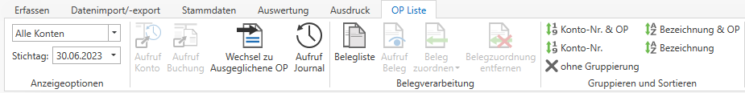

# OP-Liste

## Auswertung OP-Liste

Über den Menüpunkt *Auswertung / OP Liste* können Sie die gesamte OP Liste aufrufen. Mit den *Anzeigeoptionen* können Sie die Liste auf Debitoren, Kreditoren oder Bestandskonten einschränken und einen Stichtag angeben.

Zusätzlich können Sie über die Menüleiste das entsprechende Konto oder die Buchung bzw. das gesamte Journal aufrufen oder auch zu den ausgeglichenen OPs wechseln. Auch eine Anzeige der Belegliste oder eines zugeordneten Belegs ist hier möglich.

Im Bereich *Gruppieren und Sortieren* finden Sie verschiedenste Möglichkeiten um Ihre OP-Liste anzuordnen.

