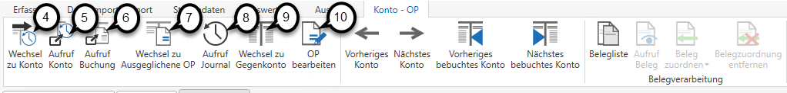

# OP

## Auswertung OP

Über den Menüpunkt *Auswertung / OP* können Sie bei aktiver OP-Verwaltung (siehe Kapitel [Einrichtung der OP-Verwaltung](../OP%20Verwaltung.md#einrichtung-der-op-verwaltung)) die Offenen Posten aufrufen.

Geben Sie die gewünschte *Kontonummer* ***(1)*** ein und bestätigen Sie diese mit der *ENTER-Taste.* Anschließend sind alle Offene Posten des Personenkontos im gewählten *Wirtschaftsjahr* ***(2)*** ersichtlich.

Im unteren Bereich wird Ihnen die Summe der Offenen Posten, der Kontosaldo und die Differenz zwischen den Offenen Posten und dem Kontosaldo angeführt ***(3)***.

Über die entsprechenden Schaltflächen im Menü können Sie zur *Auswertung Konto* ***(4)*** wechseln, das entsprechende Konto ***(5)*** oder die Buchung zur ausgewählten Buchungszeile ***(6)*** aufrufen. Weiters können Sie in die Ansicht der ausgeglichenen OPs wechseln ***(7)***, das *Journal* ***(8)*** aufrufen, zum *Gegenkonto* ***(9)***  oder direkt zum *OP bearbeiten* ***(10)*** wechseln.

Sie können hier außerdem die Belegliste oder bereits zugeordnete Belege aufrufen und die Belegzuordnung verändern.

!!! info "Tipp"

    Ein schnelles Blättern zwischen den Konten ist mit den Schaltflächen *Vorheriges / Nächstes Konto* oder *Vorheriges / Nächstes bebuchtes Konto* möglich.

