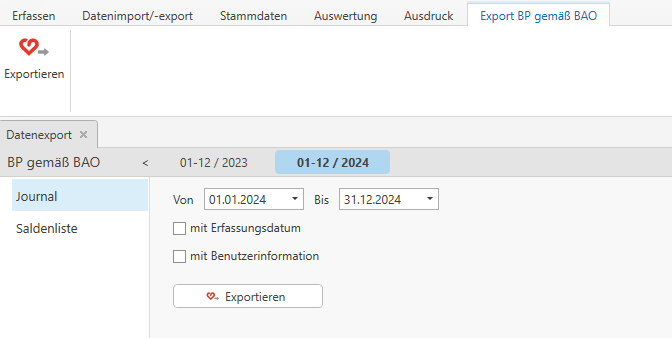

# Export BAO

## Datenexport

Unter dem Menüpunkt *Datenimport/-export / Datenexport / BP gemäß* *BAO* können Sie das Journal und die Saldenliste für die Betriebsprüfung exportieren.

Die Ausgabe kann auf einen bestimmten Zeitraum eingeschränkt und falls gewünscht kann das Journal mit *Erfassungsdatum* und *Benutzerinformationen* ausgegeben werden.

