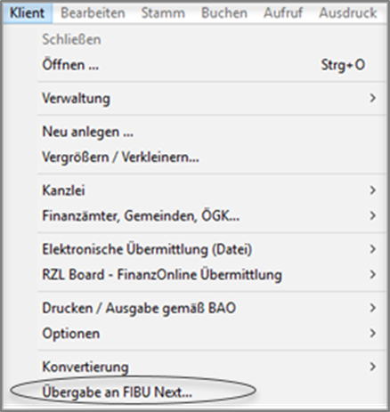
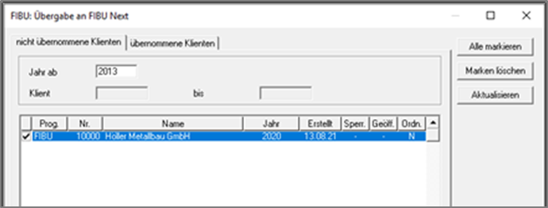
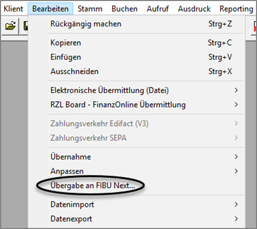
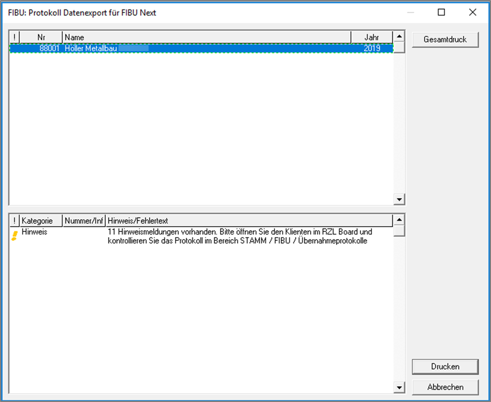
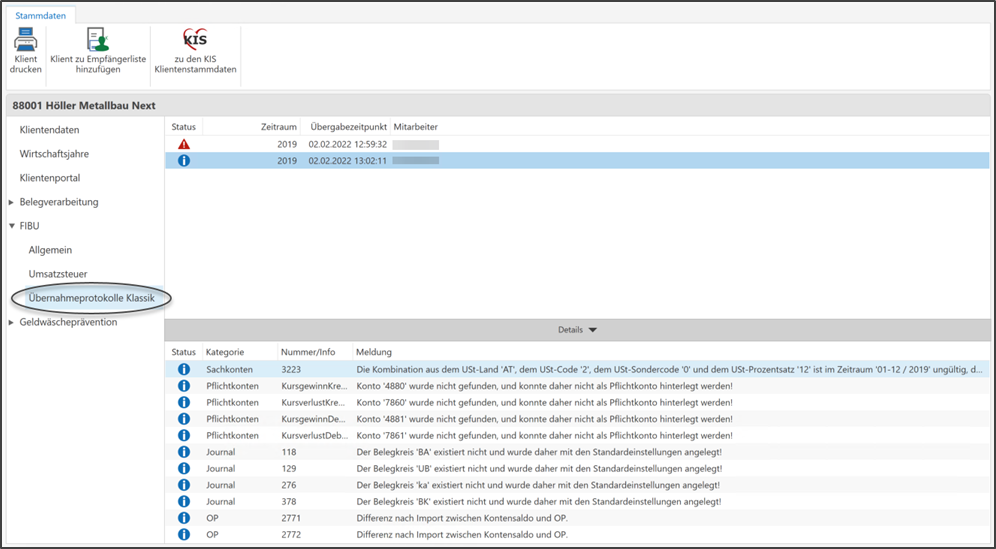
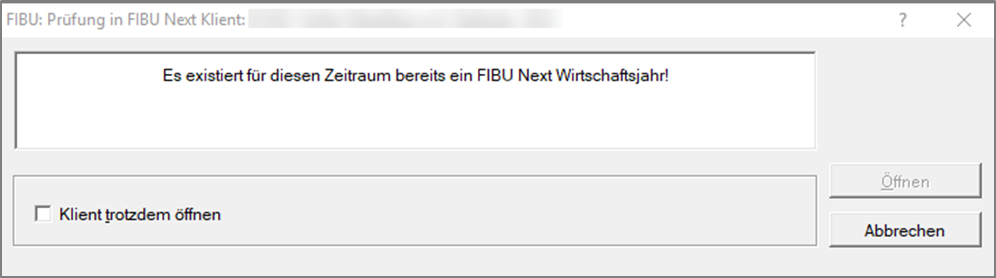

# Datenübernahme

### aus der FIBU Klassik

Als ersten Schritt müssen die Stammdaten des Klienten im RZL Board angelegt sein. Ist dies nicht der Fall, so können Sie die Stammdaten mittels der ZMV Klientenübernahme ins RZL Board übernehmen. Genaueres dazu finden Sie im Handbuch ***RZL Board*** im Kapitel *ZMV Klientenübernahme*.

Um mit der Umstellung von FIBU Next auf FIBU Klassik beginnen zu können, müssen Sie die Daten einmalig von der FIBU-Klassik in FIBU Next übernehmen. In der FIBU-Klassik vorhandene Kontenpläne, KER-Gliederungen sowie Buchungstexte werden bei der Übernahme ebenfalls in die FIBU Next mitübernommen. Um die Übernahme zu initiieren gibt es zwei Möglichkeiten. 

Um mehrere Klienten gleichzeitig zu übernehmen, wählen Sie in der FIBU Klassik den Menüpunkt *Klient / Übergabe an FIBU Next…* an.

Im Anschluss erhalten Sie eine Liste aller noch nicht übernommenen FIBU Klassik Klienten. Hier können Sie auswählen welchen Klienten Sie ab welchem Jahr in die FIBU Next übernehmen möchten. Mit einem Klick auf die Schaltfläche *Übergeben* rechts unten können Sie den Übernahmevorgang anstoßen.

Möchten Sie hingegen nur den gerade in Bearbeitung befindlichen Klienten übernehmen, so öffnen Sie den Menüpunkt *Bearbeiten / Übergabe an FIBU Next*.

Nach erfolgter Übernahme erhalten Sie ein Protokoll über den Datenexport für FIBU Next. Dieses kann im RZL Board beim jeweiligen Klienten unter *STAMM / FIBU / Übernahmeprotokoll* aufgerufen werden.

!!! info "Tipp"
    Auch Klienten, bei denen in der FIBU Klassik die Salden händisch erfasst wurden, können in die FIBU Next übernommen werden.

Wurde ein Klient bereits in die FIBU Next übernommen und anschließend wieder in der FIBU Klassik geöffnet, erscheint beim Öffnen folgende Hinweismeldung.

