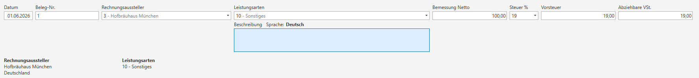
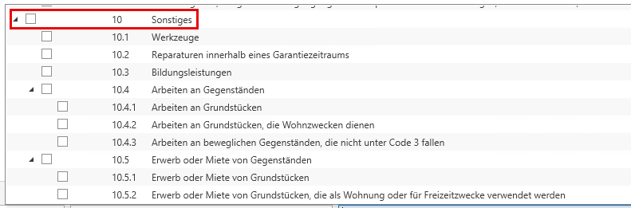
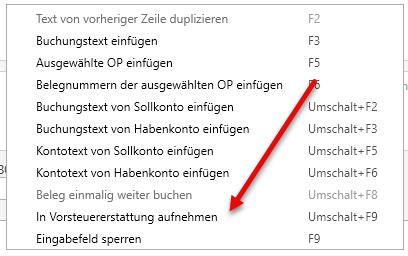

# Elektronische Vortsteuererstattung

Die Vorsteuererstattung ermöglicht es österreichischen Unternehmen im EU-Ausland bezahlte Umsatzsteuer zurückzufordern, da diese nicht über die österreichische Umsatzsteuervoranmeldung geltend gemacht werden kann. 
Der Antrag wird über die Finanzonline eingebracht, aber vom jeweiligen ausländischen Finanzamt geprüft und erstattet.

In der FIBU Next kann die elektronische Vorsteuererstattung für EU-Länder automatisch gebucht, als XML-Datei erstellt und anschließend über Finanzonline hochgeladen werden.

## Anlage der notwendigen Stammdaten

### Aktivierung der VSt-Erstattung
Um die VSt-Erstattungsanträge aus dem Programm erstellen zu können, müssen Sie über *STAMM / FIBU Next / Allgemein* die Option *Vorsteuererstattung in der EU* auswählen. 

Auch die darunter befindlichen Optionen müssen bei Zutreffen angehakt werden, da die VSt-Erstattung nicht zulässig ist, wenn

- Ausschließlich Lieferungen oder sonstige Leistungen ausgeführt wurden, die ohne Recht auf VSt-Abzug von der Steuer befreit sind.
- Die Steuerbefreiung für Kleinunternehmer in Anspruch genommen wurde.
- Die Durchschnittssatzbesteuerung für land- und forstw. Betriebe in Anspruch genommen wurde.

### Aktivierung nur für VSt-Erstattung

Die Auswahl der Option *nur für Vorsteuererstattung* bewirkt, dass dieses USt-Land nur für Zwecke der Vorsteuererstattung angelegt wird. Bei Auswahl dieser Option muss unter *Stammdaten / Pflichtkonten / USt* für das ausgewählte USt-Land das **Vorsteuersammelkonto** hinterlegt sein. In der Folge können für dieses USt-Land in den Stammdaten der Konten nur mehr die Codes: **ohne Steuer, VSt-Hinterlegungen, nicht abzugsf. VSt,** hinterlegt werden, damit nicht irrtümlicherweise Buchungen mit MWSt für dieses Land durchgeführt werden.

### Anlegen der Rechnungsausteller
Bei der elektronischen Übermittlung des VSt-Erstattungsantrages sind auch die Daten der Rechnungsausteller elektronisch zu übermitteln und müssen daher im Programm angelegt werden.

Die Rechnungsaussteller müssen im Klienten über *VSt-Erstattung EU / Rechnungsausteller* angelegt werden.

Über die Kontonummer kann ein Personenkonto ausgewählt werden. Ist die Option *Person aus Konto verwenden* aktiviert, werden die Personendaten automatisch aus dem Personenkonto übernommen. 

!!! warning "Hinweis"

    Die zugeordnete Person kann dann nicht mehr geändert werden. Adresse und UID können bei Bedarf dennoch angepasst werden.

Ist die Option nicht aktiviert, kann die Person unabhängig vom Personenkonto manuell ausgewählt oder geändert werden.
Beim Löschen eines Rechnungsaustellers bleibt die zugeordnete Person erhalten. Das Löschen ist nur möglich, wenn noch keine Erfassungszeilen vorhanden sind.

!!! warning "Hinweis"

    Im Regelfall sind der Staat und das EU-Land der Rückerstattung identisch. In Ausnahmefällen, wie z. B. beim Import, kann das EU-Land der Rückerstattung vom Staat des Rechnungsaustellers abweichen. In diesem Fall ist die Option *Importeur* anzuwählen.

Wird der Vermerk *nur Kleinbetragsrechnungen* gesetzt, ist die UID-Nummer nicht zwingend notwendig. Die Art der Leistung kann beim Rechnungsausteller verankert werden und wird beim Erfassen der Vorsteuererstattung vorgeschlagen, kann dort aber auch überschrieben werden.

### Anlegen des EU-Landes des Rechnungsaustellers
Voraussetzung für die elektronische Einreichung eines Vorsteuererstattungsantrags ist, dass

-	keine Lieferungen oder sonstige Leistungen sowie keine innergemeinschaftlichen Erwerbe getätigt wurden, oder

-	nur Leistungen bewirkt wurden, bei denen die Steuerschuld auf den Leistungsempfänger übergangen ist (Reverse Charge) und/oder nur steuerfreie Beförderungsleistungen und damit verbundene Nebentätigkeiten mit Recht auf Vorsteuerabzug bewirkt wurden.

Es muss daher über *VSt-Erstattung EU / EU-Länder* für die Länder, die bei einem Rechnungsausteller hinterlegt sind, bei Zutreffen eine der beiden Optionen aktiviert sein, damit eine elektronische Übermittlung möglich ist.

Unter bestimmten Bedingungen muss im Antrag der Vorsteuererstattung die Art der vom Rechnungsausteller erbrachten Leistung textlich erläutert werden. Daher kann bei den Stammdaten des EU-Landes des Rechnungsaustellers die Sprache der Erläuterung hinterlegt werden. Standardmäßig ist die jeweilige Landessprache hinterlegt.

## Erfassung der Erstattungsrechnungen

Über *VSt-Erfassung EU / Erfassen* können Sie Erstattungsrechnungen erfassen. Diese Erfassung ist unabhängig vom Buchen und kann nachträglich durchgeführt werden.

Sie gelangen in folgenden Dialog:

-	**Datum:** Rechnungsdatum in dem Format TTMMJJJJ
-	**Beleg:** Rechnungsnummer

!!! warning "Hinweis"

    Im Kontextmenü kann die Option *Als Importeur übermitteln* explizit ausgewählt werden. Die Verwendung ist nur zulässig, wenn der Rechnungsausteller als Importeur geführt wird.

-	**Rg.-Austeller:** Eingabe der Nummer des Rechnungsaustellers. Der Rechnungsausteller kann entweder durch Eingabe der entsprechenden Nummer oder über das Dropdown-Menü ausgewählt werden.
-	**Leistungsarten:** In diesem Feld ist die Art der vom Rechnungsausteller erbrachten Leistung anhand von vorgegebenen Kategorien anzugeben. Über das Dropdown-Menü können die Codes/Subcodes aufgerufen werden. Es können **maximal 5 Arten gemeldet** werden.

!!! warning "Hinweis"

    Sollte durch keine der vorgegebenen Leistungsarten die betreffende Leistung abgedeckt sein, ist die *Art (10) Sonstiges* auszuwählen und dann im Feld *Text* in der beim EU-Land des Rechnungsaustellers hinterlegten Sprache zu erläutern. 

-	**Bemessung Netto:** Eingabe der Bemessungsgrundlage (Nettobetrag) in der Währung des Erstattungslandes (erfolgt am Bildschirm kein besonderer Hinweis, so sind die Beträge in Euro einzugeben)
-	**Steuer %:** Mit der Eingabe des Steuersatzes wird vom Programm die Vorsteuer ausgerechnet. Die Steuersätze können auch im Dropdown-Menü ausgewählt werden.
-	**Vorsteuer:** Vorsteuerbetrag lt. Rechnung
-	**Abziehbare VSt.:** abziehbare Vorsteuer
-	**Text:** Dieses Feld ist nur aktiv, wenn die *Art (10) Sonstiges* ausgewählt wurde.

### Erfassen außerhalb des Buchens

Wurde bei der Buchung keine Vorsteuererstattung erfasst, kann dies nachträglich über die Funktion *In VSt-Erstattung aufnehmen* unter *Auswertung / Konto oder Journal* erfolgen. Die Funktion steht im Kontextmenü zur Verfügung und wird nur angezeigt, wenn die Vorsteuererstattung im Stamm aktiviert ist.

Beim Aufruf öffnet sich der Erfassungsdialog der Vorsteuererstattung, wobei vorhandene Buchungsdaten automatisch übernommen werden. Für Zeiträume, für die bereits eine Meldung erstellt wurde, ist keine nachträgliche Übernahme mehr möglich. Übernommene Buchungen werden in der Spalte *VSt-Erstattung* mit einem Häkchen gekennzeichnet. Wird die Funktion erneut ausgeführt, öffnet sich die bereits vorhandene Erfassungszeile zur weiteren Bearbeitung.   

### Erfassen während des Buchens

Mit der Eingabe der Buchungszeile können auch schon Daten für die Vorsteuererstattung eingegeben werden. Der Eingabedialog erscheint, wenn

-	Ein Aufwandskonto mit einem USt-Land, bei dem die Option *nur für VSt-Erstattung* aktiviert ist
-	Ein Personenkonto, das bei einem Rechnungsausteller hinterlegt ist
-	Im Textfeld über das Kontextmenü oder über *Umschalt + F9* die Funktion In VSt-Erstattung aufnehmen ausgewählt wurde

Der Erfassungsdialog unterscheidet sich in der Folge nicht vom manuellen Erfassen.