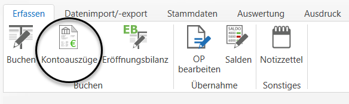
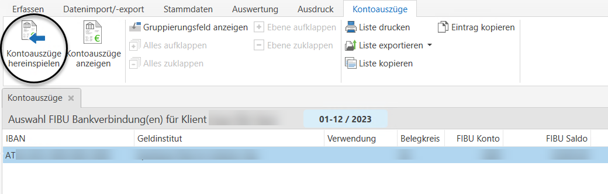
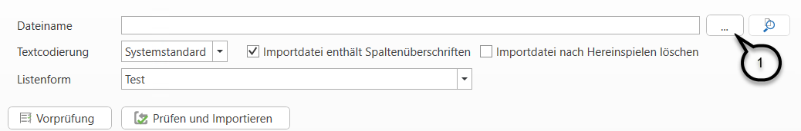
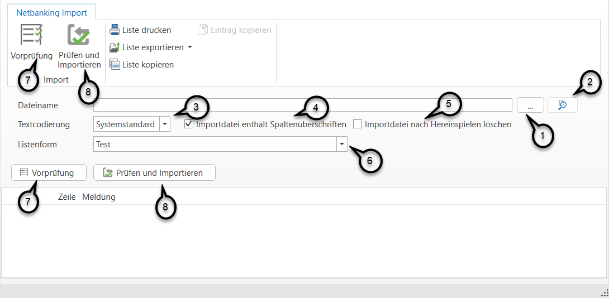
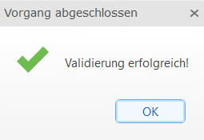
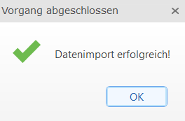
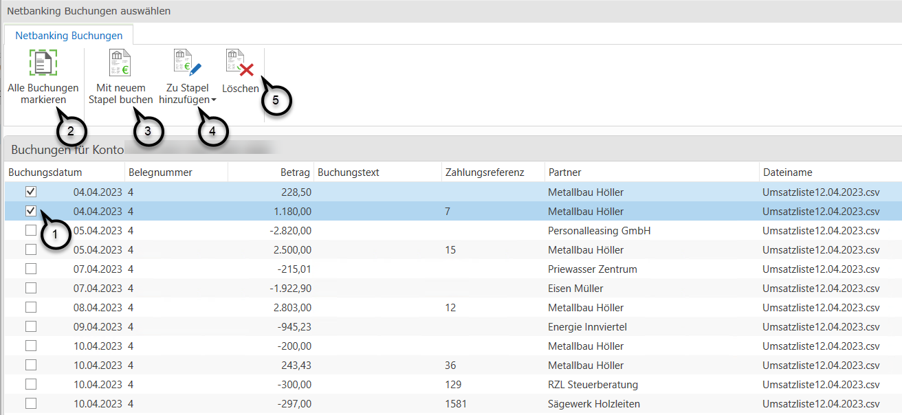
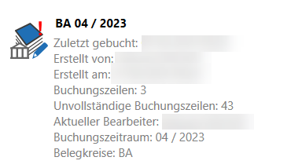

# Verarbeitung von Kontodaten mittels CSV/TXT-Datei (Netbanking)

### Verarbeitung von Kontodaten mittels CSV/TXT-Datei (Netbanking)

Damit eine automatisierte Verarbeitung von Kontoauszügen im Dateiformat .csv oder .txt (Netbanking) möglich ist, ist im Vorfeld die Anlage einer Listenform notwendig (siehe Kapitel [Listenformen Netbanking](../Stammdaten%20Vorlagen/Listenformen_Netbanking.md)).

Zusätzlich sind vorab die entsprechenden Bankverbindungen unter dem Menüpunkt *Stammdaten / FIBU Bankverbidung* zu hinterlegen (siehe Kapitel [FIBU Bankverbindungen](../Stammdaten%20FIBU%20Next/FIBUBankverbindungen.md)).

Nach einmaliger Anlage einer Listenform und Hinterlegung der Bankverbindungen können die Bankauszüge nach dem Export aus dem Online-Banking System importiert und anschließend automatisiert verarbeitet werden.

### Hereinspielen der Importdatei
Über den Menüpunkt *Erfassen / Kontoauszüge* können Kontoauszüge (camt-Dateien und Netbanking-Dateien) verbucht werden. 

Nach Anwahl der gewünschten Bankverbindung können die Kontoauszüge über den Button *Kontoauszüge hereinspielen* hereingespielt werden.

Es öffnet sich nun ein Dialogfeld zum Import der Datei. Mit Klick auf die drei Punkte *...* ***(1)*** kann die zu importierende Datei ausgewählt werden.

Wenn Sie auf die Lupe ***(2)*** klicken kann die Importdatei geöffnet werden. Die  Auswahl im Feld *Textcodierung* ***(3)*** sowie die Option *Importdatei enthält Spaltenüberschriften* ***(4)*** werden von den getroffenen Einstellungen der ausgewählten Listenform übernommen. Die Option *Importdatei nach Hereinspielen löschen* ***(5)*** wird von den getroffenen Einstellungen in den Stammdaten des Bankkontos übernommen. Im Feld *Listenform* ***(6)*** ist die gewünschte Listenform auszuwählen. 

Anschließend kann eine *Vorprüfung* ***(7)*** durchgeführt werden. War diese erfolgreich erhalten Sie nachstehende Meldung:

Mit *Prüfen und importieren* ***(8)*** kann die Datei importiert werden. Eine Vorprüfung ist nicht zwingend notwendig. 
War der Datenimport erfolgreich erhalten Sie folgende Meldung:

Im Anschluss daran können Sie sich die hereingespielten Kontoauszüge über den Menüpunkt *Kontoauszüge anzeigen* anzeigen lassen.

Nun öffnet sich eine Liste mit den einzelnen Buchungszeilen dieser Netbanking-Datei. Hier können Sie auswählen, welche Buchungszeile Sie verbuchen ***(1)*** möchten. Sie können auch alle Buchungen auf einmal markieren ***(2)***. Die ausgewählten Buchungen können anschließend in einem neuen Stapel gebucht werden ***(3)*** oder Sie fügen diese Buchungen einem bestehenden Stapel hinzu ***(4)***. Mit der *Schaltfläche löschen* ***(5)*** können einzelnen Buchungszeilen gelöscht werden.

### Auszug verbuchen
Nach Klick auf *Mit neuen Stapel buchen* oder *Zu Stapel hinzufügen* öffnet sich ein Buchungsstapel mit allen zuvor ausgewählten Zeilen.
