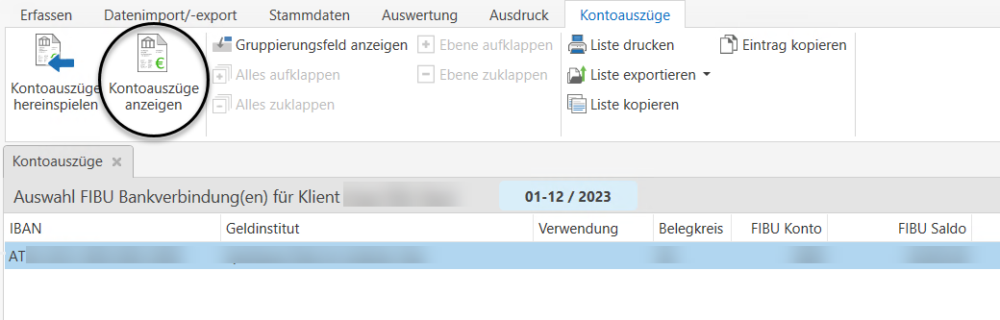
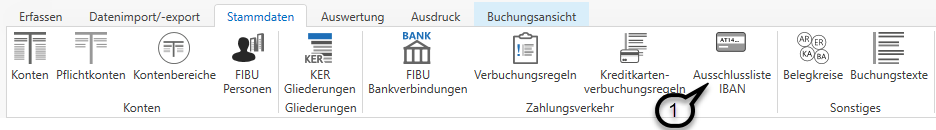

# Verarbeitung von Kontodaten mittels CSV/TXT-Datei (Netbanking)

### Verarbeitung von Kontodaten mittels CSV/TXT-Datei (Netbanking)

Damit eine automatisierte Verarbeitung von Kontoauszügen im Dateiformat .csv oder .txt (Netbanking) möglich ist, ist im Vorfeld die Anlage einer Listenform notwendig (siehe Kapitel [Listenformen Netbanking](../Stammdaten%20Vorlagen/Listenformen_Netbanking.md)).

Zusätzlich sind vorab die entsprechenden Bankverbindungen unter dem Menüpunkt *Stammdaten / FIBU Bankverbidung* zu hinterlegen (siehe Kapitel [FIBU Bankverbindungen](../Stammdaten%20FIBU%20Next/FIBUBankverbindungen.md)).

Nach einmaliger Anlage einer Listenform und Hinterlegung der Bankverbindungen können die Bankauszüge nach dem Export aus dem Online-Banking System importiert und anschließend automatisiert verarbeitet werden.

### Hereinspielen der Importdatei
Über den Menüpunkt *Erfassen / Kontoauszüge* können Kontoauszüge (camt-Dateien und Netbanking-Dateien) verbucht werden. 

Nach Anwahl der gewünschten Bankverbindung können die Kontoauszüge über den Button *Kontoauszüge hereinspielen* hereingespielt werden.

Es öffnet sich nun ein Dialogfeld zum Import der Datei. Mit Klick auf die drei Punkte *...* ***(1)*** kann die zu importierende Datei ausgewählt werden.

Wenn Sie auf die Lupe ***(2)*** klicken kann die Importdatei geöffnet werden. Die  Auswahl im Feld *Textcodierung* ***(3)*** sowie die Option *Importdatei enthält Spaltenüberschriften* ***(4)*** werden von den getroffenen Einstellungen der ausgewählten Listenform übernommen. Die Option *Importdatei nach Hereinspielen löschen* ***(5)*** wird von den getroffenen Einstellungen in den Stammdaten des Bankkontos übernommen. Im Feld *Listenform* ***(6)*** ist die gewünschte Listenform auszuwählen. 

Anschließend kann eine *Vorprüfung* ***(7)*** durchgeführt werden. War diese erfolgreich erhalten Sie nachstehende Meldung:

Mit *Prüfen und importieren* ***(8)*** kann die Datei importiert werden. Eine Vorprüfung ist nicht zwingend notwendig. 
War der Datenimport erfolgreich erhalten Sie folgende Meldung:

Im Anschluss daran können Sie sich die hereingespielten Kontoauszüge über den Menüpunkt *Kontoauszüge anzeigen* anzeigen lassen.

Nun öffnet sich eine Liste mit den einzelnen Buchungszeilen dieser Netbanking-Datei. Hier können Sie auswählen, welche Buchungszeile Sie verbuchen ***(1)*** möchten. Sie können auch alle Buchungen auf einmal markieren ***(2)***. Die ausgewählten Buchungen können anschließend in einem neuen Stapel gebucht werden ***(3)*** oder Sie fügen diese Buchungen einem bestehenden Stapel hinzu ***(4)***. Mit der *Schaltfläche löschen* ***(5)*** können einzelnen Buchungszeilen gelöscht werden.

### Auszug verbuchen
Nach Klick auf *Mit neuen Stapel buchen* oder *Zu Stapel hinzufügen* öffnet sich ein Buchungsstapel mit allen zuvor ausgewählten Zeilen.

In den Buchungsoptionen ***(1)*** finden Sie die Informationen aus den Stammdaten der FIBU Bankverbindung (siehe Kapitel [FIBU Bankverbindungen](../Stammdaten%20FIBU%20Next/FIBUBankverbindungen.md)) inkl. dem Anfangssaldo des hinterlegten Sammelkontos.

Um Belege zuordnen zu können, können Sie sich die Belegliste ***(2)*** einblenden lassen und bei Bedarf auch automatisch zuordnen ***(3)***. Diverese Auswertungen, wie das Journal und die Kontoauswertungen, können Sie sich über die Schaltflächen im Bereich *Auswertungen* ***(4)*** auch während des Buchens anzeigen lassen.

Sämtliche Daten aus der Importdatei  werden im unteren Bereich des Buchungsdialogs ***(5)*** angezeigt.

Sollte eine Buchung noch nicht vollständig verbucht sein, so wird diese mit einem roten Rufzeichen am Beginn der Buchungszeile markiert ***(6)***.

Bei Vorliegen bestimmter Daten kann die FIBU Next einen automatischen Buchungsvorschlag erstellen, der jedoch jederzeit, solange der Stapel noch nicht finalisiert wurde, abänderbar ist.
In der Spalte Vorschlag ist ersichtlich, aufgrund welcher Logik der Buchungsvorschlag erstellt wurde:

| **Kennzeichen** | **Kurzbeschreibung**                                                                                             |
| --------------- | ---------------------------------------------------------------------------------------------------------------- |
| I               | Vorschlag auf Grund des IBAN                                                                                     |
| V               | Vorschlag auf Grund der Verbuchungsregel Die Zahl neben dem V definiert, welche Verbuchungsregel angewandt wird. |
| Z               | Vorschlag auf Grund der Zahlungsreferenz                                                                         |

!!! info "Tipp"

    Die Bankverbindung können Sie bei allen Personenkonten händisch hinterlegen. Zusätzlich lernt die FIBU Next automatisch dazu, indem sie den IBAN aus der jeweiligen Kontoauszugszeile automatisch beim entsprechenden Personenkonto hinterlegt. Somit kann bei der nächsten Verbuchung mit der gleichen Bankverbindung das Personenkonto gleich vorgeschlagen werden.

Beim Verbuchen von Kontoauszügen gibt es im Kontextmenü des Buchungstextes einige hilfreiche Optionen.  
Beispielsweise können Sie mit der Tastenkombination **Umschalt+F11** automatisch den Partner (Auftraggeber bzw. Empfänger) aus der Netbanking-Datei einfügen.

### Ausschlussliste IBAN

Sollten gewisse Bankverbindungen bei keinen Personenkonten hinterlegt werden (z.B. Versicherungsentschädigungen) so können diese Bankverbindungen in der Ausschlussliste IBAN ***(1)*** erfasst werden.

Die automatische Auslesung der Buchungsvorschläge und Zuordnung zu den offenen Posten bzw. Personenkonten erfolgt in folgenden Schritten:

* Erkennung einer vordefinierten Verbuchungsregel
* Auslesung des Kundendatenfeldes bzw. der Zahlungsreferenz
* Zuordnung des Personenkontos anhand der hinterlegten IBAN in den Kontostammdaten

Konnte das Personenkonto ausgelesen werden, wird nach einem passenden Offenen Posten anhand des Betrages – mit einer Abweichung von maximal +/- 5 Prozent zum Rechnungsbetrag – gesucht und zugeordnet.

Ein offener Posten wird dann vollständig ausgeglichen und mit einem grünen Häkchen ***(1)*** markiert.

Handelt es sich um eine Überzahlung, so wird die Buchung mit einem grauen Rufzeichen ***(2)*** gekennzeichnet.

Wird jedoch ein geringerer Betrag als der offene Posten überwiesen, so wird ein neuer, zusätzlicher offener Posten angelegt. Ersichtlich ist dies am blauen Plus ***(3)***.

Erscheint in dieser Darstellung ein gelbes Rufzeichen ***(1)***, so wurde zwar ein passendes Personenkonto gefunden und anhand der Zahlungsreferenz ein offener Posten ausgelesen, jedoch befindet sich am entsprechenden Personenkonto kein offener Posten mit dieser Nummer. Als Ergebnis wird auch hier ein neuer offener Posten angelegt.

!!! info "Tipp"

    Wenn Sie eine neue Verbuchungsregel anlegen oder bei einem Personenkonto einen neuen IBAN anlegen, so werden diese Änderungen angewandt und Buchungsverschläge daraus erstellt, sobald Sie den Buchungsstapel zurücklegen und anschließend neu öffnen.

#### Nähere Informationen zu Verbuchungsregeln finden Sie im Kapitel [Verbuchungsregeln](../Stammdaten%20FIBU%20Next/Verbuchungsregeln.md).