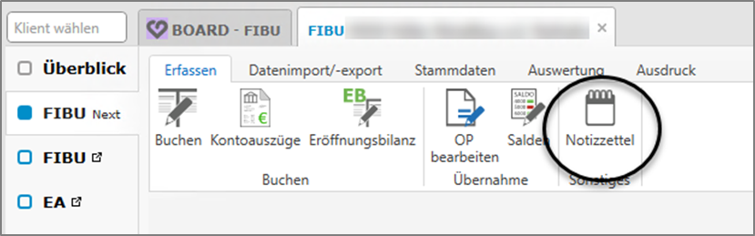
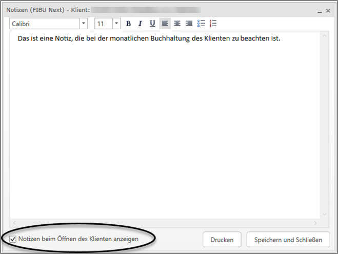

# Notizzettel

### Notizzettel

hier hat sich auch noch was geändert mit der neuen Version.
Test

Im Menüpunkt *Erfassen / Notizzettel* können Sie Notizen pro Klienten hinterlegen. Diese Notizen gelten für alle Wirtschaftsjahre des Klienten übergreifend und werden beim Öffnen des Klienten in der FIBU Next angezeigt, wenn die entsprechende Option beim Erfassen der Notiz aktiviert wird.

{width="600"}

{width="500"}

!!! warning "Hinweis"
    Notizen aus der FIBU Klassik werden bei Übernahme des Klienten in die FIBU Next automatisch mitübernommen.
