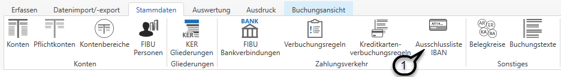

# Retourdatenverarbeitung mittels CAMT-Dateien

### Retourdatenverarbeitung mittels CAMT-Dateien

### Kontoauszüge hereinspielen

Über diesen Menüpunkt können Sie camt.053 Kontoauszüge verbuchen.

Vorab müssen die entsprechenden Bankverbindungen über den Menüpunkt *Stammdaten / FIBU Bankverbindungen* hinterlegt werden (siehe Kapitel [FIBU Bankverbindungen](../Stammdaten%20FIBU%20Next/FIBUBankverbindungen.md))

Nun wählen Sie die gewünschte Bankverbindung in der Liste aus und spielen die Kontoauszüge über die Schaltfläche *Kontoauszüge hereinspielen* ***(1)*** ein.

Im Anschluss daran können Sie sich die hereingespielten Kontoauszüge über den Menüpunkt *Kontoauszüge anzeigen* ***(2)*** anzeigen lassen.

Nun öffnet sich eine Liste mit allen noch nicht verbuchten Kontoauszügen dieser Bankverbindung. Hier können Sie auswählen ***(1)***, welche Auszüge Sie verbuchen ***(2)*** möchten.

Zusätzlich haben Sie hier auch noch die Möglichkeit, Auszüge zu einem bestehenden Stapel hinzuzufügen ***(3)***.

Auch ein Löschen von Auszügen ist in dieser Ansicht möglich.

!!! warning "Hinweis"

    Sobald ein Kontoauszug hereingespielt wurde, wird dieser aus dem hinterlegten Ordnerpfad automatisch in einen Unterordner (Hereingespielt) verschoben, damit dieser nicht doppelt hereingespielt und somit verbucht werden kann.\
    Werden Kontoauszüge aus dieser Ansicht gelöscht, so gelangen sie automatisch wieder in den hinterlegten Ordnerpfad und können somit erneut hereingespielt werden.

### Kontoauszüge verbuchen

Sobald auf *Kontoauszug buchen* geklickt wird, öffnet sich ein Buchungsstapel mit allen Zeilen aus den gewählten Auszügen.

In den Buchungsoptionen ***(1)*** finden Sie die Informationen aus den Stammdaten der FIBU Bankverbindung (siehe Kapitel [FIBU Bankverbindungen](../Stammdaten%20FIBU%20Next/FIBUBankverbindungen.md)) inkl. dem Anfangssaldo des hinterlegten Sammelkontos.

Um Belege zuordnen zu können, können Sie sich die Belegliste ***(2)*** einblenden lassen und bei Bedarf auch automatisch zuordnen ***(3)***. Diverese Auswertungen, wie das Journal und die Kontoauswertungen, können Sie sich über die Schaltflächen im Bereich *Auswertungen* ***(4)*** auch während des Buchens anzeigen lassen.

Sämtliche Daten aus dem Kontoauszug, wie IBAN, Partner, Verwendungszweck und Endsaldo lt. Auszug werden im unteren Bereich des Buchungsdialogs ***(5)*** angezeigt.

Sollte eine Buchung noch nicht vollständig verbucht sein, so wird diese mit einem roten Rufzeichen am Beginn der Buchungszeile markiert ***(6)***.

!!! warning "Hinweis"

    Auch ein Buchungsstapel mit Kontoauszügen kann verworfen werden. In diesem Fall gelangen die Kontoauszüge zurück in die Liste der hereingespielten Auszüge und können dort erneut ausgewählt und anschließend verbucht werden.

Bei Vorliegen bestimmter Daten kann die FIBU Next einen automatischen Buchungsvorschlag erstellen, der jedoch jederzeit, solange der Stapel noch nicht finalisiert wurde, abänderbar ist.
In der Spalte Vorschlag ist ersichtlich, aufgrund welcher Logik der Buchungsvorschlag erstellt wurde:

| **Kennzeichen** | **Kurzbeschreibung**                                                                                             |
| --------------- | ---------------------------------------------------------------------------------------------------------------- |
| I               | Vorschlag auf Grund des IBAN                                                                                     |
| V               | Vorschlag auf Grund der Verbuchungsregel Die Zahl neben dem V definiert, welche Verbuchungsregel angewandt wird. |
| Z               | Vorschlag auf Grund der Zahlungsreferenz                                                                         |

!!! info "Tipp"

    Die Bankverbindung können Sie bei allen Personenkonten händisch hinterlegen. Zusätzlich lernt die FIBU Next automatisch dazu, indem sie den IBAN aus der jeweiligen Kontoauszugszeile automatisch beim entsprechenden Personenkonto hinterlegt. Somit kann bei der nächsten camt-Verbuchung mit der gleichen Bankverbindung das Personenkonto gleich vorgeschlagen werden.

Beim Verbuchen von Kontoauszügen gibt es im Kontextmenü des Buchungstextes einige hilfreiche Optionen.  
Beispielsweise können Sie mit der Tastenkombination **Umschalt+F11** automatisch den Partner (Auftraggeber bzw. Empfänger) aus der camt-Datei einfügen.

### Ausschlussliste IBAN

Sollten gewisse Bankverbindungen bei keinen Personenkonten hinterlegt werden (z.B. Versicherungsentschädigungen) so können diese Bankverbindungen in der Ausschlussliste IBAN ***(1)*** erfasst werden.

Die automatische Auslesung der Buchungsvorschläge und Zuordnung zu den offenen Posten bzw. Personenkonten erfolgt in folgenden Schritten:

* Erkennung einer vordefinierten Verbuchungsregel
* Auslesung des Kundendatenfeldes bzw. der Zahlungsreferenz
* Zuordnung des Personenkontos anhand der hinterlegten IBAN in den Kontostammdaten

Konnte das Personenkonto ausgelesen werden, wird nach einem passenden Offenen Posten anhand des Betrages – mit einer Abweichung von maximal +/- 5 Prozent zum Rechnungsbetrag – gesucht und zugeordnet.

Ein offener Posten wird dann vollständig ausgeglichen und mit einem grünen Häkchen ***(1)*** markiert.

Handelt es sich um eine Überzahlung, so wird die Buchung mit einem grauen Rufzeichen ***(2)*** gekennzeichnet.

Wird jedoch ein geringerer Betrag als der offene Posten überwiesen, so wird ein neuer, zusätzlicher offener Posten angelegt. Ersichtlich ist dies am blauen Plus ***(3)***.

Erscheint in dieser Darstellung ein gelbes Rufzeichen ***(1)***, so wurde zwar ein passendes Personenkonto gefunden und anhand der Zahlungsreferenz ein offener Posten ausgelesen, jedoch befindet sich am entsprechenden Personenkonto kein offener Posten mit dieser Nummer. Als Ergebnis wird auch hier ein neuer offener Posten angelegt.

!!! info "Tipp"

    Wenn Sie eine neue Verbuchungsregel anlegen oder bei einem Personenkonto einen neuen IBAN anlegen, so werden diese Änderungen angewandt und Buchungsverschläge daraus erstellt, sobald Sie den camt-Buchungsstapel zurücklegen und anschließend neu öffnen.

#### Nähere Informationen zu Verbuchungsregeln finden Sie im Kapitel [Verbuchungsregeln](../Stammdaten%20FIBU%20Next/Verbuchungsregeln.md).

