# Anzahlungsrechnungen

Die Verbuchung von Anazhlungsrechnungen an Debitoren mit automatischer Steuerkorrektur beim Einbuchen der Zahlung bzw. Schlussrechnung.

## Notwendige Pflichtkonten
Zur Verwendung der Buchungssystematik mit den Sondersteuercodes ist die Hinterlegung der dafür notwendigen Verrechnungs- und Umsatzsteuerkonten in der FIBU unter *Stammdaten / Pflichtkonten / Reiter Anzahlungsrechnungen* notwendig.

!!! warning "Hinweis"
    Haben Sie den RZL Kontenplan eingespielt, werden die Pflichtkonten automatisch hinterlegt.

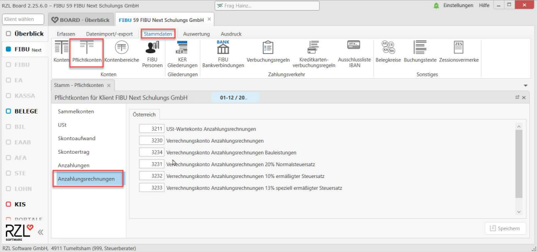

## Erhaltene Anzahlungsrechnung von Debitoren

#### Steuercodes
Erhaltene Anzahlungsrechnungen können mit folgenden Steuercodes gebucht werden:

| *Steuercode* | *Beschreibung*                          |
| ------------ | --------------------------------------- |
| AN20         | Anzahlungsrechnung mit 20% Umsatzsteuer |
| AN13         | Anzahlungsrechnung mit 13% Umsatzsteuer |
| AN10         | Anzahlungsrechnung mit 13% Umsatzsteuer |
| ANB01        | Anzahlungsrechnung für Bauleistungen    |

#### Buchung der Anzahlung
Eine Anzahlungsrechnung ist auf einem eigenen Konto einzubuchen, damit mit dem entsprechend hinterlegten Steuercode in den Stammdaten, ein Ausweis der Umsatzsteuer erst bei Zahlung bzw. Einbuchung der Schlussrechnung erfolgt.

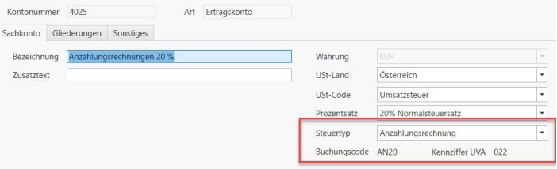

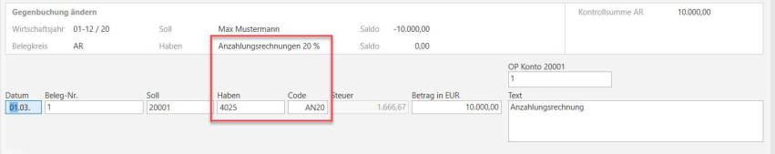

Durch die Buchung der Anzahlungsrechnung wird ein neuer OP angelegt und die Umsatzsteuer wird auf das entsprechende Verrechnungskonto gebucht.

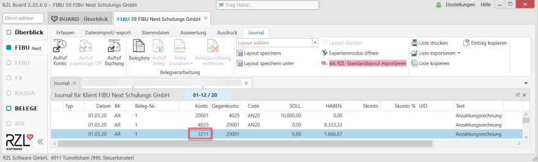

#### Buchung der Zahlung
Wird die Zahlung der Anzahlungsrechnung eingebucht, ist es notwendig, die dazugehörige(n) Anzahlungsrechnung(en) über das OP Feld (F2), zuzuordnen.

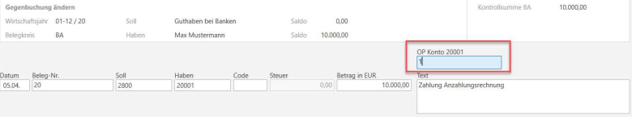

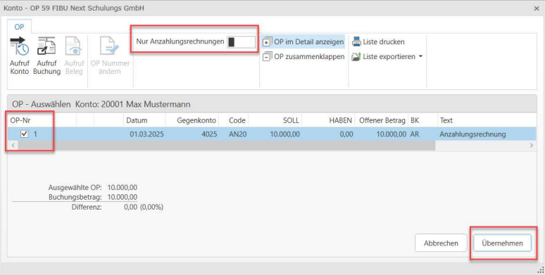

!!! warning "Hinweis"
    Sollten Sie mehr Rechnungen bei einem Debitor haben, können Sie die Schaltfläche im oberen Menü *Nur Anzahlungsrechnungen* aktivieren. Jetzt werden nur die offenen Anzahlungsrechnungen angezeigt.

Durch die Verbuchung der Zahlung wird die Automatikbuchung der Umsatzsteuer vom USt-Wartekonto Anzahlungsrechnungen auf das tatsächliche Umsatzsteuer-Sammelkonto umgebucht und die Anzahlungsrechnung auf Verrechnungskonten bis zur Einbuchung der Schlussrechnung geparkt.

*USt auf Anzahlungsrechnung / Umsatzsteuer*        **-** *Steuerbetrag*

*Verr.-Konto Anzahlungsrechnungen / Verr.-Konto Anzahlungsrechnungen 20%*        **-** *Nettobetrag*

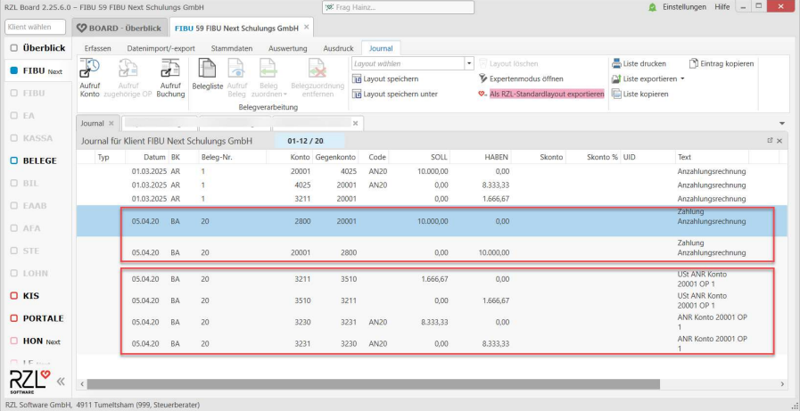

**Exkurs Skonto**

Ist der Betrag der Zahlung niedriger als der Betrag der Anzahlungsrechnung, so ernscheint eine Abfrage, ob der Restbetrag als Skonto ausgebucht werden soll. Handelt es sich **nicht** um einen Skonto, so ist diese Abfrage lediglich mit **Übernehmen** zu bestätigen.

### Buchung der Schlussrechnung
Die automatische Korrektur der Anzahlungsrechnung findet bei Buchung der Schlussrechnung über das OP-Feld statt. Mit Eingabe der OP Nummer kann eine individuelle OP Nummer für die Schlussrechnung vergeben werden. Mit F2 öffnet sich die OP Auswahl.

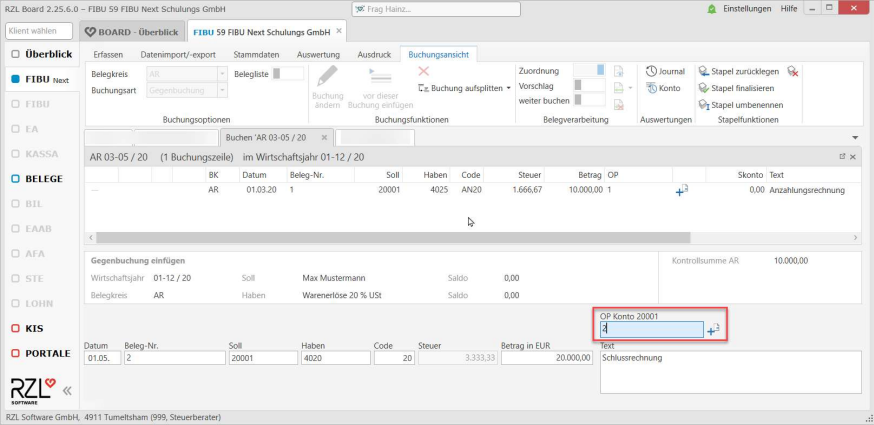

Hier muss die Anzahlungsrechnung markiert werden.

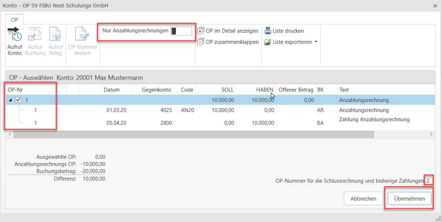

!!! warning "Hinweis"
    Sollten Sie mehr Rechnungen bei einem Debitor haben, können Sie die Schaltfläche im oberen Menü *Nur Anzahlungsrechnungen* aktivieren. Jetzt werden nur die offenen Anzahlungsrechnungen angezeigt.

Falls die Anzahlungsrechnung noch nicht bezahlt wurde, wird durch die Verbuchung der Schlussrechnung die Anzahlungsrechnung storniert und die Schlussrechnung zur Gänze versteuert.

Falls die Anzahlungsrechnung bereits bezahlt und somit versteuert wurde, wird einerseits die Anzahlungsrechnung, aber auch die bereits vorgenommene Versteuerung inkl. der Buchungen auf den Verrechnungskonten storniert und die Schlussrechnung zur Gänze versteuert.

Außerdem werden Zahlungen, die bisher die OP-Nummer der Teilrechnungen hatten auf die OP-Nummer der Schlussrechnung "umgehängt"

*USt auf Anzahlungsrechnung / Umsatzsteuer*        **-** *Steuerbetrag*

*Verr.-Konto Anzahlungsrechnungen / Verr.-Konto Anzahlungsrechnungen 20%*        **-** *Nettobetrag*

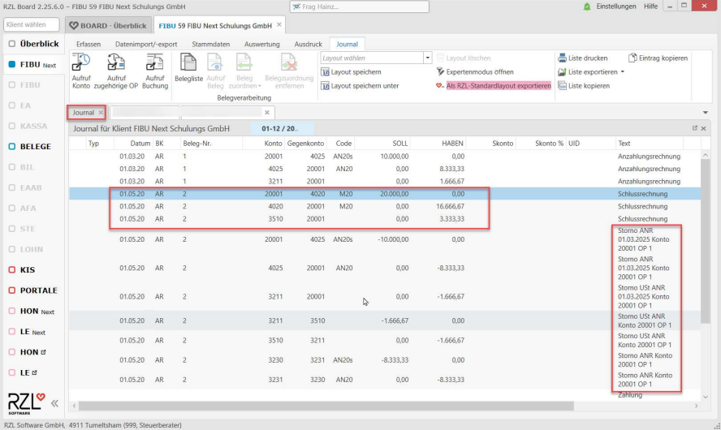

!!! warning "Hinweis"
    Eine eingebuchte Schlussrechnung kann nicht geändert, jedoch aber gelöscht und neu eingebucht werden.

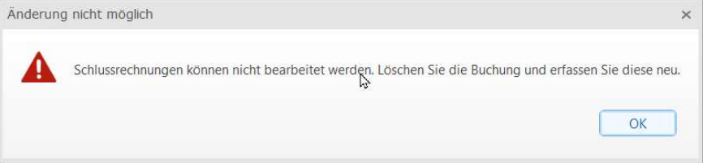

!!! warning "Hinweis"
    Auf der OP-Liste ist mit Einbledung der Spalte OP-Nr., die ursprüngliche OP-Nummer der Zahlung ersichtlich.

 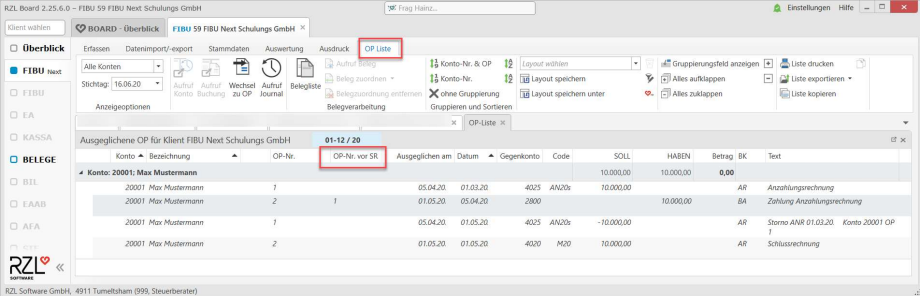   