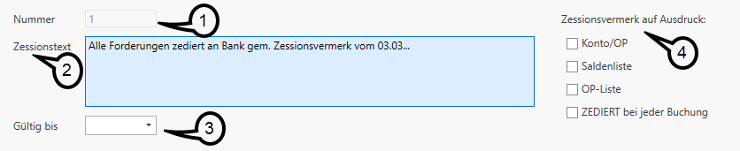
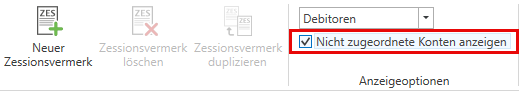
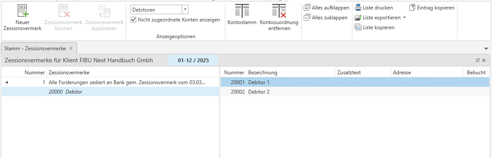
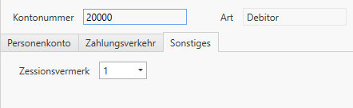

# Zessionen
In Österreich bezeichnet eine **Zession** die **Abtretung einer Forderung** von einem Gläubiger (Zedent) an einen neuen Gläubiger (Zessionar). Das bedeutet, dass eine Person oder ein Unternehmen eine bestehende Forderung an eine andere Person oder Instituion überträgt. Der Schuldner muss dabei grundsätzlich nicht zustimmen, aber er muss informiert werden.

Soll auf Konten und/oder der OP-Liste ein Zessionsvermerk aufscheinen, so ist als erster Schritt der gewünschte Zessionstext zu definieren.

## Zessionen anlegen

Im Menüpunkt *Stammdaten / Zessionsvermerke* können neue Zessionsvermerke angelegt werden. Mit einem Klick auf die Schaltfläche *Neuer Zessionsvermerk* im oberen Menü öffnet sich die Detailansicht und Sie können einen neuen Vermerk anlegen.

Als erster Schritt ist im Feld *Nummer* ***(1)*** eine laufende Nummer zu vergeben; mit der Tabulator-Taste wird das Feld *Zessionstext* ***(2)*** erreicht, in dem der gewünschte Text eingegeben werden kann. Das Feld *Gültig bis* ***(3)*** kann leer gelassen werden, falls das Feld befüllt wird, wird der Zessionsvermerk nur bis zu diesem Tagesdatum angezeigt/ausgedruckt. Über die Checkbox *Zessionsvermerk auf Ausdruck* ***(4)*** können Sie festlegen, auf welchem Ausdruck der Zessionsvermerk angezeigt werden soll.

## Zuordnung der Zessionsvermerke

Unter dem Punkt *Nicht zugeordnete Konten anzeigen* können alle Konten angezeigt werden, die aktuell keinem Zessionsvermerk zugeordnet sind. In dieser Ansicht haben Sie die Möglichkeit, auszuwählen, ob **Sachkonten** oder **Debitoren** angezeigt werden sollen.

Im rechten Bereich sehen Sie anschließend eine Liste der noch nicht zugeordneten Konten. Abhängig von der Auswahl, werden die entsprechenden Konten angezeigt. Konten lassen sich einfach per **Drag & Drop** einem Zessionsvermerk zuordnen.

!!! info "Tipp"

    Mit **Strg + A** können alle Konten aufeinmal markiert werden.

In den Stammdaten eines Debitors oder Bestandkontos kann unter *Sonstiges* ein Zessionsvermerk zugeordnet werden. Beim Löschen erscheint ein Hinweis, falls diesem noch Konten zugeordnet sind, damit keine versehentlichen Löschungen erfolgen. 

