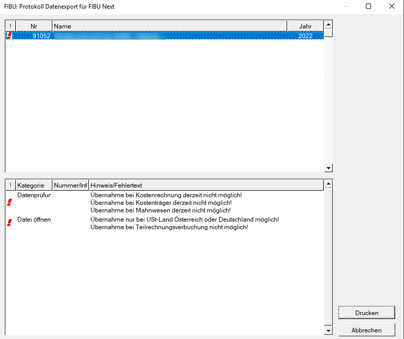
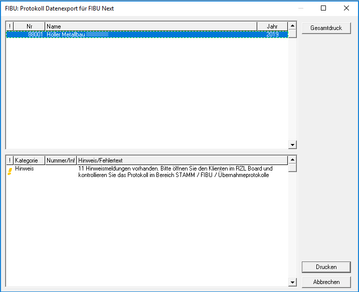
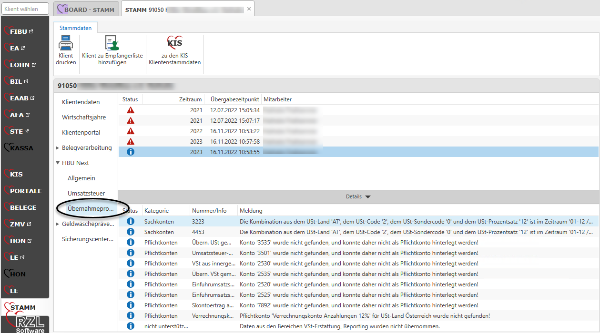
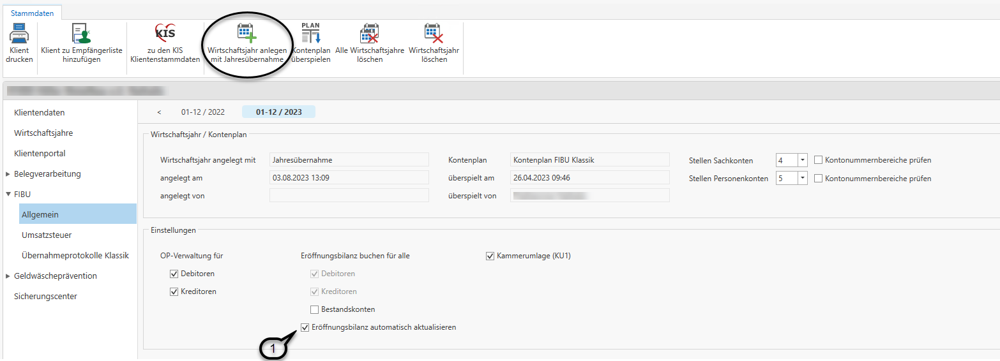

# Umstieg von FIBU Klassik

In folgender Kurzanleitung möchten wir Ihnen Schritt für Schritt die
ersten Schritte erklären, welche bei der Umstellung eines Klienten von
der FIBU Klassik auf die FIBU Next zu beachten sind.

!!! warning "Hinweis"

    Bitte beachten Sie vor Umstellung Ihrer Klienten die aktuelle
    Leistungsbeschreibung der FIBU Next. Klienten, für die Funktionen
    benötigt werden, die es in der FIBU Next noch nicht gibt, sollten noch
    nicht umgestellt werden.

## Übergabe des Klienten

Als ersten Schritt müssen die Stammdaten des Klienten im RZL Board
angelegt sein. Ist dies nicht der Fall, so können Sie die Stammdaten
mittels der ZMV Klientenübernahme ins RZL Board übernehmen. Genaueres
dazu finden Sie im Handbuch RZL Board im Kapitel ***2.6** ZMV
Klientenübernahme*.

In der FIBU Klassik können Sie Ihre Klienten entweder
klientenübergreifend über den Menüpunkt *Klient / Übergabe an FIBU Next*
durch Auswahl der entsprechenden Klientennummern und Wirtschaftsjahre
übernehmen oder pro Klient, wenn dieser in der FIBU geöffnet ist. Dazu
öffnen Sie den Menüpunkt *Bearbeiten / Übergabe an FIBU Next*.

Klienten können nur in die FIBU Next übernommen werden, wenn keine
Funktionen aktiv sind, die dem aktuellen Leistungsumfang der FIBU Next
nicht entsprechen.  
Sobald ein Klient zur Übernahme ausgewählt wird, der solche Funktionen
aktiviert hat, erscheint im nächsten Schritt eine Fehlermeldung mit
allen Funktionen, die die Übernahme blockieren und der Klient wird nicht
in die FIBU Next übernommen.

Es kann auch vorkommen, dass in dieser Maske gelbe Rufzeichen
erscheinen. Dies kann auftreten, wenn zum Beispiel einzelne Belegkreise
oder Pflichtkonten in der FIBU Next nicht gefunden werden. Solche
Sachverhalte stellen aber keinen Ausschlussgrund für eine Übernahme dar
und der Klient wird trotzdem in die FIBU Next übernommen.

Genauere Informationen und das Protokoll zur Übernahme finden Sie im RZL
Board unter *Stamm / FIBU Next / Übernahmeprotokolle Klassik*.

In der FIBU-Klassik vorhandene Kontenpläne, KER-Gliederungen sowie
Buchungstexte werden bei der Übernahme ebenfalls in die FIBU Next
mitübernommen.

Außerdem werden auch sämtliche Stammdaten im Zusammenhang mit der
Retourdatenverarbeitung (Bankkonten, Verbuchungsregeln,…) mit
übernommen.

## Buchen

Um mit dem Buchen zu beginnen, wählen Sie im Register *Erfassen* die
Schaltfläche *Buchen*. Wurden bei dem gewählten Klienten in dem
aktuellen Wirtschaftsjahr noch keine Buchungen erfasst, öffnet sich
automatisch das Register *Buchungsansicht*.

Im oberen Bereich des Buchungsfensters können Sie den Belegkreis
***(1)*** und die Buchungsart ***(2)*** auswählen. Zusätzlich können Sie
sich hier die Belegliste der ungebuchten Belege ***(3)*** einblenden
lassen. So können Sie mit Belegen buchen. Wird im Bereich
*Belegverarbeitung* zusätzlich das Feld *Vorschlag* aktiviert, so werden
Ihnen pro Beleg die ausgelesenen Belegdaten in der Buchungszeile
vorgeschlagen. Nach Abschluss der Buchung springt die Belegansicht
automatisch zum nächsten Beleg weiter.

Erscheint beim erstmaligen Einstieg in den Buchungsdialog folgender
Hinweis, so sollten Sie vor dem Buchen unter *Stammdaten / Konten*
zumindest ein Konto (Bank bzw. Kassa) als Zahlungsmittelkonto
definieren. Dies ist erforderlich, damit Skonti automatisch verbucht
werden können.

Die Buchungslogik inkl. aller gängigen Shortcuts sind großteils ident
zur Verbuchung in der FIBU Klassik. Alle wesentlichen Unterschiede
finden Sie im folgenden Kapitel.

## Wesentliche Unterschiede zur FIBU Klassik

### Mehrere Stapel gleichzeitig

In der FIBU Next haben Sie die Möglichkeit mehrere Stapel gleichzeitig
zu bebuchen und offen zu haben. Erst zur Erstellung der UVA müssen Sie
alle offenen Stapel des betroffenen Zeitraums finalisieren.  
Eine Ausnahme ist jener Stapel aus der Bilanz mit den Bilanzumbuchungen
– dieser muss nicht zwingend finalisiert werden, damit eine erneute
Übergabe der Bilanzumbuchungen möglich bleibt.

Auch vor gewissen Funktionen (Hereinspielen von camt-Dateien,
Datenimport,…) müssen die Stapel nun nicht mehr finalisiert werden.

Außerdem ist es möglich Stapel zu benennen oder auch einzeln zu
finalisieren oder zu löschen.

Camt-Retourdaten und Importe werden auch in einem Stapel gebucht. Die
Buchungen daraus können also auch immer wieder, bis der Stapel
finalisiert wird, bearbeitet werden.

!!! info "Tipp"

    Wir empfehlen bei Monatsbuchhaltungen pro Belegkreis und pro Monat
    eigene Stapel anzulegen. Somit haben Sie zur Erstellung der UVA die
    Möglichkeit, nur die betreffenden Stapel zu finalisieren.

### Splitbuchungen

Splitbuchungen können in der FIBU Next (im Unterschied zur FIBU Klassik)
im Nachhinein geändert werden.

Zusätzlich ist es nun auch möglich, Splitbuchungen mit unterschiedlichen
Steuercodes zu buchen. Daher ist es bei einer Splitbuchung eines
innergemeinschaftlichen Erwerbs auch nicht mehr notwendig in der
Sammelzeile ein *E* im Feld Steuercode zu erfassen.

Gegenbuchungen können auch im Nachhinein zu Splitbuchungen abgeändert
werden.

### Offene Posten

In der FIBU Next ist es möglich, Buchungen zwischen zwei OP-führenden
Konten durchzuführen. Dabei erscheint im Buchungsdialog ein zweites
Eingabefeld für die OP-Nummer des zweiten Kontos.

Auch in der FIBU Next können offene Posten händisch bearbeitet werden.
(*Erfassen / OP bearbeiten*). Im Unterschied zur FIBU Klassik ist es nun
aber möglich, OPs auch MIT Skonto miteinander auszugleichen. Wichtig
dabei ist, dass einer der beiden offenen Posten gegen ein
Zahlungsmittelkonto erfasst wurde.

### Vorschlag Belegnummer

In den Stammdaten der Belegkreise können Sie in der FIBU Next festlegen,
dass stets die nächste Belegnummer pro Belegkreis beim Buchen
vorgeschlagen wird.

Dabei ist es im Gegensatz zur FIBU Klassik nicht mehr notwendig, dass
bei der ersten Buchung im Buchungsdialog ein ***+*** hinter der
Belegnummer eingegeben wird.

### Jahresübernahme / EB Aktualisierung

Eine Jahresübernahme in ein neues Wirtschaftsjahr erfolgt für FIBU Next
Klienten in den Klientenstammdaten im RZL Board im Bereich FIBU Next.
Klicken Sie dazu auf die Schaltfläche *Wirtschaftsjahr anlegen mit
Jahresübernahme*.

Aktivieren Sie das Häkchen *Eröffnungsbilanz automatisch aktualisieren
**(1)***, so wird der EB-Wert auf den entsprechenden Konten stets
automatisch aktualisiert. Im Gegensatz zur FIBU Klassik muss somit bei
Nachbuchungen im Vorjahr keine erneute Jahresübernahme mehr gemacht
werden, damit EB-Werte aktualisiert werden.

Ist diese Option nicht aktiviert, können Eröffnungsbilanzwerte in der
FIBU Next über den Menüpunkt *Erfassen / Eröffnungsbilanz* aktualisiert
werden.

In jedem Fall muss eine Jahresübernahme bei FIBU Next Klienten nur
einmal pro Wirtschaftsjahr durchgeführt werden.

!!! warning "Hinweis"

    Möchten Sie einen Klienten aus der FIBU Next bilanzieren, so beachten
    Sie dazu bitte unsere Kurzanleitung ***Bilanzieren eines FIBU Next
    Klienten***.

### Kontostammdaten

Einzelne Konten können nun in den Kontostammdaten gesperrt werden, so
dass diese nicht mehr bebucht werden können. Anschließend kann sogar ein
neues Konto mit derselben Nummer angelegt werden.

Die Volltextsuche nach einem Konto funktioniert in der FIBU Next ganz
einfach ohne Eingabe des Zeichens \*. Möchten Sie in einem Kontofeld
nach einer Kontonummer suchen, so geben Sie hier einfach die Bezeichnung
des Kontos oder einen Teil davon ein.

Zusätzlich haben Sie in der FIBU Next auch die Möglichkeit, bei einem
Konto mehrere KER-Gliederungen für unterschiedliche Auswertungen in der
Kurzfristigen Erfolgsrechnung zu hinterlegen.

### Generelle Bedienung

-   Die FIBU Next ist multi-User-fähig, was bedeutet, dass hier mehrere
    Benutzer gleichzeitig im selben Klienten arbeiten können.

-   In der FIBU Next kann man mehrere Klienten gleichzeitig geöffnet
    haben und jederzeit zwischen diesen wechseln.

-   Innerhalb eines Klienten kann man ganz einfach zwischen den
    einzelnen Wirtschaftsjahren wechseln.

-   Einzelne Ansichten und Fenster können ganz einfach herausgezogen,
    verschoben oder neu platziert werden.

-   Man kann auch innerhalb eines Klienten mehrere Ansichten
    gleichzeitig geöffnet haben. (z.B. Buchungsdialog und Journal)

-   Innerhalb von Tabellen (z.B. Auswertung Journal oder Auswertung
    Konten) kann man mit dem Kurzbefehl ***Strg + F*** nach Stichwörtern
    suchen.

-   Mit der F5-Taste kann man Ansichten aktualisieren.

### Arbeitsprotokoll

Ein weiterer großer Unterschied zur FIBU Klassik ist, dass das
Arbeitsprotokoll nicht mehr extra gespeichert oder gedruckt werden
muss.  
Das Arbeitsprotokoll wird stets automatisch mitgespeichert und kann über
den Menüpunkt *Auswertung / Arbeitsprotokoll* zu jeder Zeit aufgerufen
werden.

### Sicherungscenter

Sicherungen können auch in der FIBU Next ganz einfach erstellt werden.  
Das Sicherungscenter finden Sie in den Klientenstammdaten im RZL Board.

Darin können Sie ganz einfach Sicherungen erstellen ***(1)***,
Sicherungen wiederherstellen ***(2)***, Sicherungen als Datei
exportieren ***(3)*** und Sicherungen aus einer Datei importieren
***(4)***.

!!! warning "Hinweis"

    In der FIBU Next werden sämtliche Sicherungen in der Datenbank
    gespeichert und nicht mehr pro Klient und Wirtschaftsjahr in einem
    separaten Datenordner.

    Wir empfehlen daher regelmäßig Sicherungen der FIBU Next zu erstellen.

