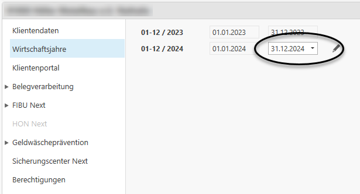

# Wirtschaftsjahr bearbeiten

### Wirtschaftsjahr bearbeiten

In den Stammdaten des Klienten können Sie über den Menüpunkt *Wirtschaftsjahre* den Zeitraum des jeweils letzten Wirtschaftsjahres bearbeiten.

Mithilfe des Stifts können Sie das Ende des letzten Wirtschaftsjahres bearbeiten, solange in dem verkürzten Zeitraum noch nichts gebucht wurde.

