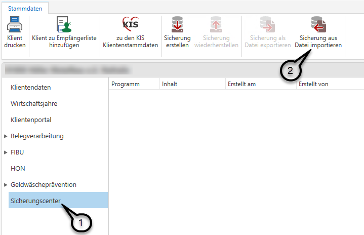
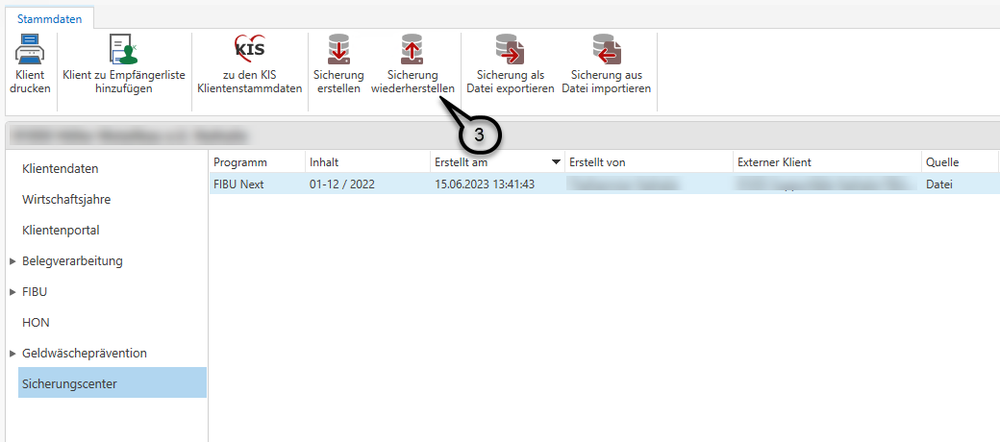
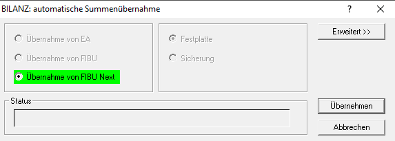
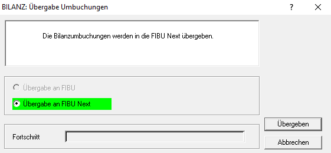
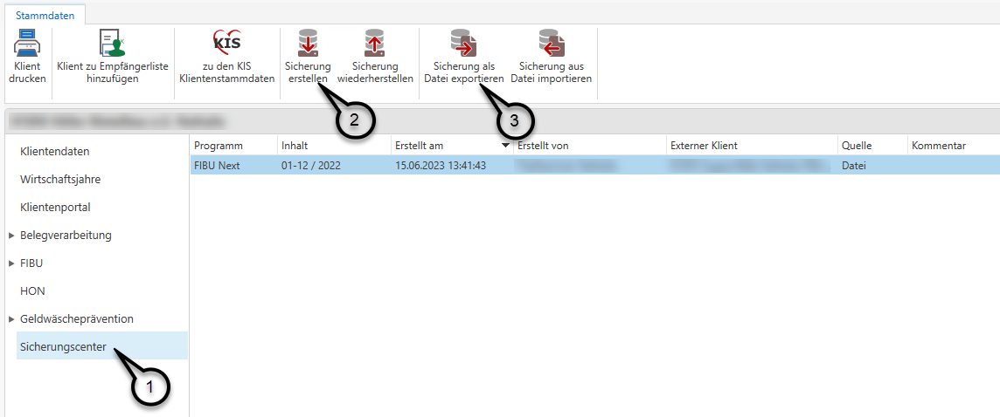
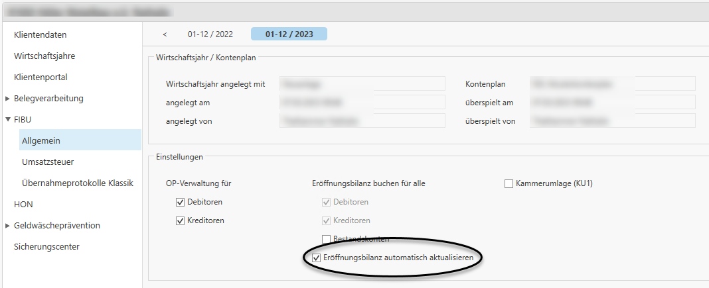
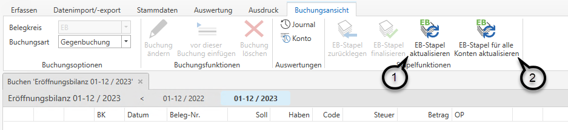

Bucht Ihr Klient selbst und verwendet dabei schon die FIBU Next, sind
für die Bilanzierung folgende Schritte notwendig, falls Sie selbst die
FIBU Next noch nicht lizenziert haben.

Auf den ersten Seiten dieser Kurzanleitung finden Sie die notwendigen
Schritte für Sie als Steuerberater. In Kapitel 2 finden Sie schließlich
die Anleitung für den Klienten, welcher Ihnen die Buchhaltung zusendet.

# Notwendige Schritte für den Steuerberater/Bilanzierer

## Einspielen der Daten

Die Daten des Klienten sind auf Ihrem PC auf einem beliebigen
Speicherort abzuspeichern. Öffnen Sie nun die Klientenstammdaten im RZL
Board und dort das Sicherungscenter ***(1)***. Über den Menüpunkt
*Sicherung aus Datei importieren* ***(2)*** können Sie schließlich die
abgespeicherten Daten des Klienten importieren.

Sobald Sie die Sicherung importiert haben, können Sie diese
wiederherstellen. ***(3)***

***  
***

## Automatische Übernahme in Bilanz

Nachdem Sie die Sicherung aus der FIBU Next hereingespielt haben, können
Sie im Bilanzprogramm wie gewohnt die automatische Summenübernahme
(*Bearbeiten / Übernahme / Autom. Summenübernahme*) durchführen. Hier
ist der Menüpunkt *Übernahme von FIBU Next* zu wählen.

Damit haben Sie alle Salden, wie gewohnt, in der Bilanz und können zu
Bilanzieren beginnen.

## Übergabe der Umbuchungen nach Abschluss des Bilanzierens

Nachdem Sie die Bilanz des Klienten abgeschlossen haben, können Sie im
Bilanzprogramm unter *Bearbeiten / Übernahme / Übergabe Umbuchungen in
FIBU* die Umbuchungen in den FIBU Next Datenstand des Klienten
übergeben, so dass dieser im Folgejahr mit den korrekten
Eröffnungsbilanzwerten weiterbuchen kann.

HINWEIS

Eine Übergabe der EB in die FIBU des Folgejahres ist hier nicht
notwendig, da sich die EB-Werte in der FIBU Next automatisch
aktualisieren.

## Erstellen der Sicherung mit Bilanzumbuchungen

Zum Abschluss, nachdem Sie die Bilanzumbuchungen in die FIBU Next
übergeben haben, muss noch eine Sicherung erstellt werden, die wieder an
den Klienten retourniert werden kann.

Dazu öffnen Sie wieder die Klientenstammdaten im RZL Board und dort das
Sicherungscenter ***(1)***.

Erstellen Sie hier eine neue Sicherung ***(2)*** und exportieren Sie
diese schließlich in Ihr Dateisystem ***(3)***.

Die exportierte Datei können Sie nun Ihrem Klienten wieder senden.

HINWEIS

Eine Sicherung aus der FIBU Next besteht, im Gegensatz zur FIBU Klassik,
aus nur einer Datei.

# Notwendige Schritte für den Klienten/Buchhalter

## Erstellen einer Sicherung der Buchhaltung

Damit Ihr Steuerberater die Bilanz für das betroffene Wirtschaftsjahr
erstellen kann, benötigt er den von Ihnen gebuchten FIBU Datenstand.

Um eine Sicherung des zu bilanzierenden Wirtschaftsjahres zu erstellen,
öffnen Sie im RZL Board die Klientenstammdaten und dort den Punkt
Sicherungscenter ***(1)***. Mittels *Sicherung erstellen **(2)*** können
Sie eine Sicherung des gewünschten Wirtschaftsjahres erstellen und diese
anschließend als Datei exportieren ***(3)***.

Die soeben erstellte Datei können Sie nun Ihrem Steuerberater bzw.
Bilanzbuchhalter zur Bilanzierung zusenden.

HINWEIS

Nachdem Sie die Daten zur Bilanzierung gesendet haben, darf im
betroffenen Wirtschaftsjahr nicht mehr gebucht werden.

## Einspielen der fertigen Buchhaltung nach der Bilanzierung.

Nachdem Ihr Steuerberater bzw. Bilanzbuchhalter mit der Bilanzierung
fertig ist, retourniert er Ihnen die Daten aus der Buchhaltung inklusive
aller von ihm getätigten Bilanzumbuchungen.

Bitte speichern Sie diese Sicherungsdatei an einem beliebigen
Speicherort auf Ihrem PC ab.

Über das Sicherungscenter ***(1)*** und Sicherung aus Datei importieren
***(2)*** können Sie die Sicherung wieder in Ihr RZL Board einspielen.

Nachdem Sie die Sicherung eingespielt haben, ist diese noch
wiederherzustellen ***(3)***.

## Übernahme der Umbuchung in die Eröffnungsbilanz des Folgejahres

Die Eröffnungsbilanzwerte werden im Zuge des automatischen Abgleichs
sofort in das Folgejahr übernommen, sofern die Option *Eröffnungsbilanz
buchen für alle Konten* im jeweiligen Folgejahr aktiviert ist.

Hier greift immer die Einstellung des Jahres, in welchem die EB-Werte
gebucht werden sollen.

**Beispiel:**

Wurde das Jahr 2022 bilanziert und Ihnen von Ihrem Steuerberater bzw.
Bilanzbuchhalter retourniert, so müssen die Häkchen für die
Eröffnungsbilanzbuchungen im Wirtschaftsjahr 2023 gesetzt werden, damit
die EB automatisch gebucht bzw. aktualisiert werden kann.

## Spezialfälle bei Umstellung von FIBU Klassik auf FIBU Next

### Das Bilanzjahr wurde vollständig in der FIBU Klassik gebucht und in die FIBU Next übergeben. Das Folgejahr wurde bereits in der FIBU Next angelegt und dort bebucht.

In diesem Fall ist im Folgejahr das unter *Stamm / FIBU / Allgemein* das
Häkchen *Eröffnungsbilanz automatisch aktualisieren* zu setzen. Damit
werden für alle darüber angehakten Kontoarten (Debitoren, Kreditoren und
Bestandskonten) die EB-Werte automatisch gebucht und aktualisiert.

### Sowohl das Bilanzjahr als auch das Folgejahr wurden aus der FIBU Klassik übernommen. 

Wurde auch das Folgejahr aus der FIBU Klassik übernommen (dabei spielt
es keine Rolle, ob auch bereits Buchungen in der FIBU Next gemacht
wurden), kann das Häkchen Eröffnungsbilanz automatisch aktualisieren
nicht gesetzt werden.  
In diesem Fall ist es notwendig nach Übergabe der Umbuchungen in die
FIBU Next im Folgejahr unter *Erfassen / Eröffnungsbilanz* die EB-Werte
händisch zu aktualisieren.  
Dabei können Sie auswählen, ob die Eröffnungsbilanz nur für jene Konten
gebucht werden soll, bei denen hinterlegt ist, dass die Eröffnungsbilanz
gebucht werden soll (entweder unter *Stamm / FIBU / Allgemein* oder
direkt in den Kontostammdaten) ***(1)*** oder generell für alle Konten
***(2)***.

HINWEIS

Wurde der EB-Stapel einmal für alle Konten aktualisiert, so ist künftig
nur mehr dieser Button aktiv. Eine Aktualisierung von (nur) ausgewählten
Konten ist in diesem Fall nicht mehr möglich, da es ansonsten zu
Differenzen kommen könnte.

### Das Bilanzjahr befindet sich noch in der FIBU Klassik, das Folgejahr wurde in die FIBU Next übernommen.

In diesem Fall empfehlen wir, die FIBU des Bilanzjahres ebenfalls in die
FIBU Next zu übernehmen, bevor Sie den Datenstand an Ihrem Steuerberater
bzw. Bilanzbuchhalter senden.  
Anschließend gehen Sie bitte wie oben beschrieben (*Sowohl das
Bilanzjahr als auch das Folgejahr wurden aus der FIBU Klassik
übernommen.*) vor.
