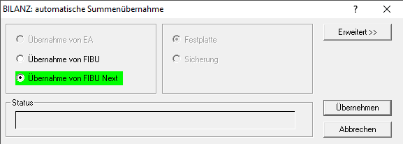
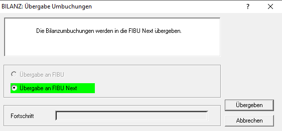
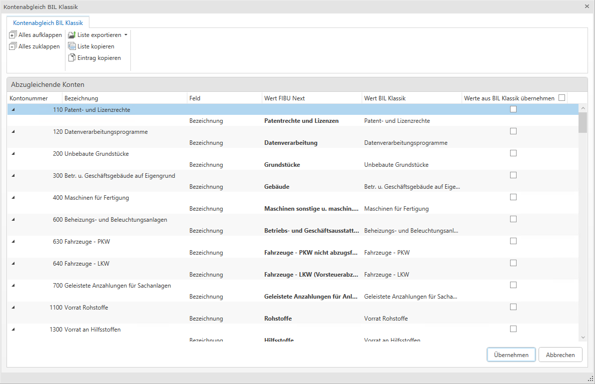
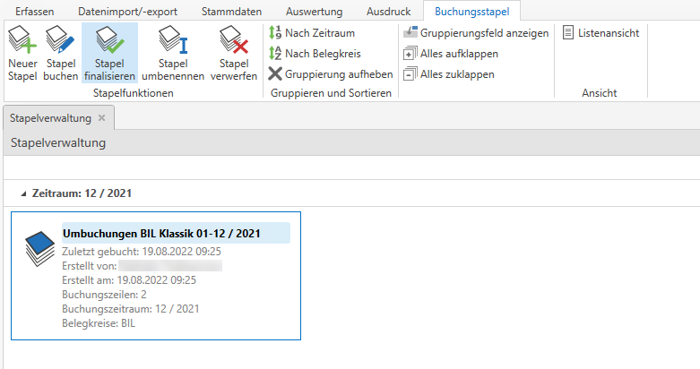
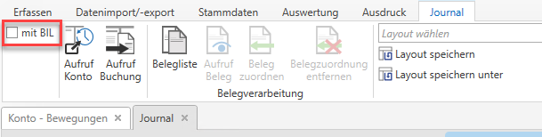
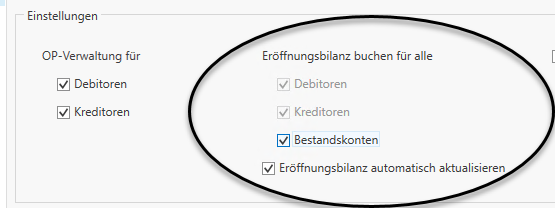
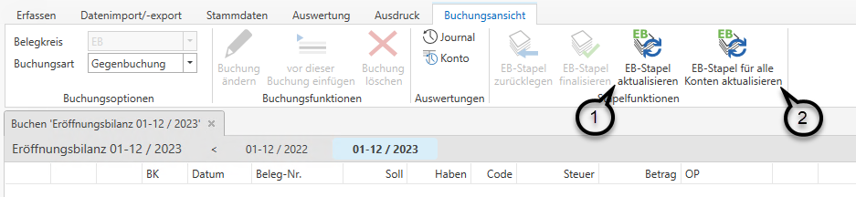
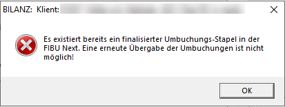
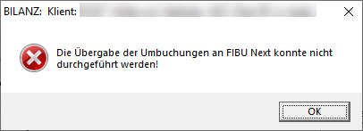

Ab der RZL Programmversion 2.22.8 bieten wir Ihnen die Möglichkeit, die
in der Bilanz durchgeführten Umbuchungen inklusive der Buchungen aus der
Gewinnverteilung in die FIBU Next zu übernehmen.

# Vor dem Bilanzieren

Im Bilanzprogramm können Sie über den Menüpunkt *Bearbeiten / Übernahme
/ Automat. Summenübernahme* die Salden aus der FIBU Next übernehmen.
Sobald der Klient im zu bilanzierenden Wirtschaftsjahr in der FIBU Next
bebucht wurde, wird im folgenden Dialog automatisch die FIBU Next
vorgeschlagen.  
Wurde der Klient nur in die FIBU Next zur Ansicht übernommen aber dort
keine Buchungen mehr gemacht, wird *Übernahme von FIBU* vorgeschlagen.

# Nach dem Bilanzieren

## Vorgehensweise in der Bilanz

Im Bilanzprogramm können Sie die Umbuchungen nach Abschluss der
Bilanzierung wie gewohnt über den Menüpunkt *Bearbeiten / Übernahme /
Übergabe Umbuchungen in FIBU* in die FIBU Next übergeben.  
Sobald der Klient des bilanzierten Wirtschaftsjahres in der FIBU Next
besteht (auch wenn er nur übergeben wurde und noch keine Buchungen in
der FIBU Next durchgeführt wurden), wird hier nur *Übergabe an FIBU
Next* vorgeschlagen.

HINWEIS

Bei Verwendung der FIBU Next ist es nun möglich, auch nach Übergabe der
Umbuchungen weitere Änderungen in der Bilanz vorzunehmen und die
Umbuchungen anschließend mehrmals zu übergeben.  
Erst beim Finalisieren des Stapels in der FIBU Next kann die Bilanz
schließlich nicht mehr bearbeitet werden und die Umbuchungen können
nicht mehr übergeben werden. Zusätzliche Umbuchungen oder Änderungen
müssten anschließend händisch eingebucht werden.

Unterscheiden sich Konten in der Bilanz und in der FIBU Next, so
erscheint ein Dialog zum Kontenabgleich. Hier können Sie auswählen,
welchen Wert Sie weiterverwenden möchten und in welchem Programm somit
die Kontenbezeichnungen und andere Stammdaten angepasst werden sollen.

## Vorgehensweise in der FIBU Next

### Übergabe der Umbuchungen

In der FIBU Next sind die übergebenen Bilanz-Umbuchungen nun in Form
eines offenen Umbuchungsstapels ersichtlich.

Buchungen innerhalb dieses Stapels können in der FIBU Next nicht
bearbeitet werden. Es ist aber möglich den Stapel mittels einer
neuerlichen Übergabe der Umbuchungen aus der Bilanz zu überschreiben,
falls sich in der Bilanz noch Änderungen ergeben.

Zusätzlich kann der Buchungsstapel auch umbenannt oder verworfen werden.

> **HINWEIS**
>
> Finalisieren Sie diesen Umbuchungsstapel erst dann, wenn Sie sicher
> keine weiteren Umbuchungen aus der Bilanz übernehmen werden.

Die Umbuchungen aus diesem Stapel sind bereits im Journal sowie in den
Kontoauswertungen in der FIBU Next ersichtlich. In den Menüpunkten
*Auswertung / Konto* und *Auswertung / Journal* können Sie nun jeweils
per Häkchen auswählen, ob die jeweilige Auswertung mit den
Bilanzumbuchungen oder ohne diesen dargestellt werden soll.

### Eröffnungsbilanzwerte im Folgejahr

Die Eröffnungsbilanzwerte werden im Zuge des automatischen Abgleichs
sofort in das Folgejahr übernommen, sofern die Option *Eröffnungsbilanz
buchen für alle Konten* im jeweiligen Folgejahr aktiviert ist.  
Hier greift immer die Einstellung des Jahres, in welchem die EB-Werte
gebucht werden sollen.

Beispiel:

Wurde das Jahr 2022 bilanziert und anschließend die Umbuchungen in die
FIBU Next des Jahres 2022 übernommen, so müssen die Häkchen für die
Eröffnungsbilanzbuchungen im Wirtschaftsjahr 2023 gesetzt werden, damit
die EB automatisch gebucht bzw. aktualisiert werden kann.

HINWEIS

Eine Übernahme der Eröffnungsbilanzwerte in die Buchhaltung des
Folgejahres ist somit bei Verwendung der FIBU Next nicht mehr
erforderlich bzw. auch nicht mehr möglich.

### Spezialfälle bei Umstellung von FIBU Klassik auf FIBU Next

### Das Bilanzjahr wurde vollständig in der FIBU Klassik gebucht und in die FIBU Next übergeben. Das Folgejahr wurde bereits in der FIBU Next angelegt und dort bebucht.

In diesem Fall ist im Folgejahr das unter *Stamm / FIBU / Allgemein* das
Häkchen *Eröffnungsbilanz automatisch aktualisieren* zu setzen. Damit
werden für alle darüber angehakten Kontoarten (Debitoren, Kreditoren und
Bestandskonten) die EB-Werte automatisch gebucht und aktualisiert.

### Sowohl das Bilanzjahr als auch das Folgejahr wurden aus der FIBU Klassik übernommen. 

Wurde auch das Folgejahr aus der FIBU Klassik übernommen (dabei spielt
es keine Rolle, ob auch bereits Buchungen in der FIBU Next gemacht
wurden), kann das Häkchen Eröffnungsbilanz automatisch aktualisieren
nicht gesetzt werden.  
In diesem Fall ist es notwendig nach Übergabe der Umbuchungen in die
FIBU Next im Folgejahr unter *Erfassen / Eröffnungsbilanz* die EB-Werte
händisch zu aktualisieren.  
Dabei können Sie auswählen, ob die Eröffnungsbilanz nur für jene Konten
gebucht werden soll, bei denen hinterlegt ist, dass die Eröffnungsbilanz
gebucht werden soll (entweder unter *Stamm / FIBU / Allgemein* oder
direkt in den Kontostammdaten) ***(1)*** oder generell für alle Konten
***(2)***.

HINWEIS

Wurde der EB-Stapel einmal für alle Konten aktualisiert, so ist künftig
nur mehr dieser Button aktiv. Eine Aktualisierung von (nur) ausgewählten
Konten ist in diesem Fall nicht mehr möglich, da es ansonsten zu
Differenzen kommen könnte.

### Das Bilanzjahr befindet sich noch in der FIBU Klassik, das Folgejahr wurde in die FIBU Next übernommen.

In diesem Fall empfehlen wir, vor Übergabe der Bilanz-Umbuchungen in die
FIBU das Bilanzjahr ebenfalls in die FIBU Next zu übernehmen.  
Anschließend gehen Sie bitte wie oben beschrieben (*Sowohl das
Bilanzjahr als auch das Folgejahr wurden aus der FIBU Klassik
übernommen.*) vor.

### Finalisieren des Stapels

Nachdem Sie die Bilanz vollständig abgeschlossen haben, können Sie den
Buchungsstapel schließlich finalisieren. Bitte beachten Sie dabei aber,
dass die Umbuchungen nach dem Finalisieren des Stapels kein weiteres Mal
übergeben werden können.

Folgende Meldungen erscheinen beim Versuch die Umbuchungen erneut zu
übergeben.

TIPP

Erstellen Sie vor dem Finalisieren des Buchungsstapels eine Sicherung
der FIBU-Daten über das Sicherungscenter. Damit können Sie im Falle
einer notwendigen Änderung der Bilanz die Sicherung hereinspielen und
die Umbuchungen nochmals in die FIBU Next übergeben.
