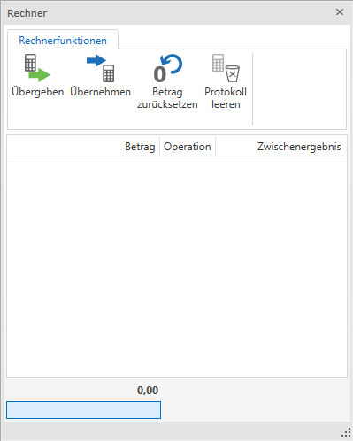

#RZL-Taschenrechner

Der RZL-Taschenrecher kann in der FIBU Next in jedem Menüpunkt mit der Tastenkombination **strg** + **R** aufgerufen werden. Der Rechner ist wie ein kaufmännischer Rechner aufgebaut.

| **Eingabe** | **Abschlusstaste** | **Wirkung**                               |
| ----------- | ------------------ | ----------------------------------------- |
| 123         | Enter              | addiert 123 zur derzeitigen Summe         |
| 123         | +                  | subtrahiert 123 von der derzeitigen Summe |
| 10 %        | Enter              | addiert 10% der Summe zum Betrag          |
| 10 %        | +                  | subtrahiert 10% der Summe vom Betrag      |
| *123        | Enter              | multipliziert die Summe mit 123           |
| /123        | Enter              | dividiert die Summe durch 123             |
| *10 %       | Enter              | errechnet 10% der Summe                   |
|             | Esc                | Rechner verlassen                         |

- Übergeben (oder auch mit dem Buchstaben H): Die angezeigte Summe wird in das Eingabefeld aus dem der Rechner aufgerufen wurde übergeben.
- Übernehmen (oder auch mit dem Buchstaben G): Der Wert des Eingabefeldes aus dem der Rechner aufgerufen wurde, wird in den Rechner übernommen.
- Betrag rücksetzen (oder auch mit dem Buchstaben C): Die bereits errechnete Zwischensumme wird auf Null gesetzt.
- Protokoll leeren (oder auch mit dem Buchstaben T): Die bereits durchgeführten Berechnungen werden gelöscht.