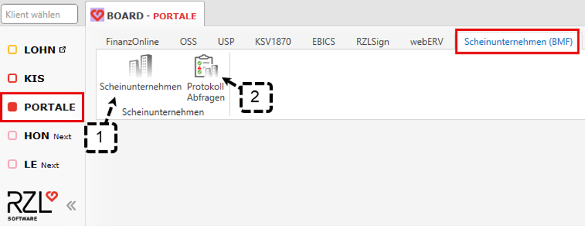
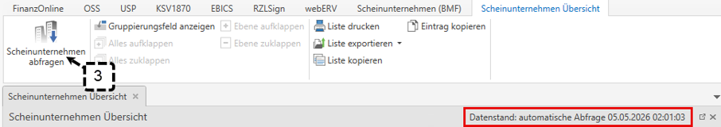
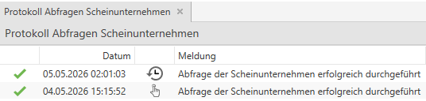

# Scheinunternehmerabfrage

Gemäß § 8 Sozialbetrugsbekämpfungsgesetz (SBBG) muss das Bundesministerium für Finanzen verpflichtend eine Liste der rechtskräftig festgestellten Scheinunternehmen zur Verfügung stellen. Um Ihnen während der laufenden Buchführung einen schnellen Zugang zu dieser Liste zu ermöglichen, besteht die Option im RZL-Board und in der RZL-FIBU eine Scheinunternehmerabfrage durchzuführen.

!!! warning "Hinweis"

    Die Scheinunternehmerabfrage ist nur in Verbindung mit dem RZL-Board möglich. Ebenfalls wird empfohlen, den RZL-Dienst zu installieren, damit die Liste der Scheinunternehmen automatisch abgerufen wird.

## Liste der Scheinunternehmen im RZL Board

Im RZL-Board steht Ihnen über die Schaltfläche *Portale* im Reiter *Scheinunternehmen (BMF)* die Liste der Scheinunternehmen zur Verfügung.

### Scheinunternehmen
Mit einem Klick auf die Schaltfläche *Scheinunternehmen (1)* öffnet sich die Liste der Scheinunternehmen. Diese Liste kann gefiltert sowie auch gruppiert werden.
Ist der RZL-Dienst installiert und aktiv, wird die Liste täglich über Nacht **abgefragt**. Das Abfrage Datum wird oberhalb der Liste angezeigt. Über *Scheinunternehmen abfragen (3)* kann die Abfrage auch manuell angestoßen werden.

### Protokoll Abfrage
Mit der Schaltfläche *Protokoll Abfragen (2)* erhalten Sie eine Liste mit allen durchgeführten Scheinunternehmerabfragen.

Das erste Symbol zeigt, dass die Abfrage automatisch über den RZL Dienst durchgeführt wurde und das zweite Symbol zeigt, dass die Abfrage manuell angestoßen wurde.

## Prüfung der Scheinunternehmen in den Kontostammdaten

In den Kontostammdaten *(Stammdaten / Konten)* gibt es analog zur Personenliste die Funktion *auf Scheinunternehmen prüfen*. 

Wird ein Konto als Scheinunternehmen erkannt (Name und Anschrift ist gleich oder UID-Nummer ist ident mit der Liste der Scheinunternehmen), ist dies mit einem **Rufzeichen** markiert.

Wird ein Konto nicht vollständig als Scheinunternehmen erkannt (Name bzw. Anschrift ist nicht ganz identisch mit der Liste der Scheinunternehmen oder z.B. Anschrift ist bei einem Scheinunternehmen hinterlegt aber der Name ist auf der Liste der Scheinunternehmen anders als im Programm), ist dies mit einem **Fragezeichen** markiert.
