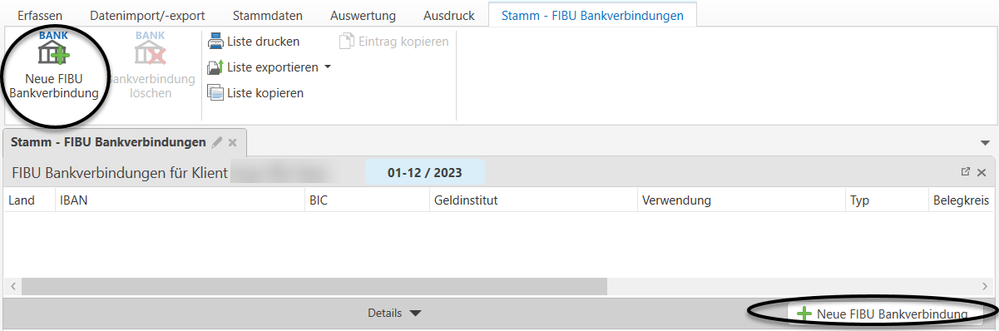
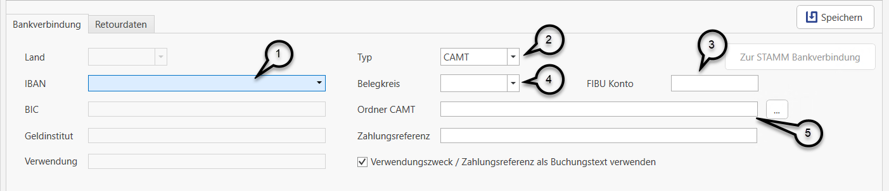
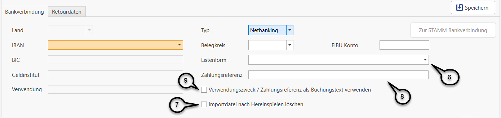

# FIBU Bankverbindungen

## FIBU Bankverbindungen

Im Menüpunkt *Stammdaten / FIBU Bankverbindungen* können Sie die Bankkonten pro Klient verwalten.

Neue Bankverbindungen können über die Schaltfläche *Neue FIBU Bankverbindung* angelegt werden.

Hier müssen Sie schließlich den *IBAN* **(1)** des jeweiligen Bankkontos eingeben. Im Feld *Typ* **(2)** muss dann definiert werden, ob bei diesem Bankkonto camt-Dateien oder Netbanking-Dateien importiert werden. Des Weiteren muss das dazugehörige *FIBU Konto* **(3)**  und der *Belegkreis* **(4)** hinterlegt werden. 

Wenn im Feld *Typ* **(2)** CAMT ausgewählt wurde, dann muss hier auch noch der Ordnerpfad **(5)**, in dem die camt-Dateien abgelegt sind bzw. aus Ihrem Electronic Banking Programm abgespeichert werden, hinterlegt werden.

Wurde im Feld *Typ* **(2)** Netbanking gewählt, dann ist hier, die zuvor angelegte *Listenform* **(6)** zu hinterlegen. Die Option *Importdatei nach Hereinspielen löschen* **(7)** kann aktiviert werden, wenn die Netbanking-Datei nach dem Hereinspielen in die FIBU  automatisch gelöscht werden soll.

Das Feld *Zahlungsreferenz* **(8)** ist für die Eingabe von Platzhaltern zur Analyse der Zahlungsreferenz vorgesehen. Hier kann definiert werden, wie das Feld Zahlungsreferenz aussieht. Die Zahlungsreferenz sollte die OP-Nummer des Kunden der zu zahlenden Rechnung beinhalten. Wurde die OP-Nummer eindeutig vergeben – das heißt die OP-Nummer kommt nur einmal in der Buchhaltun vor – genügt es, nur die OP-Nummer in die Zahlungsreferenz zu codieren. Angabe dieser Referenznummer bei Zahlung erfolgt eine automatische Zuordnung des Offenen Postens/
der Kontonummer. Ist keine eindeutige Erkennung der OP-Nummer möglich, kann auch die Kontonummer
hinterlegt werden.

**Mögliche Platzhalter:**

| Platzhalter  |  Beschreibung  |
|--------------------------------------- ---------------- | -------------------------------------------------------------------------------- |
| K     |  Platzhalter für eine Stelle der Kontonummer  |
| O    |  Platzhalter für eine Stelle der OP-Nummer (Buchstabe O)  |
| Ziffer 1-9   |  Fixe Ergänzung entweder bzgl. der Konto- oder der OP Nummer  |

 Mit dem Häkchen *Verwendungszweck / Zahlungsreferenz als Buchungstext verwenden* **(9)** können Sie steuern, ob der Verwendungszweck bzw. die Zahlungsreferenz der Überweisung als Buchungstext vorgeschlagen werden soll.
Ist das Häkchen deaktiviert, ist der Verwendungszweck bzw. Zahlungsreferenz trotzdem in hellgrau ersichtlich, wird aber bei der Verbuchung der Kontoauszugszeile nicht übernommen.

Wenn Sie hier eine neue Bankverbindung eingeben, öffnet sich automatisch die Personenansicht des Klienten, damit auch hier die entsprechende Bankverbindung erfasst werden kann. Alle Bankverbindungen der FIBU müssen stets auch in den Personenstammdaten des jeweiligen Klienten hinterlegt sein.

**Beschreibung der Eingabefelder:**

| **Feld**                                                | **Beschreibung** |
|--------------------------------------- ---------------- | -------------------------------------------------------------------------------- |
| **Land**                                                | In welchem Land das Bankkonto geführt wird |
| **IBAN**                                                | IBAN (International Bank Account Number) des entsprechenden Bankkontos                                                                                                      |
| **BIC**                                                 | BIC (Business Identifier Code) der kontoführenden Bank (wird aus der Bankverbindung in den Personenstammdaten übernommen)                                                   |
| **Geldinstitut**                                        | Bei ausgefülltem BIC wird dieses Feld automatisch befüllt (wird aus der Bankverbindung in den Personenstammdaten übernommen)                                                |
| **Verwendung**                                          | Hier kann ein freier Text erfasst werden, um Konten leichter unterscheiden zu können. (z.B. Kreditkonto) (wird aus der Bankverbindung in den Personenstammdaten übernommen) |
| **Belegkreis**                                          | In welchem Belegkreis diese Bankverbindung gebucht werden soll                                                                                                              |
| **FIBU** **Konto**                                      | Sammelkonto für die Bank-Verbuchung                                                                                                                                         |
| **Ordner** **CAMT**                                     | Ordnerpfad, in dem die camt-Dateien abgelegt sind bzw. aus Ihrem Electronic Banking Programm abgespeichert werden                                                           |
| **Verwendungszweck** **als Buchungstext** **verwenden** | Der Verwendungszweck der Banküberweisung wird als Buchungstext vorgeschlagen.                                                                                               |

!!! info "Tipp"

    Bereits in der FIBU Klassik angelegte Bankkonten werden bei Übergabe in die FIBU Next automatisch mitübernommen und sowohl in den Bankverbindungen der Personenstammdaten, als auch in den FIBU Bankverbindungen hinterlegt.  
    Außerdem werden die hinterlegten Bankkonten auch beim Sichern eines Klienten mitgesichert und daher beim Einspielen einer Sicherung übernommen.

!!! warning "Hinweis"

    Bankverbindungen können nur für das Land **Österreich** und die Währung **EUR** angelegt werden.
