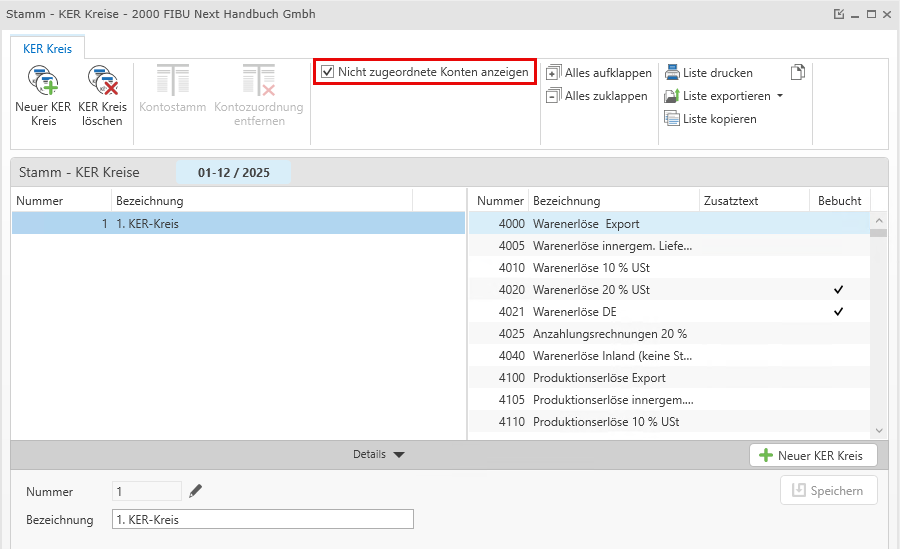

# KER Kreise

KER Kreise dienen dazu, innerhalb einer KER getrennte Bereiche auswerten zu können (z.B. bei mehreren Filialen). 

### Anlegen von KER-Kreisen

Eine erfolgsmäßig getrennte Auswertung einzelner Unternehmensbereiche oder Standorte (z.B. bei Filialen) ist im Programm über das Arbeiten mit verschiedenen KER-Kreisen möglich.

Zur Anlage der KER-Kreise ist der Menüpunkt *Stammdaten / KER Kreise* anzuwählen. Grundvoraussetzung ist, dass für jeden KER-Kreis eigene Konten definiert sind.

Nach Eingabe einer fortlaufenden Nummer (KER-Kreis Nr. 0 kann **nicht** angelegt werden) und einer Bezeichnung wird der KER-Kreis mit *Speichern* angelegt. 

Per Drag and Drop können Sie die Konten dem KER-Kreis zuordnen.