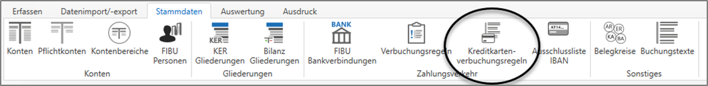
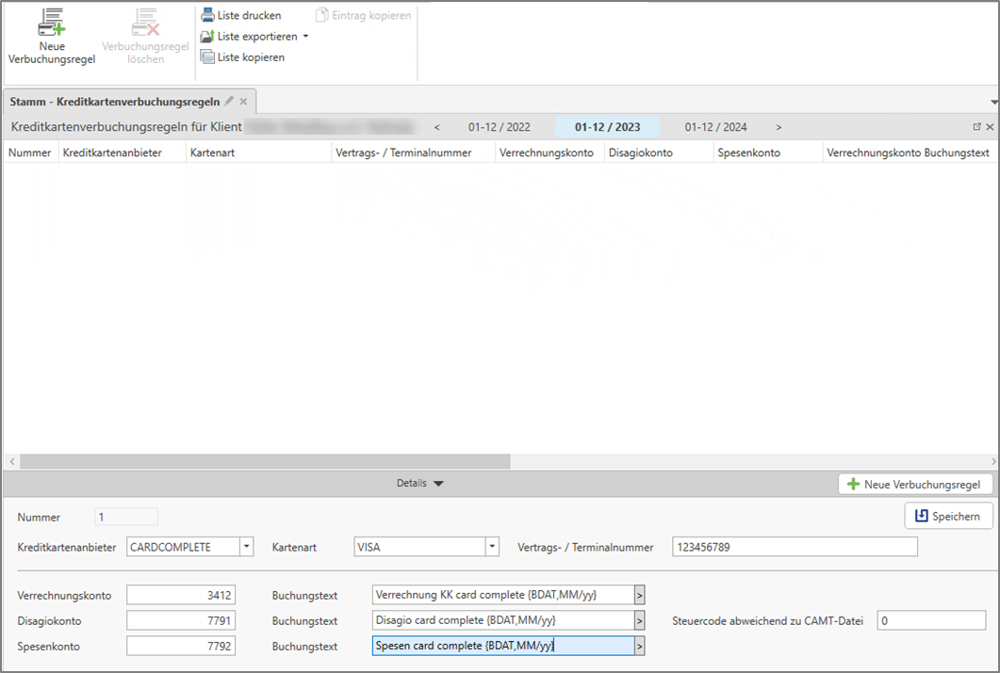

# Kreditkarten Verbuchungsregeln

## Kreditkarten Verbuchungsregeln

Sofern die CAMT-Dateien Detailinformationen zur Kreditkartenabrechnung beinhalten, kann für die Aufsplittung von Spesen, Disagio und Verrechnungsbetrag ein Buchungsvorschlag erstellt werden. Dazu ist die Hinter-legung der betroffenen Kreditkarte mit der jeweiligen Terminalnummer notwendig. 

Unter *Stammdaten / Kreditkartenverbuchungsregeln* können die notwendigen Kontenhinterlegungen für den automatischen Buchungsvorschlag eingegeben werden.

!!! info "Tipp"
    Auch direkt aus dem camt-Buchungsstapel können Sie die Stammdaten der Kreditkarten Verbuchungsregeln öffnen und dort neue Verbuchungsregeln anlegen oder bestehende Verbuchungsregeln bearbeiten.

Hier kann pro Terminal eine eigene Kreditkartenverbuchungsregel angelegt werden.

Die Vertrags- bzw. Terminalnummer können Sie in den meisten Fällen der monatlichen Abrechnung entnehmen (Ausnahme Kreditkartenanbieter Worldline - hier gibt es keine eindeutige Terminalnummer)

Sämtliche in der Liste vorhandenen Kreditkartenanbieter liefern die notwendigen Informationen für die automatische Aufteilung der Buchung im Verwendungszweck mit.
In den Stammdaten der Kreditkartenverbuchungsregel können Sie die Konten festlegen, auf welche die Abrechnung aufgeteilt werden soll.

Im jeweiligen Buchungstext ist es zusätzlich möglich einen Platzhalter (über den Pfeil am rechten Ende des Feldes) für z.B. den Buchungsmonat zu hinterlegen.

Zusätzlich ist es möglich einen zur camt-Datei abweichenden Steuercode für die Buchung zu erfassen.

!!! warning "Hinweis"
    Als Verrechnungskonto darf kein OP-führendes Konto erfasst werden. 

!!! warning "Hinweis"
    Sollte es bei einem Anbieter nicht möglich sein bspw. ein Spesenkonto zu erfassen, so werden diese Informationen von dem Anbieter nicht mitgeliefert und können dementsprechend auch nicht von RZL automatisch verarbeitet werden. 

!!! info "Tipp"
    Werden diese Kreditkartenverbuchungsregeln während dem Buchen eines camt-Stapels angelegt oder verändert, so werden diese auf alle nicht geklärten Buchungszeilen, die zutreffend sind, ange-wandt sobald der Buchungsstapel geschlossen und neu geöffnet wird. 
