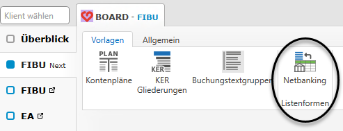
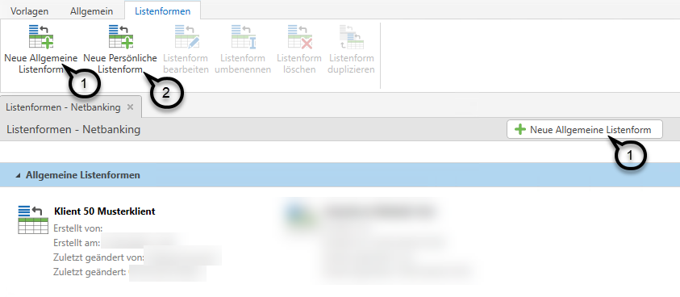
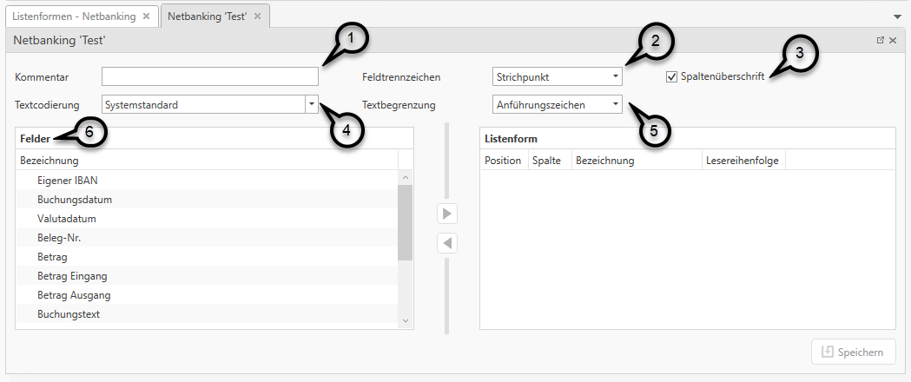
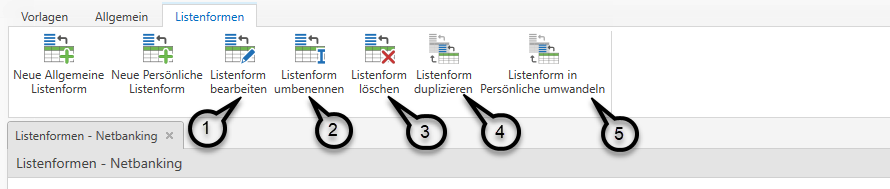

# Listenformen Netbanking

### Anlage / Bearbeiten Listenform
Eine Listenform kann in den allgemeinen Stammdaten der FIBU Next (ohne vorherige Auswahl eines Klienten) im Reiter *Vorlagen* unter *Listenformen / Netbanking* angelegt werden. 

Mit dem Button *Neue Allgemeine Listenform* oder *Neue Persönliche Listenform* kann eine neue Listenform angelegt werden.

Für die neu angelegte Listenform ist eine Bezeichnung zu vergeben.

Anschließend öffnet sich der Dialog zur Anlage der Listenform.

Im Feld *Kommentar* ***(1)*** können Sie einen Kommentar zur Listenform erfassen (z.B. den Namen der Bank). In den Feldern *Feldtrennzeichen* ***(2)***, *Textbegrenzung* ***(5)***, *Textcodierung* ***(4)*** sowie beim Feld *Spaltenüberschrift* ***(3)*** können  diverse Grundeinstellungen bezüglich des Formates der Importdatei getroffen werden.
!!! info "Tipp"
    Öffnen Sie die Netbanking Datei am Speicherort mit dem Editor. Rechtsklick auf die Datei *Öffnen mit / Editor*. Über  die Ansicht im Editor sind die Textbegrenzungszeichen sowie die Feldtrennzeichen gut zu erkennen.
Auf der linken Seite sind einzelnen *Felder* ***(6)*** gelistet. 

Mit Auswahl des gewünschten Feldes und Klick auf den Pfeil nach rechts ***(1)***, können die einzelnen Felder der Listenform hinzugefügt werden. Mit Klick auf den linken Pfeil ***(2)*** kann ein Feld von der Listenform wieder entfernt werden. Weiters ist es möglich die Reihenfolge der Felder in der Listenform nachträglich zu verschieben. Halten Sie die linke Maustaste gedrückt und verschieben Sie das ausgewählte Feld  in die gewünschte Position.
!!! warning "Hinweis"
    Achten Sie darauf, dass die Reihenfolge der Listenfelder mit der Reihenfolge der Felder in der Importdatei exakt übereinstimmt.

Beinhaltet die Importdatei ein Feld, das nicht übernommen werden soll, muss in der Listenform ein Leerfeld ***(3)*** als Platzhalter eingefügt werden.
Mit dem Button *Feld löschen* ***(4)*** kann ein Feld in der Listenform gelöscht werden.

Felder, die bereits der Listenform hinzugefügt wurden und kein zweites Mal hinzugefügt werden können, werden in der Liste der Feld hellgrau angezeigt. Felder, die nicht der Listenform hinzugefügt wurden oder Felder die öfter der Listenform hinzugefügt werden können, sind nicht ausgegraut. 

Das Feld Buchungstext, Verwendungszweck, Partner, Partner IBAN und Partner BIC können der Listenform mehrmals hinzugefügt werden. Bei diesen Feldern wird dann eine Lesereihenfolge ***(5)*** definiert. Diese Lesereihenfolge kann über den Button *Feld konfigurieren* ***(6)*** für das jeweilige Feld bearbeitet werden. Das bedeutet, dass sich z. B. das Feld Verwendungszweck aus diesen beiden Feldern zusammensetzt. Damit die Reihenfolge bestimmt werden kann, wie diese beiden Felder zusammengefügt werden sollen, muss eine Lesereihenfolge angegeben werden.

Mit Klick auf *Speichern* ***(7)*** werden die eingegebenen Daten bzw. Änderungen in der Listenform gespeichert.

Listenformen können jederzeit bearbeitet ***(1)***, umbenannt ***(2)***, gelöscht ***(3)***, dupliziert ***(4)*** oder von einer Allgemeinen Listenform in eine Persönliche Listenform umgewandelt ***(5)*** werden.

