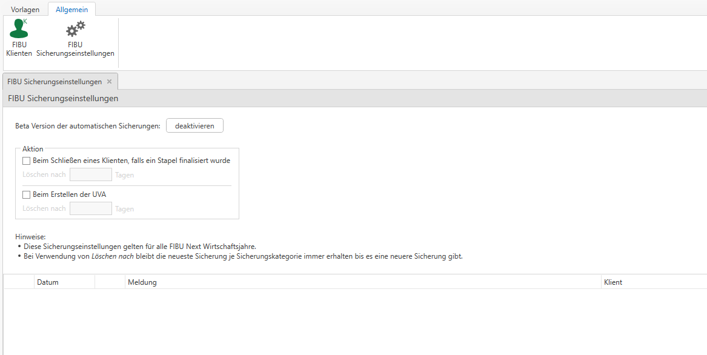
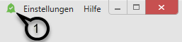
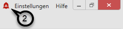
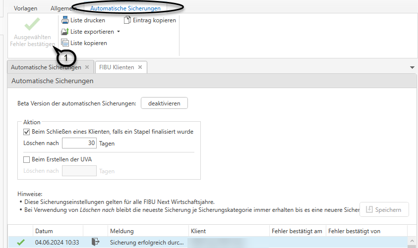

# FIBU Sicherungseinstellungen

### Automatische Sicherungen

In der FIBU Next ist es auch möglich, automatische Sicherungen aller Klienten erstellen zu lassen.

Die Einstellungen dazu finden Sie im Menüpunkt *FIBU Next / Allgemein / FIBU Sicherungseinstellungen*. Wichtig
dabei ist, dass noch kein Klient im Board ausgewählt ist. Diese Einstellungen gelten klientenübergreifend für die
gesamte Kanzlei.

!!! warning "Hinweis"
    Die automatischen Sicherungseinstellungen befinden sich aktuell noch in einer Beta-Version. Bevor Sie die automatischen Sicherungen nutzen können, müssen Sie einmalig den Nutzungsbedingungen zustimmen.

Hier haben Sie verschiedene Möglichkeiten, um automatische Sicherungen zu hinterlegen.

- **Beim Schließen des Klienten, falls ein Stapel finalisiert wurde**: Hier kann festgelegt werden, dass immer beim Schließen eines Klienten
in der FIBU Next eine Sicherung erstellt werden soll, wenn in der Zwischenzeit ein Stapel finalisiert wurde.

- **Beim Erstellen der UVA**: Mit dieser Option wird immer eine Sicherung erstellt, sobald bei einem Klienten
die UVA erstellt wird.

Diese beiden Möglichkeiten können auch miteinander kombiniert werden.

Zusätzlich kann man pro Option auswählen, nach welcher Dauer die Sicherungen automatisch gelöscht werden
sollen. 
Die letzte Sicherung pro Klient und Wirtschaftsjahr bleibt dabei aber immer bestehen.

!!! warning "Hinweis"
    Sicherungen werden nur erstellt, wenn es seit dem letzten Sicherungsstand Änderungen gegeben hat.

Im FIBU Sicherungscenter können Sie nun anhand der einzelnen Symbole erkennen, aus welcher Option heraus
eine Sicherung erstellt wurde.

 Beim Schließen des Klienten, falls ein Stapel finalisiert wurde  
 Beim Erstellen der UVA  
 Manuelle Sicherung  

Im Benachrichtigunszentrum ist neben anderen Benachrichtigungen ersichtlich, ob die Automatischen Sicherungen der FIBU Next problemlos durchgeführt werden konnten (grüne Glocke) ***(1)*** oder ob Probleme aufgetreten sind (rote Glocke) ***(2)***. Das Benachrichtigungszentrum finden Sie rechts oben im Board, unabhängig davon in welchem Dialog Sie sich gerade befinden, kann das Benachrichtigungszentrum geöffnet werden.

{width="250"}

{width="250"}

Sollten Fehler aufgetreten sein, können diese in den FIBU Sicherungseinstellungen bestätigt werden. Nach Bestätigung dieser Fehler ***(1)*** wird die Glocke wieder grün (sofern keine anderen fehlerhaften Meldungen (z.B. bei der Belegsynchronisation) im Benachrichtungszentrum vorliegen). Das Bestätigen der fehlerhaften Einträge ist eine eigene Berechtigung ("Protokoll verwalten"), die automatisch in der Rolle Finanzbuchhaltung enthalten ist.

