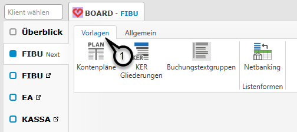
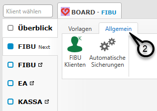

# Stammdaten

## Allgemeine Stammdaten

Die allgemeinen Stammdaten, welche für alle Klienten zur Verfügung stehen (Kanzleistammdaten), werden im RZL Board im Register *FIBU Next* verwaltet.  
Wechseln Sie dazu auf den Menüpunkt *FIBU Next* ohne zuvor einen Klienten auszuwählen.
Hier gibt es da Register *Vorlagen* ***(1)***, in dem die Kontenpläne, KER Gliederungen, Buchungstextgruppen und die Listenformen verwaltet werden.

Im Register *Allgemein* ***(2)*** gibt es eine Liste der FIBU Klienten und auch die Sicheurngseinstellungen können hier getroffen werden.

