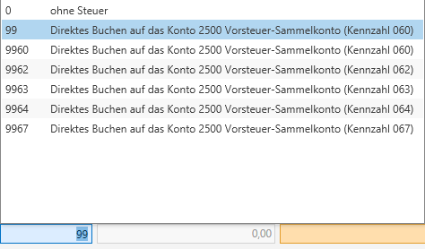

# Buchen mit Vorsteuer

## Buchen mit Vorsteuer

| **Geschäftsfall**                            | **Kennziffer** **UVA** | **Steuerhinterlegung** **am** **Konto** |                 |               | **Eingabe** **im Buchungsdialog** **(Feld Code)** | **Anzeige** **Journal/Konto** |
| -------------------------------------------- | ---------------------- | --------------------------------------- | --------------- | ------------- | ------------------------------------------------- | ----------------------------- |
|                                              |                        | **Code**                                | **Prozentsatz** | **Steuertyp** |                                                   |                               |
| Einkauf mit 10% Vorsteuer                    | &#48;60                | Vorsteuer                               | &#49;0          | \-            | &#49;0                                            | V10                           |
| Einkauf mit 20% Vorsteuer                    | &#48;60                | Vorsteuer                               | &#50;0          | \-            | &#50;0                                            | V20                           |
| Einkauf mit 13% Vorsteuer                    | &#48;60                | Vorsteuer                               | &#49;3          | \-            | &#49;3                                            | V13                           |
| Einkauf mit 19 % für Jungholz und Mittelberg | &#48;60                | Vorsteuer                               | &#49;9          | \-            | &#49;9                                            | V19                           |

Auf Konten mit Vorsteuerverankerung *(USt-Code: Vorsteuer)* kann mit unterschiedlichen Steuersätzen gebucht werden.  
Sofern auch ein Prozentsatz in den Stammdaten verankert wurde, wird dieser beim Buchen des Kontos vorgeschlagen, kann jedoch jederzeit überschrieben werden.

Falls Sie in den Stammdaten einen prozentuellen VSt-Abzug verankert haben (*STAMM / FIBU / Umsatzsteuer*), wird dieser eingegebene Prozentsatz als abzugsfähige Vorsteuer berücksichtigt. Dazu muss im Feld *Code* nach dem Steuersatz *20/10/19/13* ein Stern (\*) eingefügt werden (z.B. 20\*)

### Abweichende Vorsteuer

Eingangsrechnungen mit abweichender Vorsteuer können mit dem ***Steuercode 99*** im Feld *Code* gebucht werden. Nach Eingabe des Codes können Sie im Feld *Steuer* den abweichenden Steuerbetrag und im Feld *Betrag* den gesamten Rechnungsbetrag eingeben.

Im Journal wird Ihnen diese Buchung mit V* angezeigt.

### Direkte Buchung auf dem Vorsteuerkonto

Sie können auch direkt am Vorsteuer-Sammelkonto buchen. Dazu müssen Sie im Feld *Code* den ***Steuercode 99*** eingeben. Den Vorsteuerbetrag können Sie anschließend im Feld *Betrag* eingeben.

Buchungen ohne Steuercode werden nicht in die Umsatzsteuervoranmeldung aufgenommen!

Mit Eingabe des ***Steuercode 99*** und anschließendem Betätigen der F2-Taste können Sie festlegen, in welche Kennziffer der UVA diese Berichtigung gelangen soll.

| **Code** | **Kennziffer UVA**                                |
| -------- | ------------------------------------------------- |
| 99       | Kennzahl 060    *(selbes Ergebnis wie Code 9960)* |
| 9960     | Kennzahl 060    *(selbes Ergebnis wie Code 99)*   |
| 9962     | Kennzahl 062                                      |
| 9963     | Kennzahl 063                                      |
| 9964     | Kennzahl 064                                      |
| 9967     | Kennzahl 067                                      |

