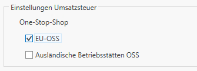
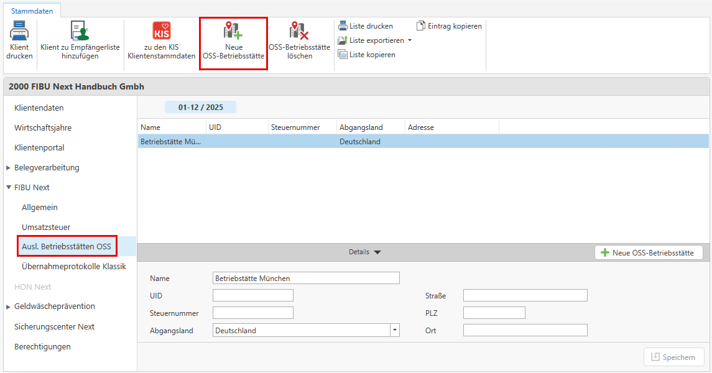
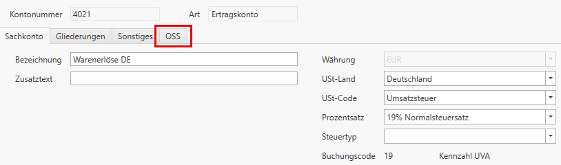
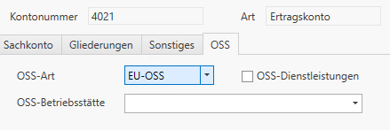

# One-Stop-Shop (OSS)
Der One-Stop-Shop (OSS) für die Umsatzsteuer ist ein EU-weites Verfahren, das Unternehmen ermöglicht, ihre Umsatzsteuerpflichtigkeiten für grenzüberschreitende Verkäufe an Endverbraucher zentral in einem einzigen EU-Mitgliedsstaat zu erfüllen. Dadurch müssen sie nicht mehr in jedem einzelnen Bestimmungsland steuerlich registrieren. Der OSS vereinfacht die Deklaration und Zahlung der Umsatzsteuer und fördert den inneneuropäischen Online-Handel.

## Einrichtung des Klienten

### Stammdaten

Für die Verbuchung von OSS-Umsätzen in FIBU Next ist die Aktivierung des One-Stop-Shop in den Stammdaten erforderlich.
Diese erfolgt im Bereich **Stamm / FIBU Next / Allgemein** über die entsprechende Checkbox.

Nach der Aktivierung können die benötigten **Betriebsstätten** zentral in den Stammdaten verwaltet werden.

Bei der Anlage sind folgende Angaben erforderlich:

- Name der Betriebstätte
  
- UID oder Steuernumer oder alternativ
  
- Abgangsland

Zusätzlich muss das jeweilige **USt-Land** in den Umsatzsteuer-Einstellungen hinterlegt sein, damit eine korrekte Verarbeitung der OSS-Umsätze möglich ist.

### Kontostammdaten

In den **Kontostammdaten** steht bei aktivem EU-OSS ein eigener Tab ***OSS*** zur Verfügung. Dieser befindet sich rechts neben dem Tab ***Sonstiges*** und ist für alle Sachkonten sichtbar, sobald EU-OSS in den Stammdaten aktiviert wurde.

Eine OSS-Zuordnung ist nur bei Konten mit **Umsatzsteuer** und einem **Steuercode mit Prozentsatz (M%%)** möglich. Bei anderen Codes (z.B. M01, M02, AN20,..) steht die OSS-Konfiguration nicht zur Verfügung.

Im Tab **OSS** kann die OSS-Art ausgewählt werden.
Die Betriebsstätte ist nur sichtbar, wenn in den Stammdaten eine ausländische Betriebsstätte angelegt wurde.

!!! info "Tipp"

    Über **F4** können Betriebsstätten neu angelegt oder bearbeitet werden.

!!! warning "Hinweis"

    Ist *OSS-Dienstleistungen* aktiviert, muss die gewählte Betriebsstätte eine UID oder Steuernummer enthalten.

## Buchen von OSS-Umsätzen
Bei Buchungen auf ein Konto mit EU-OSS-Hinterlegung werden die Daten automatisch für die spätere OSS-Meldung gespeichert.
Bei Splitbuchungen fließen nur die jeweils relevanten Gegenbuchungen auf Konten mit OSS-Hinterlegung ein.

- Direktbuchungen auf OSS-Konten sind nicht möglich.

- Ein abweichender USt-Monat bestimmt den Monat der OSS-Meldung

## Elektronische Übermittlung erstellen
Die Übermittlung der EU-OSS Meldung erfolgt über die Website von **Finanzonline** mittels Dateiupload.
Unter **Portale / OSS** befindet sich der Einstiegspunkt zur Meldungserstellung. Über den Button **EU-OSS erstellen** wird ein Dialog zur Generierung der XML-Datei geöffnet.
Im Bereich **Offene Übermittlungen** wird die erzeugte Datei angezeigt.
