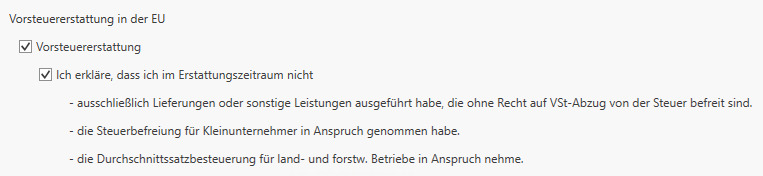
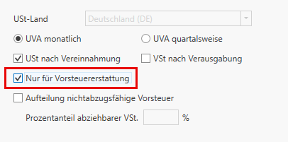
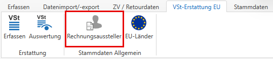
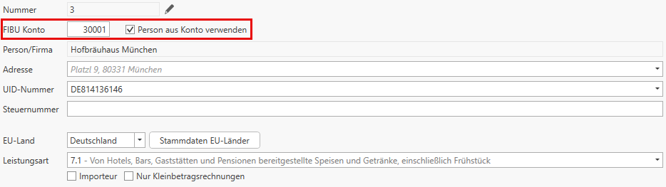

# Elektronische Vortsteuererstattung

Die Vorsteuererstattung ermöglicht es österreichischen Unternehmen im EU-Ausland bezahlte Umsatzsteuer zurückzufordern, da diese nicht über die österreichische Umsatzsteuervoranmeldung geltend gemacht werden kann. 
Der Antrag wird über die Finanzonline eingebracht, aber vom jeweiligen ausländischen Finanzamt geprüft und eingebracht.

In der FIBU Next kann die elektronische Vorsteuererstattung für EU-Länder automatisch gebucht, als XML-Datei erstellt und anschließend über Finanzonline hochgeladen werden.

## Anlage der notwendigen Stammdaten

### Aktivierung der VSt-Erstattung
Um die VSt-Erstattungsanträge aus dem Programm erstellen zu können, müssen Sie über *STAMM / FIBU Next / Allgemein* die Option *Vorsteuererstattung in der EU* auswählen. 

!!! warning "Hinweis"

    Dieser Punkt wird aus der FIBU Klassik übernommen.

Auch die darunter befindlichen Optionen müssen bei Zutreffen angehakt werden, da die VSt-Erstattung nicht zulässig ist, wenn

- Ausschließlich Lieferungen oder sonstige Leistungen ausgeführt wurden, die ohne Recht auf VSt-Abzug von der Steuer befreit sind
- Die Steuerbefreiung für Kleinunternehmer in Anspruch genommen wurde
- Die Durchschnittssatzbesteuerung für land- und forstw. Betriebe in Anspruch genommen wurde

### Aktivierung nur für VSt-Erstattung

Die Auswahl der Option nur für VSt-Erstattung bewirkt, dass dieses USt-Land nur für Zwecke der Vorsteuererstattung angelegt wird. Bei Auswahl dieser Option muss unter *Stammdaten / Pflichtkonten / USt* für das ausgewählte USt-Land das **Vorsteuersammelkonto** hinterlegt sein. In der Folge können für dieses USt-Land in den Stammdaten der Konten nur mehr die Codes **ohne Steuer, VSt-Hinterlegungen, nicht abzugsf. VSt**, hinterlegt werden, damit nicht irrtümlicherweise Buchungen mit MWSt für dieses Land durchgeführt werden.

!!! warning "Hinweis"

    Dieser Punkt wird auch aus der FIBU Klassik übernommen.

### Anlegen der Rechnungsausteller
Bei der elektronischen Übermittlung der VSt-Erstattungsantrages sind auch die Daten der Rechnungsausteller elektronisch zu übermitteln und müssen daher im Programm angelegt werden.

Die Rechnungsaussteller müssen im Klienten über *VSt-Erstattung EU / Rechnungsausteller* angelegt werden.

Über die Kontonummer kann ein Personenkonto ausgewählt werden. Ist die Option *Personenkonto verwenden* aktiviert, werden die Personendaten automatisch aus dem Personenkonto übernommen. 

!!! warning "Hinweis"

    Die zugeordnete Person kann dann nicht mehr geändert werden. Adresse und UID können bei Bedarf dennoch angepasst werden.

Ist die Option nicht aktiviert, kann die Person unabhängig vom Personenkonto manuell ausgewählt werden oder geändert werden.
Das Löschen eines Rechnungsaustellers bleibt die zugeordnete Person erhalten. Das Löschen ist nur möglich, wenn noch keine Erfassungszeilen vorhanden sind.

!!! warning "Hinweis"

    Im Regelfall sind der Staat und das EU-Land der Rückerstattung identisch. In Ausnahmefällen, wie z. B. beim Import, kann das EU-Land der Rückerstattung vom Staat des Rechnungsaustellers abweichen. In diesem Fall ist die Option *Importeur* anzuwählen.

Wird der Vermerk *nur Kleinbetragsrechnungen* gesetzt, ist die UID-Nummer nicht zwingend notwendig. Die Art der Leistung kann beim Rechnungsausteller verankert werden und wird beim Erfassen der Vorsteuererstattung vorgeschlagen, kann dort aber auch überschrieben werden.

### Anlegen des EU-Landes des Rechnungsaustellers
Voraussetzung für die elektronische Einreichung einer Vorsteuererstattungsantrags ist, dass

-	Keine Lieferungen oder sonstige Leistungen sowie keine innergemeinschaftlichen Erwerbe getätigt wurden, oder

-	Nur Leistungen bewirkt wurden, bei denen die Steuerschuld auf den Leistungsempfänger übergangen ist (Reverse Charge) und/oder nur steuerfreie Beförderungsleistungen und damit verbundene Nebentätigkeiten mit Recht auf Vorsteuerabzug bewirkt wurden.

Es muss daher über VSt-Erstattung *EU / EU-Länder* für die Länder, die bei einem Rechnungsausteller hinterlegt sind, bei Zutreffen eine der beiden Optionen aktiviert sein, damit eine elektronische Übermittlung möglich ist.

Unter bestimmten Bedingungen muss im Antrag der Vorsteuererstattung die Art der vom Rechnungsausteller erbrachten Leistung textlich erläutert werden. Daher kann bei den Stammdaten des EU-Landes des Rechnungsaustellers die Sprache der Erläuterung hinterlegt werden. Standardmäßig ist die jeweilige Landessprache hinterlegt.

