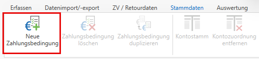
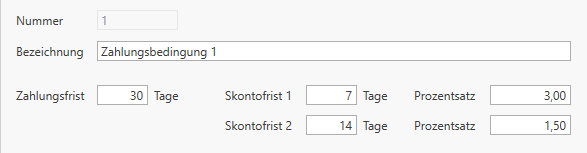
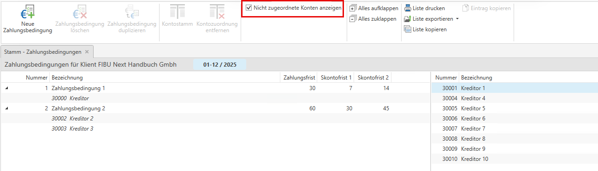

# Zahlungsbedingungen

## Zahlungsbedingungen im Zahlungsverkehr
Im Bereich **ZV / Retourdaten** steht ein neuer Menüpunkt **Zahlungsbedingungen** zu Verfügung. Hier können standardisierte Zahlungsbedingungen für Lieferanten zentral definiert und gepflegt werden - auch ohne aktive Zahlungsverkehrs-Lizenz. Die Bedingungen umfassen Zahlungsfristen sowie optionale Skontoregelungen und es können Stammdaten zugeordnet werden.

### Zahlungsbedingungen anlegen
Über den Menüpunkt **Zahlungsbedingungen** können neue Zahlungsbedingungen angelegt werden.

Beim Anlegen einer Zahlungsbedingung müssen folgende Informationen hinterlegt werden:

* Nummer 
* Bezeichnung  
* Zahlungsfrist 
* Skontofrist 1 inkl. Skontosatz (%) 
* Skontofrist 2 inkl. Skontosatz (%) 

### Zuordnung von Kreditoren
Um Kreditoren einer Zahlungsbedingung zuzuordnen, müssen zunächst die **nicht zugeordneten Konten** eingeblendet werden. Anschließend werden die Kreditoren auf der rechten Seite angezeigt.

Die angezeigten Kreditoren können per **Drag and Drop** einer Zahlungsbedingung zugewiesen werden. 

!!! info "Tipp"

    Einer Zahlungsbedingung können mehrere Kreditoren zugeordnet werden.

## Zahlungsverkehr bei Kreditoren
Bei Kreditoren können Informationen zum Zahlungsverkehr hinterlegt werden. Rechts neben dem Personenkonto befindet sich der Tab **Zahlungsverkehr**, in dem die entsprechenden Einstellungen vorgenommen werden können.

Im Bereich Zahlungslauf kann ausgewählt werden, ob kein elektronischer Zahlungsverkehr verwendet wird, ob Zahlungen per SEPA-Überweisung erfolgen oder ob eine Lastschrift durch den Kreditor durchgeführt wird.

!!! info "Tipp"

    Zusätzlich kann dem Kreditor eine Zahlungsbedingung zugeordnet werden.
