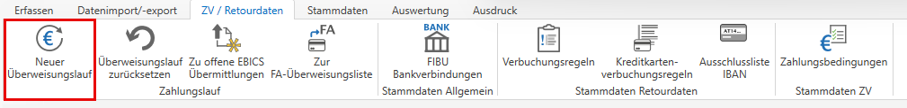
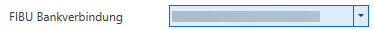
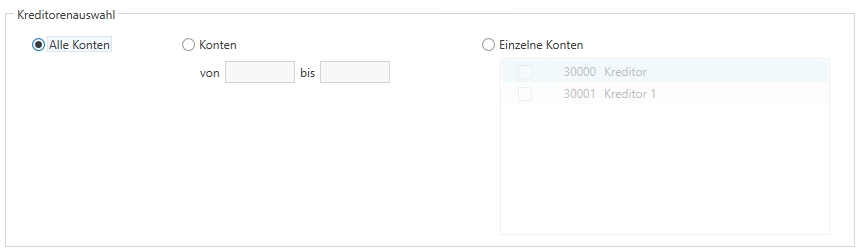
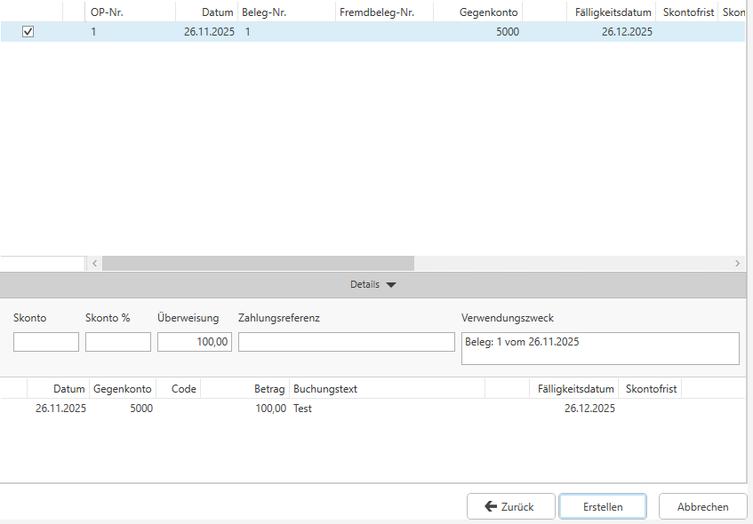
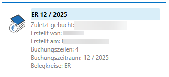
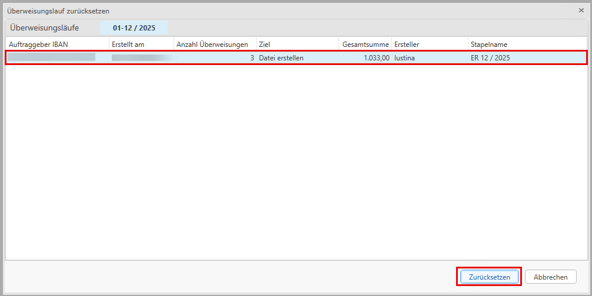

### Überweisungslauf im Zahlungsverkehr

Der Überweisungslauf dient dazu, auf Basis bereits eingebuchter Eingangsrechnungen von Lieferanten SEPA-Überweisungen zu erstellen. Abhängig von den Einstellungen können die Zahlungen entweder als Überweisungsdatei ausgegeben oder über EBICS an die Bank übertragen werden.

Der Überweisungslauf wird über das Menü **Zahlungsverkehr** aufgerufen.

## Einstellungen Überweisungslauf

#### Bankverbindung
Zu Beginn des Überweisungslaufs wird die **FIBU-Bankverbindung** ausgewählt, von der aus die Überweisungen durchgeführt werden sollen.
Berücksichtigt werden ausschließlich:

* Kreditoren ohne hinterlegte Bankverbindungen
* Kreditoren, bei denen genau diese Bankverbindung zugeordnet ist.

!!! warning "Hinweis"
    Kreditoren mit einer anderen Bankverbindung werden automatisch vom Zahlungslauf ausgeschlossen und nicht angezeigt.

#### Festlegung des Ziels
**Datei erstellen**: Es wird eine SEPA-Überweisungsdatei erzeugt.

**EBICS**: Die Überweisung wird direkt über EBICS an die Bank übermittelt. Diese Option steht nur zur Verfügung, wenn die gewählte Bankverbindung EBICS-fähig ist.

#### Durchführungsdatum
Das Datum darf nicht in der Vergangenheit liegen. Als Vorschlag wird entweder das Tagesdatum oder ein in der Bankverbindung hinterlegtes Datum verwendet.

#### Stichtag für offene Posten
Der Stichtag steuert, welche offenen Posten in den Zahlungslauf einbezogen werden. Er wird standardmäßig aus der Bankverbindung übernommen, kann aber bei Bedarf übersteuert werden, um den Zahlungsumfang gezielt anzupassen.

#### Automatische Verbuchung
Optional kann festgelegt werden, ob die Überweisungen automatisch verbucht werden sollen. Die Voreinstellung wird aus der Bankverbindung übernommen, kann jedoch im Zahlungslauf individuell geändert werden.
Ist die automatische Verbuchung aktiviert, müssen zusätzlich folgende Angaben gemacht werden:

* Buchungsdatum (muss im aktuellen Wirtschaftsjahr liegen)
* Belegnummer
* OP-Nummer

### Auswahl Kreditoren
Das ist ein zusätzlicher Filter, der die von der FIBU Bankverbindung ausgewählten Kreditoren genauer filtern lässt.

## Überweisungslauf

### Überweisungslauf - Auswahl der Kreditoren
Die Übersicht links zeigt alle Kreditoren, die eine SEPA-Überweisung hinterlegt haben und zur gewählten FIBU-Bankverbindung passen, sowie Kreditoren ohne hinterlegte Bankverbindung. Jeder Kreditor erscheint in einer eigenen Zeile.

Am Ende wird die Gesamtsumme aller ausgewählten Kreditoren angezeigt.

### Überweisungslauf - Offene Posten
Die Übersicht rechts zeigt alle offenen Posten in einer Liste, jeweils eine Zeile pro OP.

Fällige OPs (inklusive Skonto) werden standardmäßig mit einem Haken markiert. Gutschriften werden auch automatisch erkannt. OPs mit negativem Überweisungsbetrag werden nicht angezeigt.

### Bearbeitung pro OP
Skonto, Teilzahlungen, Zahlungsreferenz oder Verwendungszweck können direkt angepasst werden. Wenn ein Überweisungsbetrag manuell eingegeben wird, werden Skontofelder geleert.

## Überweisungsdatei erstellen
Über die Schaltfläche **Erstellen** wird die Überweisungsdatei erzeugt - entweder als Datei oder direkt im EBICS-Modul. Für jeden OP, der vollständig übermittelt wurde, wird das Feld **Überweisung erstellt am** gesetzt.

Dabei wird das Häkchen **Überweisungen als Sammellastschrift vom Konto abbuchen** (*Stamm / Bankverbindungen*) berücksichtigt. Die Erstellung löst außerdem eine **EB-Aktualisierung** aus, sodass OPs im Folgejahr - *sofern im Stamm aktiviert* - ebenfalls nicht mehr im Überweisungslauf erscheinen.

## Automatisches Verbuchen
Beim **automatischen Verbuchen** wird pro Zahlungslauf ein Stapel mit einer Splitbuchung erstellt. Die Gesamtsumme der Überweisungen wird als **Splitsammelbuchung** auf das ZV-Zwischenkonto gebucht, während die Gegenbuchungen pro OP auf den jeweiligen Kreditoren erfolgen - inklusive OP-Ausgleich.

Wird bei einem OP Skonto gewährt und enthält der OP eine Rechnung mit abweichender Vorsteuer, öffnet sich ein **OP-Dialog zur Skontoaufteilung**. Bei mehreren betroffenen OPs erscheint der Dialog entsprechend mehrfach hintereinander.

!!! warning "Hinweis"

    Ein Stapel kann nicht geöffnet oder bearbeitet werden.

## Überweisungslauf zurücksetzen

Über den Menüpunkt **Überweisungslauf zurücksetzen** kann ein bereits erstellter Überweisungslauf rückgängig gemacht werden. Nach Auswahl des Menüpunktes öffnet sich ein Dialog, indem die letzten Überweisungsläufe pro Wirtschaftsjahr angezeigt werden.

Der gewünschte Überweisungslauf kann ausgewählt und über **Zurücksetzen** aufgehoben werden.

!!! warning "Hinweis"

    Überweisungsläufe mit finalisiertem Stapel können nicht mehr zurückgesetzt werden.

### Auswirkungen auf Offene Posten

Beim Zurücksetzen wird eine **EB-Aktualisierung** durchgeführt. Dadurch erscheinen die betroffenen Offenen Posten - *sofern im Stamm aktiviert* - auch im Folgejahr wieder im Überweisungslauf. Wurde mindestens ein OP des Überweisungslaufs bereits ausgeglichen oder ist nicht mehr vorhanden, wird dieser nicht zurückgesetzt. Der Überweisungslauf selbst gilt dennoch als zurückgesetzt und wird aus der Liste entfernt.

!!! warning "Hinweis"

    Überweisungsläufe aus dem Vorjahr werden im neuen Wirtschaftsjahr nicht angezeigt. Wird ein Überweisungslauf im Vorjahr zurückgesetzt, erfolgt die Rücksetzung automatisch auch im neuen Jahr.
