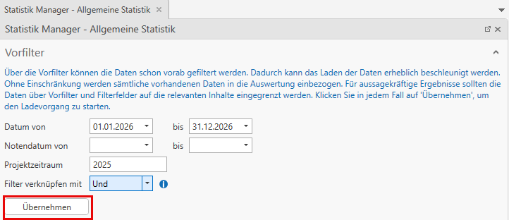
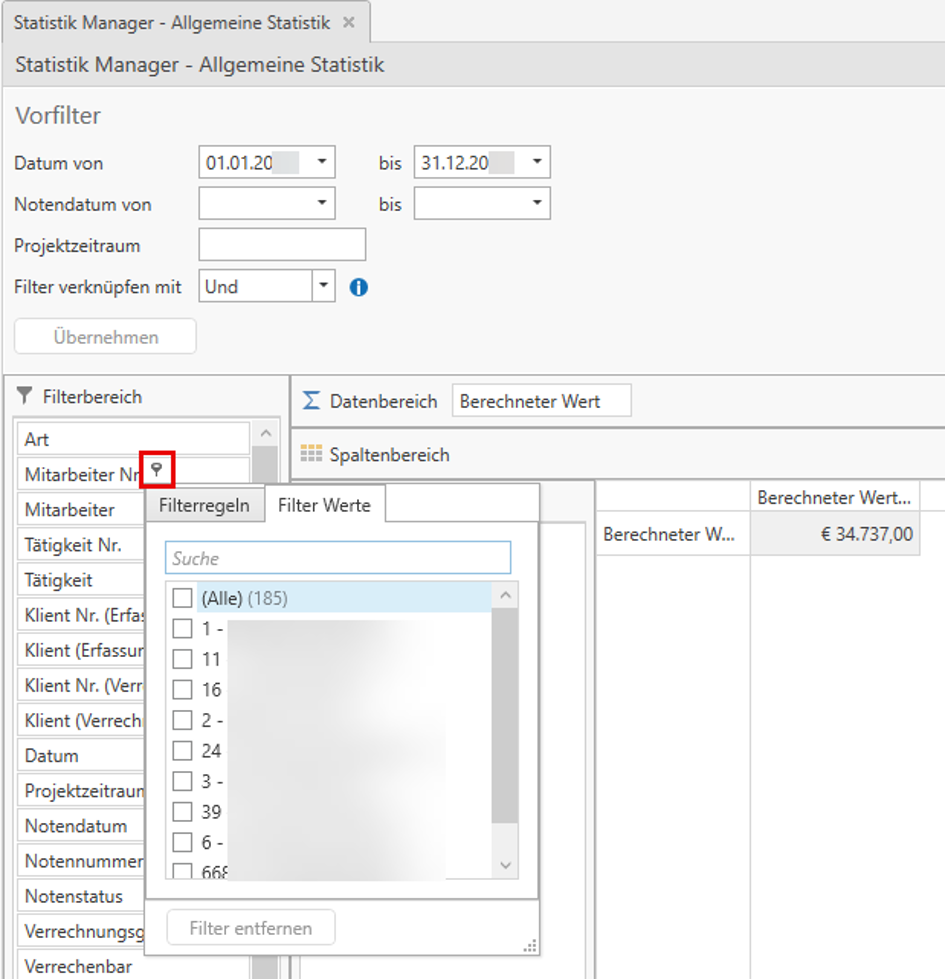

# Allgemeiner Statistik Manager

Im HON Next steht Ihnen im Reiter *Auswertungen* der Allgemeine Statistik Manager zur Verfügung. Mit dieser Auswertung können Sie sämtliche Erfassungszeilen der Honorarverrechnung analysieren.

Im Unterschied zum Statistik Manager Umsatz und zum Statistik Manager Leistungen können Sie die Auswertung sowohl nach dem Leistungsdatum als auch nach dem Notendatum einschränken.

Der Statistik Manager Leistungen bezieht sich ausschließlich auf das Leistungsdatum, während sich der Statistik Manager Umsatz ausschließlich auf das Notendatum bezieht.

Beim Öffnen des Allgemeinen Statistik Managers können Sie zunächst einen Vorfilter festlegen. Beispiel: Alle Leistungen, die im Jahr 2026 erfasst wurden, jedoch den Projektzeitraum 2025 betreffen.

Ohne Vorfilter werden alle verfügbaren Daten in die Auswertung einbezogen. Für aussagekräftige Ergebnisse empfiehlt es sich, die Daten mithilfe von Vorfiltern und weiteren Filterfeldern einzugrenzen.

!!! warning "Hinweis"
    Das Feld *Filter verknüpfen mit* gibt an, wie die einzelnen Zeitraumfilter miteinander verknüpft werden sollen. Beispielweise erfasst Datum ODER verrechnet Notendatum in einem spezifischen Jahr.

Klicken Sie anschließend auf *Übernehmen*, um die Daten zu laden.

## Bereiche des Allgemeinen Statistik Managers

**Filterbereich**

Hier stehen alle verfügbaren Filterfelder zur Verfügung. Bewegen Sie den Mauszeiger über ein Feld, um das Filtersymbol einzublenden und einen Filter zu setzen.

**Datenbereich**

Definiert die auszuwertenden Kennzahlen, beispielsweise Verrechneter Wert, Berechneter Wert, Einheiten, Betrag, erfasste / berechnete Dauer, Zu-/Abschläge / Rabatte, Akonto/Anzahlung, Eigenkosten oder Deckungsbeitrag.

**Spaltenbereich**

Legt fest, nach welchen Kriterien die Daten in Spalten gruppiert werden.

**Zeilenbereich**

Legt fest, nach welchen Kriterien die Daten in Zeilen gruppiert werden.

!!! warning "Hinweis"
    Für die Datenfelder Berechneter Wert, Zu-/Abschlag/Rabatt, Verrechneter Wert, Akonto/Anzahlung gilt allgemein folgendes:
    Das Feld **Berechneter Wert** beinhaltet den berechneten Wert einer Leistung (ohne Zu-/Abschläge) oder einer Pauschale. 
    Das Feld **Zu-/Abschlag/Rabatt** beinhaltet den Wert sämtlicher Zu-/Abschläge oder Rabatte/Aufschläge, auch die Zu-/Abschläge, die im Zuge eines Pauschalausgleichs gemacht wurden. 
    Das Feld **Verrechneter Wert** ist im Wesentlichen die Summe aus dem Berechneten Wert und Zu-/Abschlag/Rabatt. Das Feld dient als Vereinfachung, damit bei umsatzbezogenen Auswertungen nicht beide Felder addiert werden müssen. Die Felder Berechneter Wert und Zu-/Abschlag/Rabatt existieren als eigenständige Felder, damit sie gegebenenfalls verglichen/gegenübergestellt werden können. 
    Das Feld **Akonto/Anzahlung** beinhaltet nur die Werte der Akonten und Anzahlungen.

## Felddefinition

| Leistungen          |                                                                                                                                                                                                             |
| ------------------- | ----------------------------------------------------------------------------------------------------------------------------------------------------------------------------------------------------------- |
| Datum               | Leistungsdatum                                                                                                                                                                                              |
| Notendatum          | Notendatum der Honorarnote, in der die Leistung direkt abgerechnet wurde oder, wenn die Leistung Teil eines Pauschalausgleichs ist, das Notendatum der Honorarnote, in der die Pauschale abgerechnet wurde. |
| Projektzeitraum     | Projektzeitraum der Leistung                                                                                                                                                                                |
| Status              | *Offen* = wenn die Leistung weder Teil eines Pauschalausgleichs ist oder verrechnet wurde.                                                                                                                  |
|                     | *Durch Pauschale ausgeglichen* = wenn Teil eines Pauschalausgleichs, aber die Pauschale selbst noch nicht verrechnet wurde.                                                                                 |
|                     | *Verrechnet* = wenn die Leistung direkt oder indirekt durch eine Pauschale abgerechnet wurde.                                                                                                               |
| Berechneter Wert    | Berechneter Wert der Leistung; kann nicht vorhanden sein, wenn die Leistung nicht verrechenbar ist oder der Wert nicht berechnet werden kann.                                                               |
| Verrechneter Wert   | siehe Berechneter Wert                                                                                                                                                                                      |
| Zu-/Abschlag/Rabatt | leer                                                                                                                                                                                                        |
| Akonto/Anzahlung    | leer                                                                                                                                                                                                        |

!!! info "Tipp"
    Folgendes gilt für alle Arten von Pauschalzeilen (Ausgeglichene Pauschale, Nicht ausgeglichene Pauschale, Pauschalausgleichszeile).

| Pauschalen          |                                                                                          |
| ------------------- | ---------------------------------------------------------------------------------------- |
| Datum               | Feld Datum                                                                               |
| Notendatum          | Notendatum der Honorarnote, in der die Pauschale abgerechnet wurde.                      |
| Projektzeitraum     | Projektzeitraum der Pauschale                                                            |
| Status              | *Offen* = wenn Pauschale noch nicht verrechnet wurde.                                    |
|                     | *Verrechnet* = wenn die Pauschale verrechnet wurde.                                      |
| Berechneter Wert    | Betrag der Pauschale. Bei der Pauschalausgleichszeile der negative Betrag der Pauschale. |
| Verrechneter Wert   | siehe Berechneter Wert                                                                   |
| Zu-/Abschlag/Rabatt | leer                                                                                     |
| Akonto/Anzahlung    | leer                                                                                     |

!!! info "Tipp"
    Folgendes gilt für Zu-/Abschläge mit automatischer und manueller Verteilung.

| Zu-/Abschläge bei einem Pauschalausgleich |                                                                     |
| ----------------------------------------- | ------------------------------------------------------------------- |
| Datum                                     | Datum der Pauschale                                                 |
| Notendatum                                | Notendatum der Honorarnote, in der die Pauschale abgerechnet wurde. |
| Projektzeitraum                           | Projektzeitraum der Pauschale                                       |
| Status                                    | *Offen* = wenn Pauschale noch nicht verrechnet wurde.               |
|                                           | *Verrechnet* = wenn die Pauschale verrechnet wurde.                 |
| Berechneter Wert                          | leer                                                                |
| Verrechneter Wert                         | siehe Zu-/Abschlag/Rabatt                                           |
| Zu-/Abschlag/Rabatt                       | Wert des Zu-/Abschlags                                              |
| Akonto/Anzahlung                          | leer                                                                |

!!! info "Tipp"
    Folgendes gilt für Zu-/Abschläge, Rabatte oder Aufschläge mit automatischer und manueller Verteilung.

| Zu-/Abschläge/Rabatte/Aufschläge bei der Notenerstellung |                                                                                                |
| -------------------------------------------------------- | ---------------------------------------------------------------------------------------------- |
| Datum                                                    | Notendatum der Honorarnote, bei welcher der Zu-/Abschlag, Rabatt oder Aufschlag gemacht wurde. |
| Notendatum                                               | Notendatum der Honorarnote, bei welcher der Zu-/Abschlag, Rabatt oder Aufschlag gemacht wurde. |
| Projektzeitraum                                          | Projektzeitraum der Notenzeile, mit welcher der Zu-/Abschlag, Rabatt oder verbunden ist.       |
| Status                                                   | immer verrechnet                                                                               |
| Berechneter Wert                                         | leer                                                                                           |
| Verrechneter Wert                                        | siehe Zu-/Abschlag/Rabatt                                                                      |
| Zu-/Abschlag/Rabatt                                      | Wert des Zu-/Abschlags                                                                         |
| Akonto/Anzahlung                                         | leer                                                                                           |

!!! info "Tipp"
    Folgendes gilt für alle Arten von Akonto- und Anzahlungszeilen.

| Akonto/Anzahlung    |                                                                                                                                                                                                                                              |
| ------------------- | -------------------------------------------------------------------------------------------------------------------------------------------------------------------------------------------------------------------------------------------- |
| Datum               | Feld Datum                                                                                                                                                                                                                                   |
| Notendatum          | Notendatum der Honorarnote, in der das Akonto bzw. die Anzahlung abgerechnet wurde.                                                                                                                                                          |
| Projektzeitraum     | Projektzeitraum des Akontos/der Anzahlung                                                                                                                                                                                                    |
| Status Akonto       | *Offen* = wenn das Akonto noch nicht verrechnet wurde.                                                                                                                                                                                       |
|                     | *Verrechnet* = wenn das Akonto verrechnet wurde                                                                                                                                                                                              |
| Status Anzahlung    | *Offen* = wenn die Anzahlung noch nicht in der „Schlussnote“ verrechnet wurde, das heißt, wenn die Anzahlung in einer Anzahlungsnote verrechnet wurde, gilt sie in dieser Statistik trotzdem als offen. Es gibt keinen eigenen Status dafür. |
|                     | *Verrechnet* = wenn die Anzahlung in der „Schlussnote“ verrechnet/abgezogen wurde. Ermöglicht ein Gegenüberstellen der offenen Leistungen mit den offenen Anzahlungen.                                                                       |
| Berechneter Wert    | leer                                                                                                                                                                                                                                         |
| Verrechneter Wert   | leer                                                                                                                                                                                                                                         |
| Zu-/Abschlag/Rabatt | leer                                                                                                                                                                                                                                         |
| Akonto/Anzahlung    | negativer Betrag des Akontos bzw. der Anzahlung                                                                                                                                                                                              |

## Bedienung Statistik Manager
Ziehen Sie die gewünschten Felder per Drag & Drop in den Daten-/Spalten- oder Zeilenbereich.
Vgl. Kapitel [Statistik Manager](Statistik%20Manager.md)
