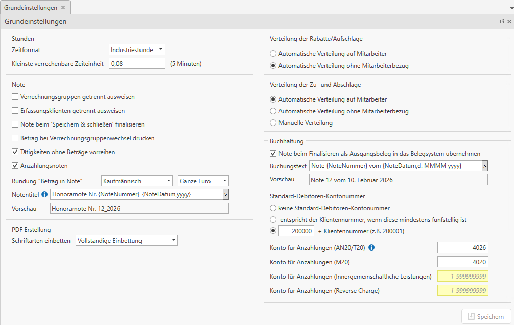

# Grundeinstellungen

Im Registerblatt *Einstellungen* können Sie die Grundeinstellungen
definieren. Die Einstellungen für die Leistungserfassung der Mitarbeiter
werden ebenso in diesem Registerblatt getroffen.

Wenn Sie auf den Button *Grundeinstellungen* klicken, öffnet sich
nachfolgender Tab.

## Stunden

Im Drop-Down Feld können Sie einstellen, ob Sie die Leistungserfassung
in Normalstunden (1 h = 60 Minuten) oder in Industriestunden (1 h = 100
Industrieminuten) führen wollen.

*Beispiel für die Eingabe:*

Erfasst werden eineinhalb Stunden für die Buchhaltung, sowie eine
viertel Stunde zusätzliche Arbeiten:

Ansicht bei Eingabe in Normalstunden:

Ansicht bei Eingabe in Industriestunden:

**Kleinste verrechenbare Zeiteinheit**

Hier kann die Zeiteinheit, welche mindestens an den Klienten verrechnet
wird, hinterlegt werden. Es wird jeweils auf ein Vielfaches der
hinterlegten Eingabe gerundet. Um die Rundung darzustellen, wird
zwischen *Dauer Erfassung* und *Dauer Verrechnung* unterschieden.

Beispiel bei hinterlegter Kleinsten verrechenbaren Einheit von einer
Viertelstunde.

Die Wertberechnung erfolgt auf Basis der verrechenbaren Dauer. Die
Eigenkosten werden auf Basis der erfassten Dauer ermittelt.

Die verrechenbare Dauer wird auf der Note, auf dem Notenjournal sowie
bei den Umsatzstatistiken angeführt.

## Note

**Verrechnungsgruppen getrennt ausweisen**

Ist die Option *Verrechnungsgruppen getrennt ausweisen* aktiviert, wird
die Note nach Verrechnungsgruppen aufgeteilt. Ist diese Option nicht
aktiviert, werden nur die Tätigkeiten auf der Note ausgewiesen. Diese
Einstellung wird beim Erstellen der Note gespeichert und kann für die
erstellte Note nicht mehr verändert werden.

Ansicht der Note, wenn *Verrechnungsgruppen getrennt ausweisen*
aktiviert:

Ansicht der Note, wenn *Verrechnungsgruppen getrennt ausweisen*
deaktiviert:

!!! warning "Hinweis"
    Diese Einstellung kann während der Notenerstellung individuell pro Note
    geändert werden.

**Erfassungsklienten getrennt ausweisen**

Mit der Option *Erfassungsklienten getrennt ausweisen*, werden die
[Erfassungsklienten](../Verrechnungs%20Erfassungsklient/Allgemeines.md) auf der Note mit dem Klientennamen extra
ausgewiesen. Diese Einstellung wird beim Erstellen der Note gespeichert
und kann für die erstellte Note nicht mehr verändert werden.

Ansicht der Note, wenn *Erfassungsklienten getrennt ausweisen*
aktiviert:

Alle Erfassungsklienten werden mit dem Klientennamen und den
dazugehörigen Leistungen angeführt.

Sollte eine Note ohne Aufteilung auf die Erfassungsklienten erfolgen,
ist die Option Erfassungsklienten getrennt ausweisen zu deaktivieren.

!!! warning "Hinweis"
    Sind die Optionen *Verrechnungsgruppen getrennt ausweisen* und
    *Erfassungsklienten getrennt ausweisen* gemeinsam aktiviert, erfolgt bei
    der Notenerstellung zusätzlich eine Unterteilung pro Erfassungsklient
    pro Verrechnungsgruppe.

**Note beim „Speichern & schließen finalisieren**

Wählen Sie das Feld *Note beim „Speichern & schließen finalisieren* aus,
wenn Sie keine vorläufigen Noten erstellen wollen, sondern jede Note
sofort bei Fertigstellung finalisieren wollen.

**Betrag bei Verrechnungsgruppenwechsel drucken & Tätigkeiten ohne
Betrag vorreihen**

Die Optionen *Betrag bei Verrechnungsgruppenwechsel drucken* und
*Tätigkeiten ohne Betrag vorreihen* beziehen sich auf *[Tätigkeiten](../Stammdaten%20HON%20Next/Tätigkeiten.md) ohne
Betrag in Note*.

Die Option *Betrag bei Verrechnungsgruppenwechsel drucken* bewirkt, dass
wenn die Note nicht nach Verrechnungsgruppen gegliedert ist und
Tätigkeiten ohne Betrag abgerechnet werden, automatisch bevor eine neue
Verrechnungsgruppe beginnt eine Summe gebildet wird.

Die Option *Tätigkeiten ohne Betrag vorreihen* bewirkt, dass Tätigkeiten
ohne Betrag als erstes innerhalb der Verrechnungsgruppe abgerechnet
werden. Grundsätzlich werden die Tätigkeiten nach den Tätigkeitsnummern
absteigend in der Note aufgelistet.

Folgend werden die Optionen und deren Auswirkung anhand von Beispielen
erläutert.

**Beispiel 1:** Es werden zwei Tätigkeiten aus der Verrechnungsgruppe
Buchhaltung und eine Tätigkeit aus der Verrechnungsgruppe
Lohnverrechnung abgerechnet.

Eine Tätigkeit aus der Verrechnungsgruppe Buchhaltung ist ohne Betrag
definiert.

In den Grundeinstellungen sind die Optionen *Verrechnungsgruppen
getrennt ausweisen*, *Betrag bei Verrechnungsgruppenwechsel drucken* und
*Tätigkeiten ohne Betrag vorreihen* aktiv.

Auf der Note wird nun die Tätigkeit ohne Betrag (Nr. 110) vorgereiht und
der Betrag wird zur nächsten Tätigkeit der gleichen Verrechnungsgruppe
(Nr. 100) addiert. Es wird also gruppiert.

!!! warning "Hinweis"
    Eine Gruppierung kann auch individuell pro Note gemacht werden. Siehe
    Kapitel [Notenerstellung](../Notenerstellung/Notenerstellung.md#notenzeilen-gruppieren).

**Beispiel 2:** Gleiche Ausgangssituation wie Beispiel 1. In den
Grundeinstellungen sind die Optionen *Verrechnungsgruppen getrennt
ausweisen, Betrag bei Verrechnungsgruppenwechsel drucken* aktiv und die
Option *Tätigkeiten ohne Betrag vorreihen* **nicht** aktiv.

Die Tätigkeit ohne Betrag (Nr. 110) wird nun nicht mehr vorgereiht. Dies
führt dazu, dass der Betrag der Tätigkeit dennoch angedruckt wird, da er
nicht mehr zu weiteren Tätigkeiten der gleichen Verrechnungsgruppe
addiert werden kann.

!!! warning "Hinweis"
    Wird nur eine Tätigkeit auf der gesamten Note abgerechnet und ist diese
    ohne Betrag deklariert ist, wird hier auch dennoch der Betrag
    angedruckt.

**Beispiel 3:** Gleiche Ausgangssituation wie Beispiel 1. In den
Grundeinstellungen ist die Option *Verrechnungsgruppen getrennt
ausweisen* **nicht** aktiv und die Optionen *Betrag bei
Verrechnungsgruppenwechsel drucken* und *Tätigkeiten ohne Betrag
vorreihen* aktiv.

Die Verrechnungsgruppen werden nicht mehr getrennt ausgewiesen, sondern
die Note ist nach Tätigkeiten gegliedert. Aufgrund der Option
*Tätigkeiten ohne Betrag vorreihen* wird Tätigkeit Nr. 110 zu Tätigkeit
Nr. 100 addiert. Da wir auch den Haken *Betrag bei
Verrechnungsgruppenwechsel drucken* gesetzt haben, wird nun, ohne
getrennten Ausweis der Verrechnungsgruppen, eine Summe pro
Verrechnungsgruppe gebildet.

!!! warning "Hinweis"
    Ist die Option *Verrechnungsgruppen getrennt ausweisen* aktiv, wird
    immer pro Verrechnungsgruppe eine Summe gebildet.

**Anzahlungsnoten**

Setzen Sie diese Option, damit Sie mit Anzahlungsrechnungen arbeiten können (vgl. Kapitel [Anzahlungsrechnungen](../Anzahlungsrechnungen/Allgemein.md)).

**Rundung "Betrag in Note"**

Mit dieser Option können Sie eine automatische Rundung innerhalb der Notenerstellung definieren.
Es stehen folgende Möglichkeiten zur Verfügung:

- Keine Rundung = der berechnete Wert (Stundenanzahl*Stundensatz) wird bei der Notenerstellung vorgeschlagen

- Kaufmännisch auf Ganze Euro oder auf Zehner = der berechnete Wert wird bei der Notenerstellung kaufmännisch gerundet. 

Bsp.: *Kaufmännisch runden auf ganze Euro*

Berechneter Wert: 102,25 €  
Wert in der Honorarnote: 102,00 €  
Die 0,25 € werden automatisch als Abschlag ausgewiesen.

*Kaufmännisch runden auf Zehner*

Berechneter Wert: 102,25 €  
Wert in der Honorarnote: 100,00 €  
Die 2,25 € werden automatisch als Abschlag ausgewiesen.

- Immer Aufrunden auf Ganze Euro oder auf Zehner = der berechnete Wert wird bei der Notenerstellung immer aufgerundet. 

Bsp.: *Immer aufrunden auf ganze Euro*

Berechneter Wert: 102,25 €  
Wert in der Honorarnote: 103,00 €  
Die 0,75 € werden automatisch als Zuschlag ausgewiesen.

*Immer aufrunden auf Zehner*

Berechneter Wert: 102,25 €  
Wert in der Honorarnote: 110,00 €  
Die 7,75 € werden automatisch als Zuschlag ausgewiesen.

!!! warning "Hinweis"
    Bei den Notenvorschlägen (*Honorarnoten / Notenerstellung*) wird immer der berechnete Wert angezeigt.

**Notentitel**

Für die Übergabe der Honorarnoten in den RZL PDF-Manager kann im Feld
*Notentitel* eine abweichende Bezeichnung vergeben werden. Es besteht
die Möglichkeit mit Platzhaltern zu arbeiten.

Folgende Platzhalter stehen Ihnen zur Verfügung:

-   *Note.Nummer* Notennummer

-   *Note.Datum* Notendatum – Hier können Sie zwischen verschiedenen  
    Datumsformaten wählen.

-   *Klient. Nummer* Klientennummer

-   *Klient.Name* Name des Klienten

-   *Klient.DebKonto.Nummer* Debitorenkontonummer des Klienten

-   *Verrechnungsgruppe* Name der Verrechnungsgruppe

-   *VerrechnungsgruppeMitProjektzeitraum* Name der Verrechnungsg.+ der
    abgerechnete Projektzeitraum

-   *Rechnungssteller.Name* Name des dem Unternehmensbereich
    zugeordneten Klienten

-   *Rechnungssteller.Bezeichnung* Bezeichnung des Unternehmensbereiches

Unter dem Feld *Notentitel* wird beispielhaft dargestellt, welche Werte
die Platzhalter bzw. ihr gewählter Titel liefert.

!!! info "Tipp"
    Wird im Feld *Notentitel* nichts hinterlegt, lautet der Titel der Note
    „Note\_Note.Datum\_Note.Nummer“

## PDF-Erstellung

Mithilfe der Option *Schriftarten einbetten*, können Sie definieren, ob
die Schriftart in das PDF eingebettet wird oder nicht. Dies hat vor
allem Auswirkungen auf die Dateigröße der Noten im PDF Format.

Grundsätzlich wird empfohlen, die Schriftarten in das PDF-Dokument
einzubetten, um sicherzustellen, dass das Dokument auch auf allen
Geräten, wo es geöffnet wird ident aussieht.

Wird hier auf *keine Einbettung* umgestellt, wird die Schriftart nicht
in das PDF eingebettet. Dies verringert zwar die Dateigröße der
PDF-Dokumente, führt aber dazu, dass Noten nur auf Endgeräten korrekt
angezeigt werden, welche die Schrift installiert haben. Fehlt die
Schrift auf dem Endgerät, erhält der Benutzer folgende Meldung und das
PDF kann nicht korrekt dargestellt werden.

## Buchhaltung

**Note beim Finalisieren als Ausgangsbeleg in das Belegsystem
übernehmen**

Wurde die Option *Note beim Finalisieren als Ausgangsbeleg in das
Belegsystem übernehmen* gesetzt, so wird nach dem Finalisieren der
Honorarnote diese automatisch als Ausgangsrechnung in das Belegsystem
übernommen. Der Beleg erscheint im Bereich der ungebuchten Belege in der
Belegverarbeitung. Diese Option kann nur gesetzt werden, wenn Sie das
Modul Belegverarbeitung lizenziert haben.

!!! warning "Hinweis"
    Finalisierte Noten können nur unter gewissen Umständen wieder verändert
    werden (siehe [Note zurücksetzen](../Notenübersicht.md#note-zurucksetzen)).

**Buchungstext**

Für den Buchungstext in der Buchhaltung besteht im Feld *Buchungstext*
die Möglichkeit mit Platzhaltern zu arbeiten. Der Standardwert ist der
Platzhalter *Verrechnungsgruppe mit Projektzeitraum*.

Folgende Platzhalter stehen Ihnen zur Verfügung:

-   *NoteNummer* Honorarnotennummer

-   *NoteDatum* Datum der Honorarnote - verschiedene Formate verfügbar

-   *Verrechnungsgruppe* Name der Verrechnungsgruppe

-   *VerrechnungsgruppeMitProjektzeitraum* Name der Verrechnungsg.+ der
    abgerechnete Projektzeitraum

-   *Anmerkung* Der Text aus dem Feld *Anmerkung* in der Note.

-   *Klient.Nummer* Klientennummer

-   *Klient.Kurzbezeichnung* Kurzbezeichnung des Klienten

-   *Klient.Name* Name des Klienten

-   *Rechnungssteller.Bezeichnung* Bezeichnung des Unternehmensbereiches

-   *Rechnungssteller.Name* Name des Klienten des Unternehmensbereiches

Unter dem Feld *Buchungstext* wird beispielhaft dargestellt, welche
Werte die Platzhalter bzw. ihr gewählter Text liefert.

!!! warning "Hinweis"
    In der Finanzbuchhaltung ist der Buchungstext mit 80 Zeichen beschränkt.
    Ein längerer Buchungstext wird beim Verbuchen abgeschnitten.

!!! info "Tipp"
    Der Buchungstext ist kein Pflichtfeld und kann somit auch leer gelassen
    werden.

**Standard-Debitoren-Kontonummer**

-   *keine Standard-Debitoren-Kontonummer*  
    Mit dieser Option muss die Debitoren-Kontonummer selbstständig in
    den Klientenstammdaten eingetragen werden.

-   *Entspricht der Klientennummer, wenn diese mindestens fünfstellig
    ist*  
    Bei mindestens fünfstelligen Klientennummern wird automatisch die
    Klientennummer als Debitoren-Kontonummer vorgeschlagen. Bei einer
    unter fünfstelligen Klientennummer muss die Debitoren-Kontonummer
    selbstständig in den Klientenstammdaten eingetragen werden.

-   *Wert + Klientennummer (z.B. 20001)*  
    Mit dieser Option können Sie definieren, dass zur Klientennummer
    immer ein bestimmter Wert addiert wird. Bsp. Wert 20000 –
    Klientennummer 500 entspricht der Debitoren-Kontonummer 20500

!!! warning "Hinweis"
    Der Vorschlag der Debitorennummer ist in den Klientenstammdaten (siehe [Buchhaltung](../Stammdaten%20Klienten.md#buchhaltung)) ersichtlich.

**Anzahlungskonten**

Diese Konten werden bei der Verbuchung von Anzahlungsrechnungen benötigt (vgl. Kapitel [Anzahlungsrechnungen](../Anzahlungsrechnungen/Allgemein.md)).

## Verteilung der Zu- und Abschläge

Hier kann die übliche bzw. am häufigsten verwendete Verteilungsmethode
eingestellt werden. Während der Notenerstellung kann die Art der
Verteilung bei jeder Notenzeile angepasst werden. Sie können mittels
Optionsfeldern einstellen, ob die Zu- bzw. Abschläge automatisch auf den
Mitarbeiter, ohne Mitarbeiterbezug oder manuell verteilt werden.

Ihre Einstellungen können Sie mittels *Speichern* bestätigen.

## Verteilung der Rabatte/Aufschläge

Hier kann die standardmäßige Verteilungsmethode für Rabatte und
Aufschläge definiert werden. Während der Notenerstellung kann die Art
der Verteilung bei jeder Rabatt-/Aufschlagszeile angepasst werden. Sie
können mittels Optionsfeldern einstellen, ob die Rabatte/Aufschläge
automatisch auf den Mitarbeiter oder ohne Mitarbeiterbezug verteilt
werden.

Ihre Einstellungen können Sie mittels *Speichern* bestätigen.*