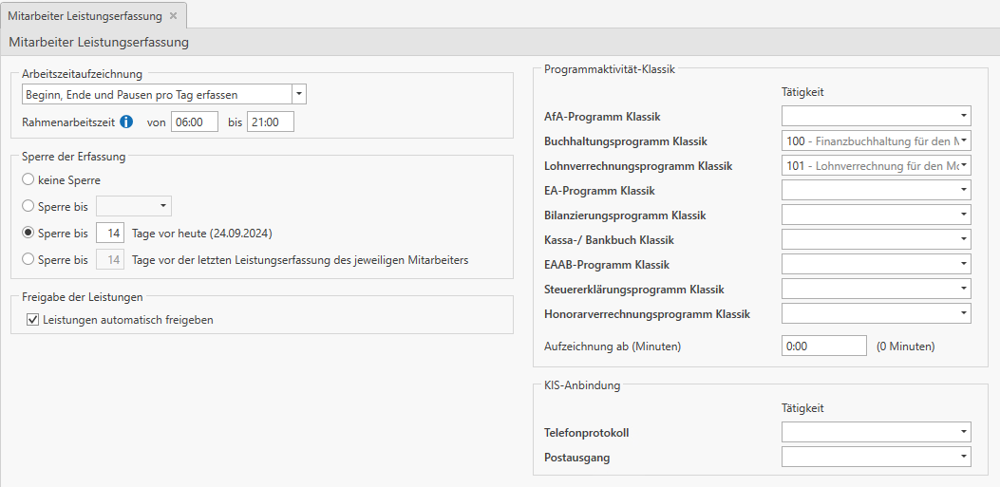
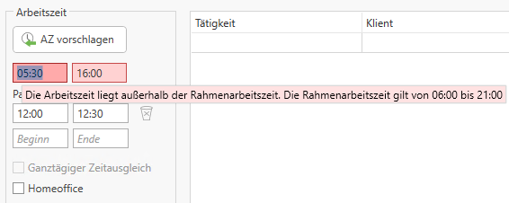
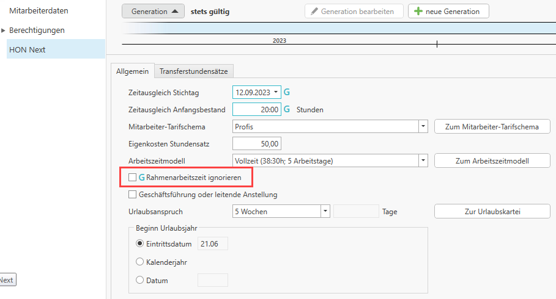

# Mitarbeiter Leistungserfassung

Unter diesem Punkt können Sie die Art der Arbeitszeiterfassung
festlegen, sowie wie lange Ihre Mitarbeiter Leistungen
bearbeiten/erfassen können und ob Leistungen automatisch freigegeben
werden oder nicht. Dieser Tab ist vor allem für die Einstellungen der
Leistungserfassung relevant und hat auch Auswirkungen auf die
Honorarverrechnung, denn solange Leistungen nicht von Ihren
Mitarbeitern freigegeben wurden, können Sie diese nicht verrechnen.

Wählen Sie den Button *Mitarbeiter Leistungserfassung* aus, um die
Grundeinstellungen für das Sperren der Leistungserfassung festzulegen oder
die Leistungen automatisch freigeben zu lassen.

### Arbeitszeitaufzeichnung

-   *Beginn, Ende und Pausen pro Tag erfassen*

    Dies ist die genaueste Variante für die Leistungserfassung. Der
    Mitarbeiter erfasst täglich seine genaue Arbeitszeit inkl. Pausen.

    Ansicht in der Leistungserfassung des Mitarbeiters:

    

-   *Arbeitszeit aus den Leistungen entnehmen*

    Bei dieser Variante gibt der Mitarbeiter keine Arbeitszeit ein,
    sondern aufgrund der eingegebenen Leistungszeilen mit *Beginn und
    Ende* wird die Arbeitszeit und die Unterbrechungen ermittelt. Wenn
    beispielsweise ein ganzer Tag an einer FIBU gearbeitet wurde,
    müssen – damit die Mittagspause errechnet werden kann – zwei
    Tätigkeiten erfasst werden, wobei in den Feldern Beginn und Ende der
    Vormittag z. B.: 07:00 – 12:00 Uhr und der Nachmittag z. B.:
    12:30–16:00 erfasst werden.

    Ansicht in der Leistungserfassung des
    Mitarbeiters:

!!! info "Tipp"
    Bei der Einstellung *Arbeitszeit aus den Leistungen entnehmen* ist es
    empfehlenswert in den Stammdaten der Tätigkeiten die *Uhrzeiteingabe
    verpflichtend* zu machen (siehe [Tätigkeiten](../Stammdaten%20HON%20Next/Tätigkeiten.md)).

-   *Keine Arbeitszeitaufzeichnung*

    Wird diese Variante gewählt, wird keine Arbeitszeit ermittelt bzw.
    kann keine Arbeitszeit eingetragen werden. Der Mitarbeiter trägt nur
    seine Leistungen ein – die Felder Beginn/Ende können befüllt werden.

    Ansicht in der Leistungserfassung des Mitarbeiters:

    

-   *Digitale Stempeluhr*

    Bei der Variante Digitale Stempeluhr, hat der Mitarbeiter in seiner
    Leistungserfassung jeweils einen Button für Kommen und Gehen. Die
    Arbeitszeit für Kommen/Gehen wird aus der Datenbank entnommen – das
    heißt, der Mitarbeiter muss aktiv auf *Kommen/Gehen* klicken, damit
    ab diesem Zeitpunkt die Arbeitszeit gezählt wird. Bei einer Pause
    muss aktiv der Button *Gehen* gewählt werden und am Ende der Pause
    die Schaltfläche *Kommen*.

    Die Arbeitszeiten können mit der digitalen Stempeluhr nur für den
    aktuellen Tag erfasst werden.

!!! warning "Hinweis"
    Die Arbeitszeiten sowie die Pausen sind nur in einer Leseansicht
    dargestellt und können in der Leistungserfassung des Mitarbeiters nicht
    geändert werden.

Änderungen an den Arbeitszeiten können nur direkt in der
Honorarverrechnung über die Mitarbeiterübersicht durchgeführt werden
(vgl. [Mitarbeiterübersicht](../Mitarbeiterübersicht/index.md)).

!!! warning "Hinweis"
    Bei der digitalen Stempeluhr ist der Import von Arbeitszeiten [Import von Arbeitszeiten](../Datenübernahme.md#datenimport-leistungen-und-arbeitszeiten) nicht möglich.

Ansicht in der Leistungserfassung des Mitarbeiters:

**Rundung**  
Bei der Variante *Digitale Stempeluhr* besteht die Möglichkeit, die
erfasste Zeit auf einen hinterlegten Wert zu runden.

Mögliche Rundungen:

-   0 = keine Rundung
-   5 = Rundung auf volle 5 Minuten
-   10 = Rundung auf volle 10 Minuten
-   15 = Rundung auf volle 15 Minuten

Beispiel für Rundung mit 15 Minuten:  
Mitarbeiter klickt um 08:04 auf *Kommen* – es wird auf 08:15 gerundet
als Beginn der Arbeitszeit  
Mitarbeiter klickt um 16:46 auf *Gehen* – es wird auf 17:00 gerundet als
Ende der Arbeitszeit

!!! warning "Hinweis"
    Die Art der Arbeitszeitaufzeichnung kann für einzelne Mitarbeiter abweichend definiert werden (siehe Kapitel [Mitarbeiterstammdaten](../Stammdaten%20Mitarbeiter.md)).

### Rahmenarbeitszeit

Mit der Definition einer Rahmenarbeitszeit kann die Eingabe einer Arbeitszeit zu gewissen Zeiten gesperrt werden. Wird eine Rahmenarbeitszeit definiert, können die Mitarbeiter in dieser Zeitspanne Arbeitszeiten erfassen. Eine Arbeitszeit außerhalb des definierten Rahmens kann vom Mitarbeiter nicht gespeichert werden.

Beispiel:
Im HON Next ist eine Rahmenarbeitszeit von 06:00 - 21:00 Uhr definiert.
Der Mitarbeiter möchte in seiner Leistungserfassung als Beginn der Arbeitszeit 05:30 eingeben – es kommt folgender Hinweis in der Leistungserfassung der Mitarbeiter:

Bis der Mitarbeiter die Arbeitszeit nicht korrigiert, kann die Tageserfassung nicht beendet/gespeichert werden.

Im HON Next über *Leistungserfassung / Mitarbeiterübersicht* beim Aufruf des Arbeitszeitkalenders der Mitarbeiter ist eine Eingabe außerhalb der Rahmenarbeitszeit möglich. Man erhält folgenden Hinweis:

Mit der Option *Rahmenarbeitszeit ignorieren* kann die Rahmenarbeitszeit bewusst für diesen einen Tag deaktiviert werden. Es gibt weder im HON Next noch im LE Next einen Hinweis.

!!! warning "Hinweis"
    Sollte für bestimmte Mitarbeiter die Rahmenarbeitszeit nicht gelten, können Sie in den Stammdaten der Mitarbeiter im Reiter HON Next die Option *Rahmenarbeitszeit ignorieren* aktivieren. Für diese Mitarbeiter wird die Prüfung der Rahmenarbeitszeit nicht angewendet.

    

### Sperre der Erfassung

In diesem Bereich können Sie Erfassungssperren für die
Leistungserfassung der Mitarbeiter setzen. Zur Auswahl stehen Ihnen die
Optionen keine Sperre, Sperre bis zu einem bestimmten Datum, Sperre bis
xy Tage vor heute, oder Sperre bis xy Tage vor der letzten
Leistungserfassung des jeweiligen Mitarbeiters. Je nachdem welche
Einstellung Sie treffen, können Sie die Leistungserfassung Ihrer
Mitarbeiter entsprechend einschränken.

### Freigabe der Leistungen

Falls die Leistungen Ihrer Mitarbeiter automatisch, sofort nach der
Erfassung freigegeben werden sollen, haken Sie diese Einstellung an. Die
Freigabe einer Leistung bewirkt, dass diese sofort für die
Honorarverrechnung zur Notenerstellung zur Verfügung steht. Werden
Leistungen nicht automatisch freigegeben, so muss der Mitarbeiter in der
Leistungserfassung selbst seine Leistungen für die Honorarverrechnung
freigeben. Solange die Leistungen vom Mitarbeiter nicht freigegeben
wurden, können Sie diese auch nicht verrechnen.

### Programmaktivitäten zuordnen

Innerhalb der Leistungserfassung der einzelnen Mitarbeiter besteht die
Möglichkeit die Zeiterfassung der Programmaktivitäten zu aktivieren. Die
Aktivierung der Zeiterfassung in der Leistungserfassung der Mitarbeiter
bewirkt, dass die Dauer der Tätigkeiten mitprotokolliert werden. (vgl.
Handbuch Leistungserfassung Next Kapitel 3.3 Zeiterfassung)

Im Honorarprogramm haben Sie die Möglichkeit den einzelnen
Programmaktivitäten bestimmten Tätigkeiten zuzuordnen. Wurde hier eine
Tätigkeit zugeordnet, wird diese dem Mitarbeiter bei der
Programmaktivität in der Leistungserfassung gleich vorgeschlagen.

Ebenfalls kann definiert werden, dass erst ab einer gewissen
Mindestanzahl von Minuten die Programmaktivität aus den Klassik
Programmen aufgezeichnet werden.

!!! warning "Hinweis"
    Pro Programmaktivität ist die Zuordnung einer Tätigkeit möglich.