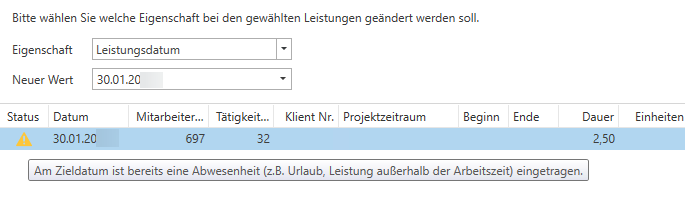

# Leistungen umbuchen

Mit der Funktion *Leistungen umbuchen* haben Sie die Möglichkeit, mehrere Erfassungszeilen gesammelt zu ändern. Der Dialog unterteilt sich in zwei Hälften. Auf der linken Seite müssen Sie vorab eingrenzen, welche Leistungen Sie ändern möchten **(1)**. Hier haben Sie die Möglichkeit, auf das Erfassungsdatum, den Mitarbeiter, die Tätigkeit und den Klienten einzuschränken.

Es werden alle Leistungen angezeigt, welche mit den Filterkriterien übereinstimmen. Sie können mit *STRG+A* alle Zeilen markieren oder einzelne Zeilen auswählen. Mit dem Pfeilsymbol **(2)** verschieben Sie die Leistungen in die rechte Hälfte und definieren damit, dass diese geändert werden sollen.

Nachdem Sie die zu ändernden Zeilen markiert und auf die rechte Seite verschoben haben, legen Sie über das Feld *Eigenschaft* **(3)** fest, was geändert werden soll. Sie können die Tätigkeit, den Klienten, den Mitarbeiter sowie das Leistungsdatum ändern. Im Feld *Neuer Wert* **(4)** definieren Sie den neuen Wert, z. B. auf welche Klientennummer die Leistungen umgebucht werden sollen.

Unterhalb **(5)** sind die Leistungen mit dem neuen Wert ersichtlich. Auf der linken Seite bleiben die ausgewählten Leistungen markiert.

Mit *Speichern* wird die Änderung aller gewählten Leistungen durchgeführt. Die geänderten Leistungen sind mit den neuen Werten auf der linken Seite ersichtlich.

Wird die Tätigkeit geändert, kann es vorkommen, dass eine übergreifende Änderung nicht möglich ist. Zum Beispiel, wenn von einer Tätigkeit, welche in Stunden abgerechnet ist, auf eine Tätigkeit nach Einheiten geändert werden soll. In der Spalte *Status* **(6)** ist ersichtlich, warum eine Änderung nicht möglich ist.

Häufige Fälle für ungültige Leistungen sind z. B. ein Wechsel der Verrechnungsart aufgrund der Änderung der Tätigkeit, dass bei der neuen Tätigkeit bestimmte Felder als Pflichtfelder definiert sind, welche bei der originalen Leistung nicht erfasst wurden (z. B. Projektzeitraum), oder dass von einer verrechenbaren zu einer nicht verrechenbaren Tätigkeit geändert werden soll. Solche Änderungen müssen pro Leistungszeile über *Leistungserfassung / Leistungen erfassen* gemacht werden.

Vorallem das Umbuchen der Leistungen auf ein anderes Leistungsdatum sollte bewusst und verantwortungsvoll eingesetzt werden.

!!! warning "Hinweis"
    Bei der Eingabe wird geprüft, ob das Zieldatum weiter als Tagesdatum in der Zukunft liegt! Eine Verschiebung in die Zukunft ist nicht möglich.

Das Umbuchen auf ein anderes Leistungsdatum ist nicht möglich wenn:

- Die Leistung nicht (mehr) änderbar (z. B. inzwischen verrechnet / in Verrechnung / gelöscht wurde) ist.
- Die Datumsänderung dazu führt, dass die Leistung in der Zielkonstellation fachlich ungültig ist (Bsp.: die Tätigkeit ist zu dem Datum ausgelaufen oder es gibt eine neue Generation mit einer anderen Verrechnungsart).
- Der Zieltag als ganztägiger Zeitausgleich markiert ist.

Gibt es am Zieltag bereits Abwesenheiten (Leistungen außerhalb der Arbeitszeit wie Urlaub oder Krankenstand) dann ist das Umbuchen zwar möglich, jedoch erhalten Sie bei der Zeile ein Orangenes Rufzeichen, was Sie auf die Abwesenheit aufmerksam macht.

!!! warning "Hinweis"
    Sobald das Leistungsdatum geändert werden soll, erhalten Sie folgenden Hinweis: 
    **Sie verschieben Leistungen auf ein anderes Erfassungsdatum. Dadurch können am ursprünglichen Tag Leistungen fehlen und die Leistungserfassung/Arbeitszeitaufzeichnung betroffener Mitarbeiter ist danach ggf. nicht mehr vollständig oder nachvollziehbar. Bitte verwenden Sie diese Funktion nur nach Prüfung und stimmen Sie Umbuchungen bei Bedarf mit den betroffenen Mitarbeitern ab.**

