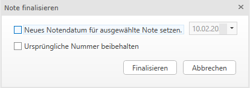

# Notenübersicht

Die Notenübersicht soll Ihnen einen Überblick über Ihre erstellten Noten
geben. Darin ist ersichtlich, welche Note finalisiert wurden, welche
Noten bereits in der Belegverarbeitung gebucht wurden und welche Noten
noch nicht finalisiert wurden und noch bearbeitet werden können.

## Allgemeines

Die Notenübersicht kann im HON-Modul unter dem Punkt *Honorarnoten –
Notenübersicht* aufgerufen werden.

Die Notenübersicht ist in nachfolgende Spalten unterteilt:

-   **Rechnung Nr.:** Nur, wenn die Noten finalisiert wurden, erhalten
    Sie eine Rechnungsnummer. Die Einstellungen zur Rechnungsnummer
    finden Sie im Kapitel [Nummernbereiche](../HONNext/Stammdaten%20HON%20Next/Nummernbereiche.md) beschrieben.

-   **Zustellung:** Die Art der Zustellung, die Sie bei der
    Notenerstellung ausgewählt haben wird angezeigt. Siehe [Stammdaten Klienten](../HONNext/Stammdaten%20Klienten.md).

-   Klienten-Nummer

-   Klienten-Name

-   **Rechnungssteller:** Der Rechnungsteller ist im Kapitel [Unternehmensbereiche](../HONNext/Unternehmensbereiche.md) beschrieben.

-   Letzter Bearbeiter der Note

-   Erstellungsdatum der Note

-   Notendatum

-   Deckungsbeitrag

-   Netto

-   Zu-/Abschlag

-   Rabatte 

-   UST
  
-   Brutto

-   Akonto/Anzahlung

-   Gesamt

-   **Status:** Mittels Tooltip erhalten Sie eine Information wie der
    Status der Note ist. Für die unterschiedlichen Stadien gibt es
    nachfolgende Symbole in der Honorarverrechnung.

     Finalisierte Note

     Finalisierte und
    gedruckte Note

     vorläufige Note

     Note die gerade in
    Bearbeitung ist

     Interne Note

-   **Beleg:** Falls Sie die Belegverarbeitung verwenden, so wird bei
    finalisierten Noten automatisch ein Ausgangsrechnungsbeleg mit allen
    wichtigen Beleginformationen an die Belegverarbeitung übergeben. Ein
    noch nicht verbuchter Beleg bzw. in der Belegverarbeitung noch nicht
    freigegebener/abgelehnter Beleg wird mit diesem Symbol
     gekennzeichnet. Wurde
    ein Beleg in der Belegverarbeitung verbucht so wird dieser mit
    diesem Symbol  dargestellt.

-   **Duplikat:** Hat eine Note den Status *Finalisiert und gedruckt*
    und wird erneut ausgedruckt, erhalten Sie eine Abfrage, ob die
    bereits gedruckt Note als Duplikat gekennzeichnet werden soll. Wird
    diese Abfrage mit *Ja* bestätigt, wird in der Spalte Duplikat ein
    Haken gesetzt.

-   **Gutschrift:** Die Spalte Gutschrift gibt Auskunft darüber, ob es
    sich um eine gutgeschriebene Note oder um eine Gutschrift handelt.

     gutgeschriebene Note

     Gutschrift

-   **Anmerkung** (vgl. Kapitel [Notenerstellung/Einstellungen](../HONNext/Notenerstellung/Notenerstellung.md/#einstellungen))

-   **Zusatztext auf Note** (vgl. Kapitel [Honorarnote](../HONNext/Stammdaten%20Klienten.md#honorarnote))

-   [Schlussnote](../HONNext/Pauschalverrechnung/Schlussnote.md)

-   **Klassik**: Wenn Sie von HON Klassik auf HON Next umsteigen, können
    Sie mit der Spalte *Klassik* erkennen, welche Noten aus HON Klassik
    übernommen wurden.

-   **Verrechnungsgruppen**: Blenden Sie sich die Spalte
    *Verrechnungsgruppen* in der Notenübersicht ein, werden Ihnen die
    bei der Note abgerechneten Verrechnungsgruppen ausgewiesen.

-   **Auswahlkriterium** – Sie können sich das im KIS/Board hinterlegte
    Auswahlkriterium einblenden.

-   **Zuständigkeitsbereiche** – Sie können sich hier die im KIS
    hinterlegten Zuständigkeiten einblenden.

!!! info "Tipp"
    In der Notenübersicht haben Sie die Möglichkeit, sich Layouts anzulegen
    ([Speicherbare Layouts](../HONNext/Auswertungen/Speicherbare%20Layouts.md)).

!!! info "Tipp"
    Mit der Tastenkombination *STRG+F* können Sie sich ein Suchfeld einblenden lassen.

!!! warning "Hinweis"
    Die Notenübersicht ist initial auf das aktuelle Jahr (Notendatum)
    eingeschränkt. Der Datumsfilter kann jederzeit angepasst werden. Weiters
    besteht die Möglichkeit, einen Vorschlag für die Ansicht zu setzen. Mit
    Rechtsklick in das *von Feld* können Sie definieren, dass Sie z. B. immer
    nur die Noten des letzten Monats sehen oder auch immer alle Noten der
    letzten zwei Jahre. Diese Einstellung wird pro Mitarbeiter gespeichert.

## Duplikat

Wurde eine Honorarnote bereits finalisiert und ausgedruckt, erhält Sie
den Status *Finalisiert und gedruckt.* Sollte die Note erneut
ausgedruckt werden, erhalten Sie die Abfrage vom Programm, ob ein
Duplikat erstellt werden soll.

Wird die Abfrage mit *Ja* bestätigt, wird die Note mit dem Vermerk
*Duplikat* ausgegeben. Ebenso wird in der Notenübersicht in der Spalte
*Duplikat* ein Haken gesetzt.

Wird die Abfrage mit *Nein* bestätigt, wird die Note ohne den Vermerk
Duplikat gedruckt.

!!! warning "Hinweis"
    Gab es im Zeitraum zwischen erstmaligem Ausdruck der Note und dem
    Ausgeben als Duplikat eine Änderung in den Stammdaten (Bsp.
    Adressänderung) wird das Duplikat mit den neuen Stammdaten ausgegeben.

## Sortierung der Notenübersicht

Die Noten werden bei der Notenübersicht nach dem Erstellungsdatum
aufsteigend sortiert d.h. die neuesten Noten werden an unterster Stelle
der Tabelle gereiht. Beim Aufruf der Notenübersicht, liegt der Fokus
standartmäßig auf der zuletzt erstellten Note.

## Note(n) bearbeiten

Sie können hier eine oder mehrere vorläufige Noten markieren, um diese erneut zu bearbeiten. Werden meh-rere Noten markiert, öffnet sich eine Bearbeitungsserie. Das heißt, es öffnen sich die gewählten Noten der Reihe nach – vergleichbar mit der Notenserie bei der Notenerstellung.

## Notendatum ändern 

Im Ribbon der Notenübersicht stehen Ihnen mehrere Funktionen zur
Auswahl.

Das Notendatum kann bei nicht finalisierten Noten einfach über den
Button *Notendatum ändern*, oder über das Kontextmenü mit der rechten
Maustaste auf die gewünschte Note, geändert werden. Es öffnet sich ein
separates Eingabefenster in welches Sie ein neues Notendatum eintragen
können. Es können auch mehrere Noten in einem Schritt geändert werden.

## Anmerkung ändern

Die bei der Honorarnote definierte Anmerkung (Kapitel [Notenerstellung/Einstellungen](../HONNext/Notenerstellung/Notenerstellung.md#einstellungen)) kann über die Schaltfläche *Anmerkung ändern*
jederzeit editiert werden, ohne die Note öffnen zu müssen.

Es öffnet sich ein Fenster mit der bisherigen Anmerkung, diese können
Sie nun abändern bzw. falls es noch keine Anmerkung gibt, eine Neue
eintragen.

## Note löschen

Noch nicht finalisierte Noten können über den Button *Note löschen*,
oder über das Kontextmenü mit der rechten Maustaste auf die gewünschte
Note, gelöscht werden. Sie erhalten eine Sicherheitsabfrage, ob die Note
wirklich gelöscht werden soll. Mit Klick auf Löschen wird die Note dann
tatsächlich gelöscht. Die in der vorläufigen Note abgerechneten
Leistungen werden nach dem Löschen wieder als offene Leistungen
dargestellt und können im Rahmen der nächsten Notenerstellung wieder
verrechnet werden.

## Note finalisieren

Vorläufige Noten müssen noch endgültig finalisiert werden. Dazu gibt es
drei Möglichkeiten die nachfolgend erläutert werden.

Noch nicht finalisierte Noten können mittels Button *Note finalisieren*,
entweder finalisiert werden oder mittels Button *Note finalisieren und
drucken* auch ausgedruckt werden.

Beim *Note finalisieren* und *Note finalisieren und Drucken* erhalten
Sie jeweils ein Fenster mit der Möglichkeit das Notendatum im Zuge des
Finalisierens abzuändern und die ursprüngliche Nummer beizubehalten. Mit der Option *Neues Notendatum für die
ausgewählten Noten setzen* definieren Sie das neue Notendatum. Setzten
Sie diese Option nicht, bleibt das bisherige Notendatum erhalten. Mit der Option *Ursprüngliche Nummer beibehalten* erhält die Note die ursprüngliche Nummerierung, sollte diese zurüchgesetzt worden sein.
Bei neu erstellten Noten, welche noch nicht zurückgesetzt wurden, hat diese Option keine Auswirkung. Die Note wird laufend Nummeriert.

Mit der Funktion *erweitertes Finalisieren* öffnet sich ein weiterer
Dialog, wo die Notennummer und das Notendatum eingegeben werden können,
bevor man finalisiert.

Die Funktion *erweitertes Finalisieren* sollte vor allem in Fällen
angewandt werden, wo die Note zurückgesetzt wurde und nun erneut
finalisiert werden muss. Hiermit sollen Lücken in der Nummerierung
vermieden werden.

!!! info "Tipp"
    Wurde eine Note zurückgesetzt und man wählt *erweitertes Finalisieren*,
    schlägt das Programm die alte Notennummer vor – sofern diese nicht
    bereits vergeben wurde. Wird über *Note finalisieren* die zurückgesetze Note finalisiert, ist es wichtig, die Option *Ursprüngliche Nummer beibehalten* zu setzten.

Sollten Sie in den [Grundeinstellungen](../HONNext/Einstellungen/Grundeinstellungen.md) bereits die Einstellung „*Note beim Speichern
& schließen finalisieren*“ ausgewählt haben, so ist für Sie dieser
Menüpunkt hinfällig.

!!! warning "Hinweis"
    Die Buttons *Notendatum ändern, Note löschen* und *Note finalisieren*
    sind nur bei vorläufigen Noten aktiv. Bei bereits finalisierten Noten
    sind diese Buttons inaktiv.

Wurde eine Note finalisiert, kann später noch die Zustellung
(Druckausgabe, E-Mail, Klientenportal) (Kapitel 6) sowie die Anmerkung
je Note ([Einstellungen](../HONNext/Notenerstellung/Notenerstellung.md#einstellungen)) geändert werden. Sollten weitere Änderungen
nötig sein, muss die Note zurückgesetzt werden.

## Noten drucken

Vorläufige und finalisierte Noten können über den Button *Note drucken*,
oder über das Kontextmenü mit der rechten Maustaste, am PDF-Manager
ausgedruckt werden.

## Note zurücksetzen

Falls Noten noch einmal auf einen vorangegangenen Status zurückgesetzt
werden müssen, so gibt es hierfür eine Möglichkeit. Über den Button
*Note zurücksetzen* oder über das Kontextmenü mit der rechten Maustaste,
kann der Status einer Note zurückgesetzt werden, wenn kein Beleg
verknüpft ist, oder der verknüpfte Beleg noch nicht mit der
Belegverarbeitung in der Finanzbuchhaltung verbucht wurde.

*Note auf „Finalisiert und gedruckt“ zurücksetzten*

Mit dieser Funktion wird der Vermerk, dass ein Duplikat erstellt wurde
rückgesetzt.

*Note auf „Finalisiert“ zurücksetzten*

Wurde eine Note bereits ausgedruckt wird dies im Stauts vermerkt. Mit
dieser Funktion wird der Status auf Finalisiert rückgesetzt.

*Note auf „Vorläufig“ zurücksetzten*

Die Note erhält den Status Vorläufig und kann wieder editiert werden.

Falls Sie eine Note auf den Status *„Vorläufig“* zurücksetzen, die mit
einem Beleg verknüpft wurde, so erhalten Sie nachfolgende
Hinweismeldung.

Wenn Sie diese Meldung mit *Zurücksetzten* bestätigen, so wird der
verknüpfte Beleg aus der Belegverarbeitung gelöscht und die Note wieder
als vorläufige Note gespeichert.

!!! warning "Hinweis"
    Die Funktion „Note auf Vorläufig zurücksetzten“ sollte nur in
    Ausnahmefällen verwendet werden.

Nach dem Zurücksetzten der Note auf den Status *Vorläufig* und dem
erneuten Finalisieren bekommt die Note eine neue Notennummer, da weiter
fortlaufend Nummeriert wird. Daher empfiehlt sich hier die Funktion
*erweitertes Finalisieren* ([Note finalisieren](../HONNext/Notenübersicht.md#note-finalisieren)).

## Beleg anzeigen

Der Button *Beleg anzeigen* zeigt Ihnen den zu der Note zugehörigen
Ausgangsbeleg, welcher in der Belegverarbeitung vorhanden ist, an. Der
Beleg kann ebenso über das Kontextmenü mit der rechten Maustaste
geöffnet werden. Dieser Button ist nur bei finalisierten Noten, die
bereits mit einem Beleg verknüpft sind, aktiv und wenn Sie das Modul
Belegverarbeitung lizenziert haben. Es öffnet sich die Beleg Ansicht, in
welcher die erkannten und hinterlegten Belegdaten ersichtlich sind.

!!! warning "Hinweis"
    Werden auf der Honorarnote Nullzeilen abgerechnet, erhalten Sie für
    diese Zeilen keine Gegenbuchungen. Bei Null-Noten wird ebenso keine
    Gegenbuchung vorgeschlagen.

In der Belegansicht steht Ihnen das Feld *Bezahlt am* zur Verfügung.
Dieses Feld können Sie entweder im HON über *Beleg anzeigen* oder direkt
in der Belegverarbeitung selbstständig befüllen und sich in der
Notenübersicht die Spalte *Bezahlt am (Beleg)* einblenden lassen.

## Notenjournal anzeigen

Der Button *Journal anzeigen* öffnet das Notenjournal. Das Notenjournal
kann ebenso über das Kontextmenü mit der rechten Maustaste auf die
gewünschte Note/Noten geöffnet werden.

Ein Notenjournal ist eine Auflistung der in der Note abgerechneten
Leistungszeilen und der Zu-/Abschläge. Mehrfachselektionen von
vorläufigen oder/und finalisierten Noten sind möglich. Es öffnet sich im
Anschluss ein eigener Tab für das Notenjournal. Die Gruppierung des
Notenjournals ist nach der Note (Nr, Datum, Klientennummer,
Klientenname) und der Tätigkeit (Nummer, Bezeichnung). Die Gruppierung
ist fix und kann nicht geändert werden.

In der ersten Zeile der Gruppierung erhält man die Gesamtsummen der
Note. Die zweite Zeile der Gruppierung stellt die Summen je Tätigkeit
innerhalb einer Note dar.

!!! warning "Hinweis"
    Mit der Schaltfläche *Journal Drucken* können Sie das Notenjournal
    ausdrucken. Der Ausdruck ist dem Tätigkeitsnachweis nachempfunden
    zusätzlich den abgerechneten Werten und Zu-/Abschlägen.

!!! warning "Hinweis"
    Im Aufruf des Notenjournal besteht die Möglichkeit sich Layouts
    anzulegen (vgl. [Speicherbare Layouts](../HONNext/Auswertungen/Speicherbare%20Layouts.md)).

## Tätigkeitsnachweis drucken

In der Notenübersicht können Sie eine/mehrere Noten markieren und über
die Schaltfläche *Tätigkeitsnachweis drucken* einen Tätigkeitsnachweis
der gewählten Noten ausgeben. Der Tätigkeitsnachweis weißt, im Gegensatz
zum Notenjournal, nur die Dauer und Einheiten der abgerechneten Zeilen
aus – keine Werte und Zu-/Abschläge.

Sie erhalten pro Tätigkeit eine nach Datum sortierte Auflistung der
dahinter liegenden Erfassungszeilen und die Summe der Dauer/Einheiten je
Tätigkeit. Eine Gesamtsumme der Stunden und Einheiten wird ebenso
ausgegeben.

Der Tätigkeitsnachweis kann für vorläufige sowie für finalisierte Noten
ausgedruckt werden.

!!! info "Tipp"
    Wenn Sie den Tätigkeitsnachweis in den PDF Drucker geben, wird
    automatisch die E-Mail-Adresse des Klienten mitgeliefert und der
    Nachweis kann einfach mit der Note mitgesandt werden.

## Notendetails anzeigen

Um die erstellte Note inklusive der verrechneten Leistungen sowie der
Zu-/Abschläge einsehen zu können, ohne jede Note extra öffnen zu müssen,
können Sie sich die Notendetails einblenden lassen.

Mit der Schaltfläche *Notendetails anzeigen* wird die Note in einem
separaten Fenster in einer Art Lesemodus geöffnet. Sie können sich noch
zusätzlich die Erfassungszeilen einblenden lassen **(1)**. Mit der
Schaltfläche *Nicht verrechnete Zeilen anzeigen* **(2)** können Sie
zwischen den verrechneten und offenen Leistungen des Klienten
umschalten. Die Ansicht der Notendetails aktualisiert sich ebenso wie
die Druckvorschau in Echtzeit.

Möchten Sie an der Note Änderungen vornehmen, muss die Note über die
Notenübersicht geöffnet werden.

## Druckvorschau anzeigen

Über den Button *Druckvorschau anzeigen* können Sie die Druckvorschau
öffnen und von Note zu Note wechseln. Die Ansicht aktualisiert sich in
Echtzeit.

## Notenrückblick anzeigen

Über den Button *Notenrückblick anzeigen* können Sie den [Notenrückblick](../HONNext/Notenrückblick.md)
öffnen und von Note zu
Note wechseln. Die Ansicht aktualisiert sich in Echtzeit.
