# Allgemeine Programmbedienung

## Programmstart

Abb. 3‑1 Ansicht KIS nach Programmstart

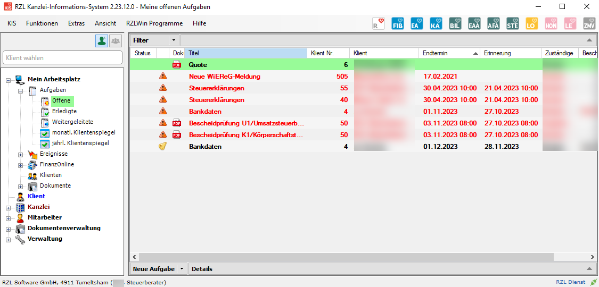

Unmittelbar nach dem Start des Programmes werden die *Menüeinträge*
(KIS, Funktionen, usw.), das Suchfeld - voreingestellt auf *Suche nach
Klient* - und im linken unteren Bereich die *Navigation* angezeigt. Im
rechten Bereich sehen Sie automatisch die offenen Aufgaben des
Mitarbeiters.

Wenn Sie im Suchfeld eine bestehende Klientennummer eintragen, werden
standardmäßig die Ereignisse des Klienten in Listenform zeitlich gereiht
angezeigt. Unter *Extras/Einstellungen* kann die Erstansicht beim Öffnen
eines Klienten pro Mitarbeiter verändert werden.

Abb. 3‑2 Erstansicht beim Öffnen des Klienten

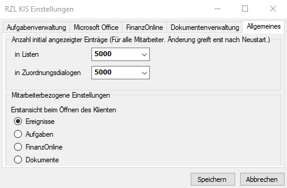

Abb. 3‑3 Eintragung einer bestehenden Klientennummer

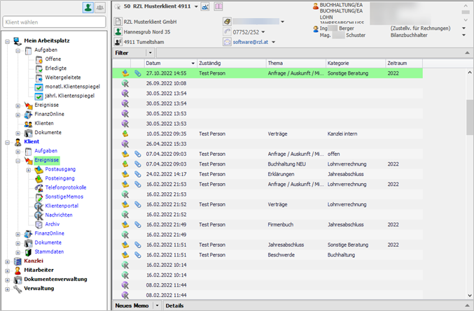

Nach dem Eintragen der Klientennummer im Suchfeld können Sie die
*TABULATOR-Taste* und/oder die *RETURN*-Taste bzw. ENTER*-*Taste
verwenden, um sich den Klienten anzeigen zu lassen.

Wenn Sie im Suchfeld nicht den *Suche nach Klient* Button
 anwählen, sondern auf *Suche
nach Mitarbeiter*  umschalten, können Sie nach
Mitarbeitern suchen bzw. neue Mitarbeiter anlegen.

Abb. 3‑4 Auswahl eines Mitarbeiters

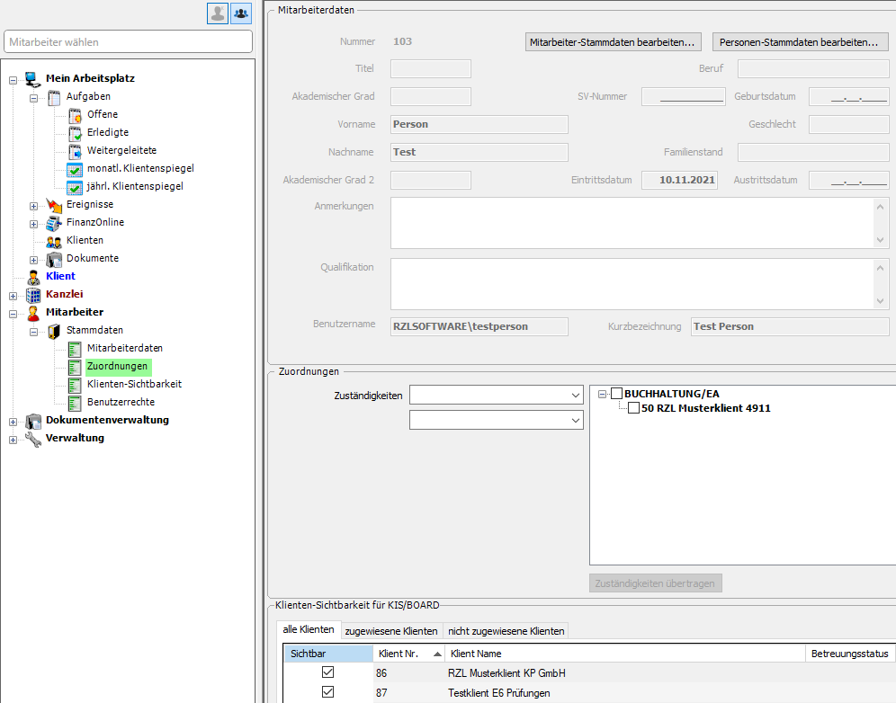

Die Anlage der Mitarbeiterstammdaten erfolgt im RZL Board. Im KIS
erfolgt die Vergabe von Sichtbarkeitsrechten und die Zuteilung des
Mitarbeiters zu den Zuständigkeitsbereichen bei den Klienten, die dieser
Mitarbeiter bearbeitet.

## Navigation

Innerhalb der einzelnen Programmpunkte des RZL
Kanzlei-Informations-Systems bewegen Sie sich in der *Navigation*. Im
Bereich der Navigation verwenden Sie die Maus.

Abb. 3‑5 Ansicht der Navigation I

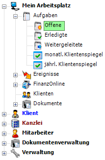

Um auf die einzelnen Programmteile zugreifen zu können, klicken Sie
entweder auf den Eintrag selbst oder auf das **+** Symbol vor dem
Eintrag.

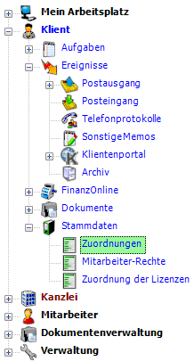 Abb. 3‑6 Ansicht der
Navigation II

Der Klientenbereich ist aufgeteilt in Aufgaben, Ereignisse,
FinanzOnline, Dokumente und Stammdaten. Beim soeben geöffneten Klienten
werden stets die Stammdaten des Klienten angezeigt.

Die Bewegung innerhalb der Navigation ist einfach und selbsterklärend.
Wenn bestimmte Einträge angewählt werden, kann es allerdings sein, dass
Sie vom Programm aufgefordert werden eine Eingabe zu machen
(Klientennummer, Mitarbeiternummer).

Im Klientenbereich und im Bereich der Mitarbeiter können Einträge nur
dann gemacht werden, wenn Sie vorher eine Klienten- oder eine
Mitarbeiternummer eintragen.

## Menü

Die Anwahl der Programmteile in der Menüleiste entspricht dem
Windowsstandard.

#### Anzeige der Klientendaten

Wenn Sie im Kanzlei-Informationssystem im *Suchfeld* mit der Einstellung
*Klient* eine gültige Klientennummer eintragen, wird im rechten Bereich
des Bildschirms eine Zusammenfassung der Stammdaten des Klienten
angezeigt. Im unteren Bereich sehen Sie die zu diesem Klienten erfassten
Ereignisse.

Abb. 3‑7 Beschreibung der Anzeige der Klientendaten I

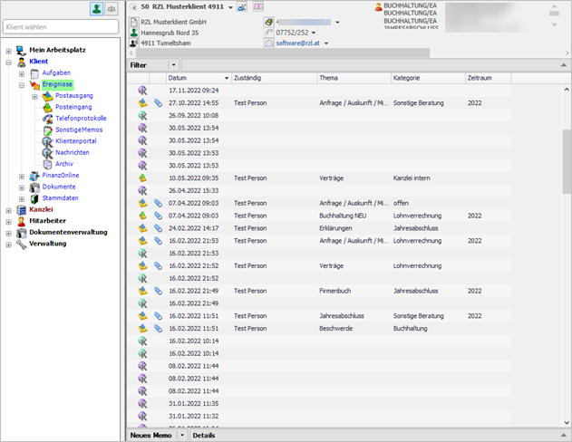

Mit dem Buchsymbol neben der Klientenbezeichnung können Notizen zu
diesem Klienten erfasst werden. Die Notiz kann bzgl. Schriftart,
Schriftgröße usw. beliebig formatiert werden. Wählt man die Option
*Notiz beim Öffnen des Klienten anzeigen* an, wird die Notiz beim Öffnen
des Klienten angezeigt.

Abb. 3‑8 Notizen

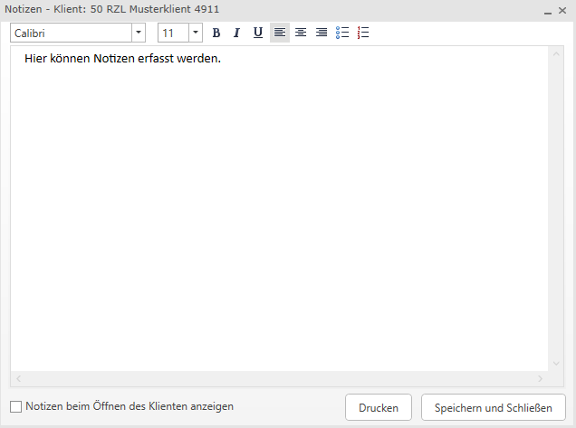

Abb. 3‑9 Beschreibung der Anzeige der Klientenstammdaten III

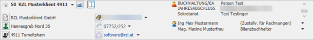

Im linken Bereich der Klientenstammdaten werden der Name und die
Adressen des Klienten angezeigt.

Im mittleren Bereich sehen Sie die Anmerkungen, die Steuernummer des
Klienten, zusammengefasst die UID-Nummer, die Firmenbuchnummer und die
SV-Nummer des Klienten, die allgemeinen Telefonnummern des Klienten und
die Firmen E-Mail-Adressen. Diese Daten kommen aus der
Stammdatenverwaltung im RZL Board.

Der rechte Bereich zeigt Ihnen zunächst die Zuständigkeiten innerhalb
der Kanzlei (vgl. Kap. 9.3.1 Zuordnungen) an. Die Reihenfolge der
Anzeige wird in der Verwaltung festgelegt (vgl. Kap. 11.14
Zuständigkeitsbereich). Unterhalb sehen Sie die Kontaktpersonen des
Klienten. Die Anlage von Personen erfolgt ebenso im RZL-Board.

#### Briefe schreiben

Abb. 3‑10 Briefe schreiben

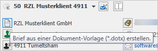

Wenn Sie das Brief-Symbol anwählen, können Sie direkt aus dem
Kanzlei-Informations-System einen Brief (mit Hilfe von Vorlagen)
erstellen und automatisch als Postausgang speichern. Die genaue
Vorgehensweise ist im Kapitel 13 *Abläufe* im Punkt 13.1 *Briefe
schreiben* erläutert.

#### Einstieg in FinanzOnline – Kopieren der Steuernummer

Wenn Sie auf die Finanzamt-Steuernummer klicken, wird automatisch die
Homepage von FinanzOnline geöffnet. Wenn in der Verwaltung für
FinanzOnline ein Mitarbeiterzugang angelegt ist (vgl. 6.2 Eintragung der
Zugangskennungen), ersparen Sie sich das Eintippen der Zugangskennungen
und kommen sofort ins FinanzOnline (**Direkteinstieg**).

Das Kanzlei-Informations-System kopiert die Steuernummer in die
Windows-Zwischenablage. Wenn Sie innerhalb von FinanzOnline nachfolgend
für Abfragen wie z. B.: den Steuerakt des Klienten die Steuernummer
eintragen müssen, geben Sie bitte **NUR** die Tasten­kombination STRG + V
ein.

Somit wird die Steuernummer automatisch eingetragen und Sie ersparen
sich das Eintippen.

#### Kopieren von UID-Nummer, Firmenbuchnummer, Sozialversicherungsnummer

Abb. 3‑11 Nummern kopieren

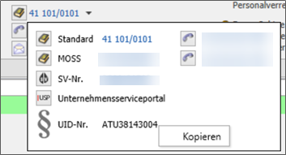

Die UID-Nummer, die Firmenbuchnummer und die Sozialversicherungsnummer
können durch Anwahl der rechten Maustaste kopiert werden. Wenn bei der
natürlichen Person eine Sozialversicherungsnummer eingetragen ist, wird
durch einen Einfachklick mit der Maus (linke Maustaste) das Portal der
österreichischen Sozialversicherung geöffnet. Mit einem Klick auf die
Schaltfläche Unternehmensserviceportal werden Sie automatisch über den
in der Verwaltung hinterlegten FinanzOnline Mitarbeiterzugang im USP
angemeldet. Aufgrund der fehlenden Zwei-Faktor-Authentifizierung
(Handy-Signatur, Bürgerkarte) stehen Ihnen dabei aber nur eingeschränkte
Funktionen zur Verfügung.

#### Anruf des Kunden übers KIS

Wenn eine Anbindung an eine Telefonanlage existiert und diese
Telefonanbindung im Kanzlei-Informations-System lizensiert ist, können
Sie durch Anwahl des Telefonsymbols  Ihren Kunden direkt aus dem
KIS heraus anrufen.

Zusätzlich öffnet sich automatisch ein Telefonprotokoll, das die
Gesprächsdauer protokolliert (vgl. Kap. 5.4.1 RZL Telefon Anbindung).

#### E-Mails schreiben

Durch einen Klick auf das Briefsymbol  wird automatisch ein E-Mail
mit der hinterlegten E-Mail-Adresse als Empfänger-Adresse geöffnet.
Dieses E-Mail kann automatisch als Postausgang gespeichert werden.

Die genaue Vorgehensweise finden Sie im Kapitel 13 *Abläufe* im Punkt
13.3 *E-Mails schreiben*.

Tipp

Wenn Sie nach einem Eintrag das  Symbol anwählen können,
lassen sich zusätzliche Informationen (weitere Telefonnummern,
E-Mail-Adressen) aufrufen und verwenden.

#### Kontaktpersonen

Abb. 3‑12 Kontaktpersonen

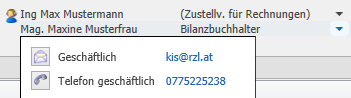

Die Kontaktpersonen werden im rechten Bereich angeführt. Durch Anwahl
des kleinen Pfeils rechts werden Detaildaten zur Kontaktperson
angezeigt. Sie können ein E-Mail an die Kontaktperson schicken (vgl.
Kap. 13.3.1 *E-Mail aus dem KIS schreiben*) und erhalten die
Telefonnummer der Kontaktperson angezeigt.

Wenn Sie die RZL Telefon-Anbindung verwenden, können Sie durch Anwahl
der Telefonverbindung die Kontaktperson direkt anrufen. Zusätzlich
öffnet sich automatisch ein Telefonprotokoll, das die Gesprächsdauer
protokolliert (vgl. Kap. 5.4.1 *RZL Telefon Anbindung*).

## Möglichkeiten der Listengestaltung

Sie erhalten nachfolgend eine Beschreibung der Funktionen der Listen
innerhalb des Kanzlei-Informations-Systems anhand der Ereignisliste
erklärt.

### Sortierung der Listen

Die Listen des Kanzlei-Informations-Systems werden nach
unterschiedlichen Kriterien vor­sortiert. Die Liste der Ereignisse ist
grundsätzlich nach Datum sortiert. Der aktuellste Eintrag steht ganz
oben.

Abb. 3‑13 Änderung der Sortierung der Listen

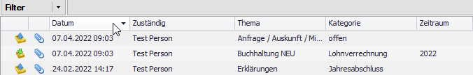

Sie können die Sortierung der Listen jederzeit ändern, indem Sie einfach
auf die gewünschte Spaltenüberschrift – nach der sortiert werden soll –
klicken. Wenn Sie auf die Spaltenüberschrift *Datum* klicken, ändern Sie
die Sortierung der zeitlichen Darstellung und das älteste Ereignis wird
ganz oben dargestellt. Ebenso können Sie die Sortierung nach den
Texteinträgen (*Zuständig, Thema; Kategorie*) alphabetisch auf- oder
absteigend ändern.

### Bearbeiten der Listen – Spalten auswählen/Spalten verschieben

Sie können selbst festlegen, welche Spalten in den Listen geführt werden
sollen. Die Vorgehensweise ist sehr einfach. Sie müssen sich mit dem
Cursor auf der Zeile mit der Spaltenbeschriftung befinden und wählen die
rechte Maustaste an.

Abb. 3‑14 Bearbeiten von Listen - Spaltenauswahl

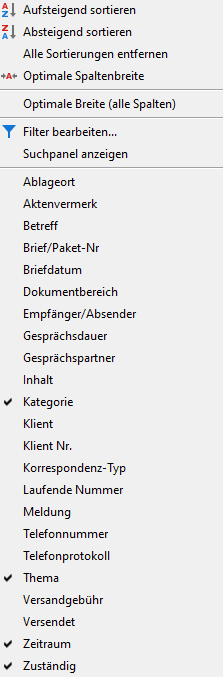

Sie erhalten ein Kontextmenü mit den möglichen Spalten angezeigt. Wenn
Sie auf einen Eintrag mit der Maus klicken wird die Anzeige deaktiviert
bzw. auch wieder aktiviert. Wenn Sie eine Spalte mit der linken
Maustaste anwählen und diese gedrückt halten, können Sie die Position
der Spalte nach links oder rechts verschieben.

Gibt es innerhalb einer Liste sehr viele Felder und somit
Auswahlmöglichkeiten, wird das Kontextmenü etwas verändert dargestellt.
Wenn Sie innerhalb der Klientenliste im Kanzleibereich die rechte
Maustaste drücken, erhalten Sie folgende Ansicht.

Abb. 3‑15 Klientenliste - Spaltenauswahl

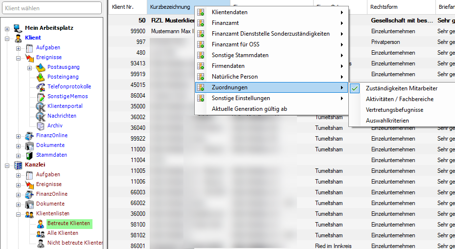

Da innerhalb dieser Liste sehr viele Felder ein- und ausgeblendet werden
können, ist das Kontextmenü für die Spaltenauswahl in mehrere Bereiche
untergliedert (*Klientendaten, Finanzamt, Finanzamt für Gebühren,
Finanzamt für MOSS, Sonstige Stammdaten, Firmendaten, Natürliche Person,
Zuordnungen, Sonstige Einstellungen*). Sie müssen einen dieser Bereiche
anwählen und können in der Liste die aufgeschlagen wird, die Felder
aktivieren und deaktivieren.

### Bearbeiten der Listen – Funktionen

Wenn sich der Cursor innerhalb der Liste befindet, erhalten Sie durch
Anwahl der rechten Maustaste ein Kontextmenü mit den möglichen
Funktionen.

Abb. 3‑16 Bearbeiten von Listen - Funktionen

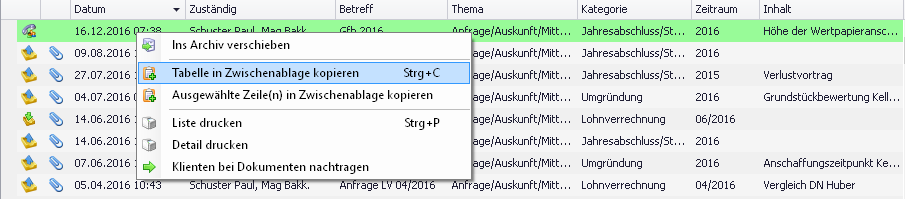

In der oben dargestellten Liste kann die Tabelle in die Zwischenablage
kopiert werden (Strg + C) und die Liste ausgedruckt werden.

Sie haben zwei Möglichkeiten Ihre Listen zu kopieren. Entweder Sie
wählen innerhalb der Liste die Sie kopieren wollen die Tastenkombination
STRG + C an oder Sie drücken die rechte Maustaste und klicken auf den
Eintrag *Tabelle in Zwischenablage kopieren*.

Nach dem Kopieren öffnen Sie das Programm, in das Sie die Liste kopieren
wollen (sehr häufig MS Excel) und wählen die Tastenkombination STRG + V
zum Einfügen an.

Eine Beschreibung der Funktion *Ins Archiv verschieben* finden Sie im
Kapitel 5.6 *Archivierung von Ereignissen*.

Mit der Funktion *Klienten bei Dokumenten nachtragen* wird bei zu diesem
Ereignis zugeordneten Dokumenten der bei dem Ereignis hinterlegte Klient
beim Dokument eingetragen.

### Bearbeiten der Listen – Mehrfachauswahl

Innerhalb der Ereignis- und Dokumentenlisten haben Sie die Möglichkeit
mehrere Ereignisse/Dokumente gleichzeitig auszuwählen. Die
Mehrfachauswahl erfolgt entweder durch Anwahl der UMSCHALT-Taste
(Bereichsauswahl) oder STRG-Taste (Einzelauswahl) und der Maustaste.

Abb. 3‑17 Bearbeiten von Listen - Funktionen

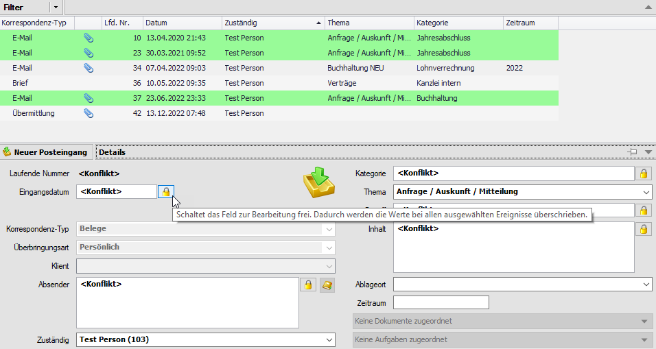

Die Funktionen in den Listen (z. B.: das Versenden von Dokumenten per
E-Mail) können natürlich auch für die Mehrfachauswahl verwendet werden.
Zusätzlich haben Sie die Möglichkeit die Details zu den
Ereignissen/Dokumenten für mehrere Einträge gleichzeitig zu bearbeiten.

Wie oben im Kontextmenü ersichtlich können Sie das Feld – indem sich
gerade der Maus-Cursor befindet – freischalten. Die Freischaltung
ermöglicht die Eingabe im freigeschalteten Feld. Diese Einträge werden
für alle markierte Ereignisse/Dokumente gleichzeitig gespeichert.

Diese Möglichkeiten bestehen in allen drei Bereichen (Mein Arbeitsplatz,
Klientenebene, Kanzleiebene). Lediglich innerhalb der gesamten
Ereignisliste kann die Mehrfachauswahl nicht verwendet werden.

## Filterfunktionen

Abb. 3‑18 Filterfunktionen

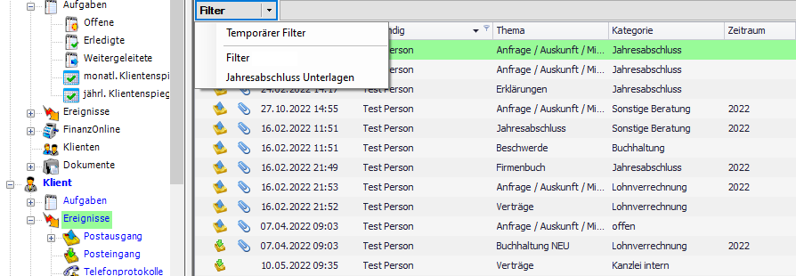

Wenn Sie sich in Programmteilen mit Listendarstellung befinden, (hier
die Liste der Ereignisse im Klientenbereich) sehen Sie im oberen Bereich
des Bildschirms einen Balken mit der Bezeichnung *Filter*.

Wenn Sie mit der Maus auf den Filter-Balken klicken, können Sie einen
temporären Filter anlegen oder einen gespeicherten Filter öffnen. Filter
können in der Verwaltung der sonstigen Stammdaten fix gespeichert
werden. Fixe Filter können in den Navigator gezogen werden (vgl. Kap.
11.7 *Filter*) .

Die Bedienung der Filterfunktion ist unabhängig von der Liste, die Sie
gerade bearbeiten, immer gleich. Im unten angeführten Bildschirm wird
ein temporärer Filter erstellt.

Abb. 3‑19 Anzeige der Filterfunktion

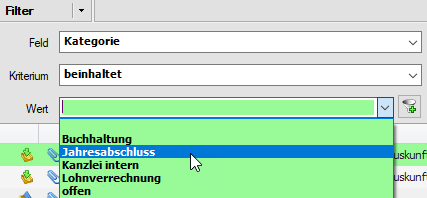

Im Bereich *Feld* tragen Sie ein, in welchem Feld der Liste der Filter
gesetzt werden soll. Die Auswahlmöglichkeiten im Bereich *Kriterium*
hängen vom ausgewählten Feld ab. Im Feld *Wert* bestimmen Sie den von
Ihnen gesuchten Wert.

Durch Anwahl des Symbols  wird der Filter gesetzt.

Abb. 3‑20 Anzeige des Filters

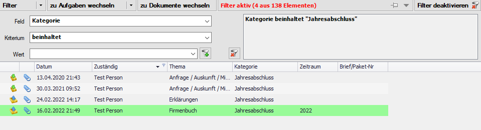

Im rechten Bereich der Filterfunktion wird der gesetzte Filter
angezeigt. Im oberen Balken wird angezeigt, aus welcher Gesamtanzahl von
Elementen wie viele in diesem Beispiel Ereignisse gefiltert wurden.

Sie können mehrere Filter gleichzeitig setzen, in dem Sie die oben
beschriebene Vorgehensweise wiederholen.

Abb. 3‑21 Setzen mehrerer Filter

Das bedeutet, Sie können innerhalb Ihrer umfangreichen Listen
(Ereignisse, Klienten usw.) sehr gezielt Informationen herausfiltern und
so die Datenflut innerhalb der Kanzlei bewältigen.

Solange Sie das Kanzlei-Informations-System nicht schließen, bleiben die
temporären Filter erhalten. Ein Wechsel zwischen den verschiedenen
Bereichen des Programms löscht die temporären Filter ebenfalls nicht.

Durch Anwahl der Schaltfläche *Filter deaktivieren* werden alle
gesetzten Filter gelöscht. Möchten Sie nur einen der Filter löschen,
können Sie das mithilfe von 

Abb. 3‑22 Filter löschen

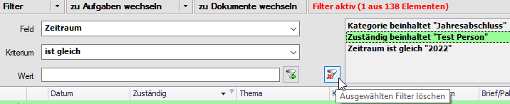

Wenn Sie das Kanzlei-Informations-System schließen, werden die
temporären Filter automatisch gelöscht. Die innerhalb der Verwaltung
(vgl. Kap. 11.7 *Filter*) gespeicherten Filter bleiben natürlich
erhalten.

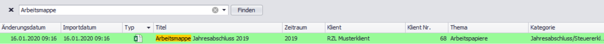 Abb. 3‑23 Volltextsuche

Mit dem Shortcut STRG + F innerhalb von Dokumentenlisten kann die
Volltextsuche aufgerufen werden. Nach dem eingegebenen Suchkriterium
wird in allen eingeblendeten Spalten gesucht und die gefundenen
Ergebnisse werden gelb hinterlegt.

## Filterfunktionen Dokumentenliste neu 

Innerhalb der neuen Dokumentenliste wurde die Ansicht der Filterfunktion
modernisiert. Die Funktionalität bleibt dabei gänzlich erhalten und
wurde um den Expertenmodus (vgl. Kap. 3.7 *Expertenmodus
(Dokumentenliste)*) erweitert. Durch Auswahl des Dropdownfeldes können
die Bedingungen für den Filter gesetzt werden. Neben dem Eintrag *Feld*
kann wie bereits erläutert ein bestimmtes Kriterium ausgewählt werden,
nachdem gefiltert werden soll. (vgl. Kap. 3.5 *Filterfunktionen*)

Abb. 3‑24 Filter anlegen I

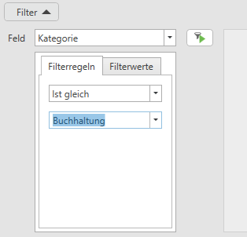

Im Register *Filter Werte* können mittels Aktivierung der Checkbox
gleich mehrere Filterbediungen gesetzt werden.

Abb. 3‑25 Filter anlegen II

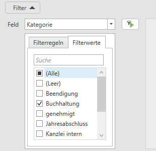

Mit einem Klick auf das Filtersymbol  wird der Filter aktiviert.
Die erstellten Filter können Sie mit einem Klick auf den Button *Filter
speichern* direkt aus dieser Liste nach Vergabe einer Bezeichnung
speichern.

Abb. 3‑26 Filter speichern

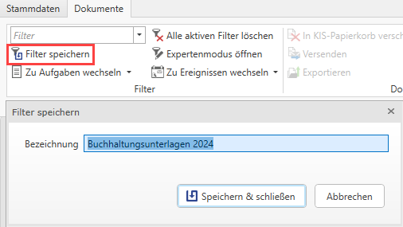

## Expertenmodus (Dokumentenliste) 

Innerhalb der Dokumentenlisten können noch viel differenziertere Filter
im sogenannten Expertenmodus erstellt werden. Durch einen Klick auf
*Expertenmodus öffnen* im Ribbon kann der Expertenmodus aufgerufen
werden.

Abb. 3‑27 Expertenmodus öffnen

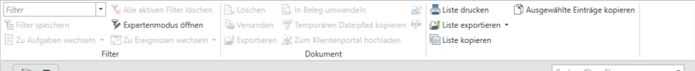

Im Expertenmodus können beliebig viele Und, Oder, Nicht Und und Nicht
Oder Bedigungen erstellt werden. Durch einen Klick auf das Dropdownfeld
können die Bedigungen ausgewählt werden. Mit einem Klick auf das
Plus-Symbol können mehrere Verknüpfungen für den zu erstellenden Filter
ausgewählt werden.

Abb. 3‑28 Filter bearbeiten I

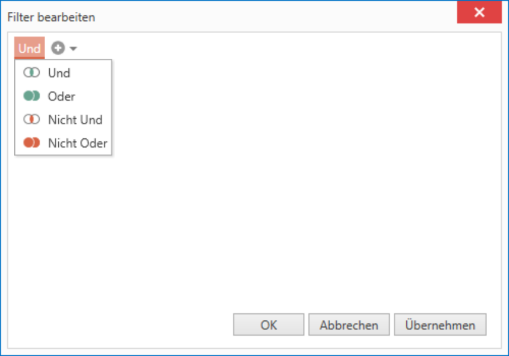

#### Und – Verknüpfung 

Mit dem logischen Und wird geprüft ob mehrere Bedingungen erfüllt sind.

#### Oder – Verknüpfung 

Muss nur eine von mehreren Bedingungen erfüllt sein verwendet man die
Oder Verknüpfung

#### Nicht Und – Verknüpfung 

Eine oder mehrere Bedingungen, welche durch UND verknüpft sind, sollen
ausgeschlossen werden.

#### Nicht Oder – Verknüpfung 

Eine oder mehrere Bedingungen, welche durch ODER verknüpft sind, sollen
ausgeschlossen werden.

Über das Plus-Symbol können dem Filter noch weitere Bedingungen
hinzugefügt werden. Im unten angeführten Beispiel filtert der angelegte
Expertenfilter alle Dokumente im Zeitraum 2019, welche das Thema
Korrespondenz Finanzamt betreffen.

Abb. 3‑29 Filter bearbeiten II

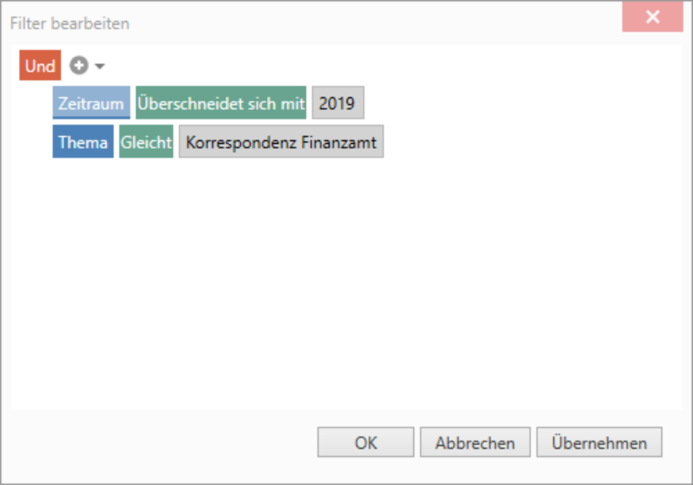

Mit einem Klick auf den Übernehmen-Button wird der Filter auf die
Dokumentenliste angewandt. Einen aktiven Filter erkennt man an der
grauen Leiste unterhalb des Ribbons. Der im Expertenmodus angelegte
Filter kann mit einem Klick auf *Filter speichern* gespeichert werden.
Durch einen Klick auf *Alle aktiven Filter löschen* werden die
angelegten Filterbedingungen wieder gelöscht. (vgl. Kap. 11.6 *Filter*).

Abb. 3‑30 Aktiver Filter innerhalb der Dokumentenliste

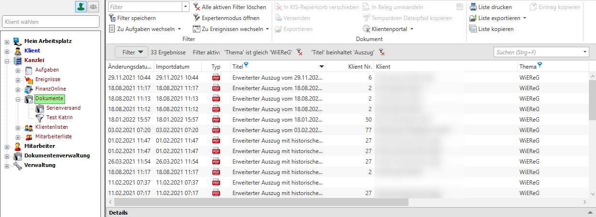

Haben Sie einen Filter innerhalb Ihrer Dokumentenliste aktiv gesetzt
können Sie mithilfe der linken Maustaste auf das Dropdownfeld neben *Zu
Aufgaben wechseln* innerhalb der festgelegten Filterkriterien zu den
Offenen bzw. Erledigten Aufgaben wechseln.

Abb. 3‑31 Wechsel zu Aufgaben

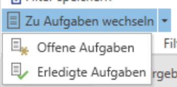

Anschließend erhalten Sie eine gefilterte Liste der Aufgaben mit den von
Ihnen innerhalb der Dokumentenliste festgelegten Filterkriterien. Mit
einem Klick auf *Zu Ereignissen wechseln* können Sie ebenso den Filter
direkt aus der Dokumentenliste auf die Ereignisliste anwenden. Mit der
Auswahl des Dropdownfelds können Sie noch gezielter innerhalb der
Ereignislisten differenzieren.

Abb. 3‑32 Wechsel zu Ereignissen

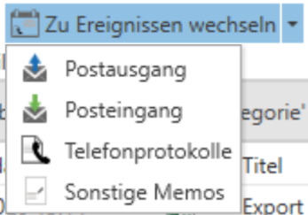

## Suche nach Klienten/Mitarbeitern/

Sie können im KIS nicht nur nach Klienten, sondern auch nach
Mitarbeitern suchen. Die Symbole orientieren sich nach jenen im Board.
Die Klientensuche aktivieren Sie mit Klick auf
. Die Mitarbeitersuche
aktivieren Sie mit Klick auf .

Standardmäßig ist die Suche nach Klienten hinterlegt, daher steht im
Suchfeld auch *Klient wählen*. Beim Wechsel auf Mitarbeiter steht im
Suchfeld *Mitarbeiter wählen*.

Nachfolgend erhalten Sie eine Beschreibung für die *Suche nach
Klienten*. Die Suche nach Mitarbeitern erfolgt von der Vorgehensweise
gleich und wird nicht extra beschrieben.

#### Listensuche

Wenn Sie mit Hilfe der Klientenliste den gewünschten Klienten auswählen
wollen, tragen Sie im Suchfeld nichts ein und drücken entweder die
ENTER-Taste oder die Leerzeichen-Taste.

Abb. 3‑33 Suche mit Klientenliste

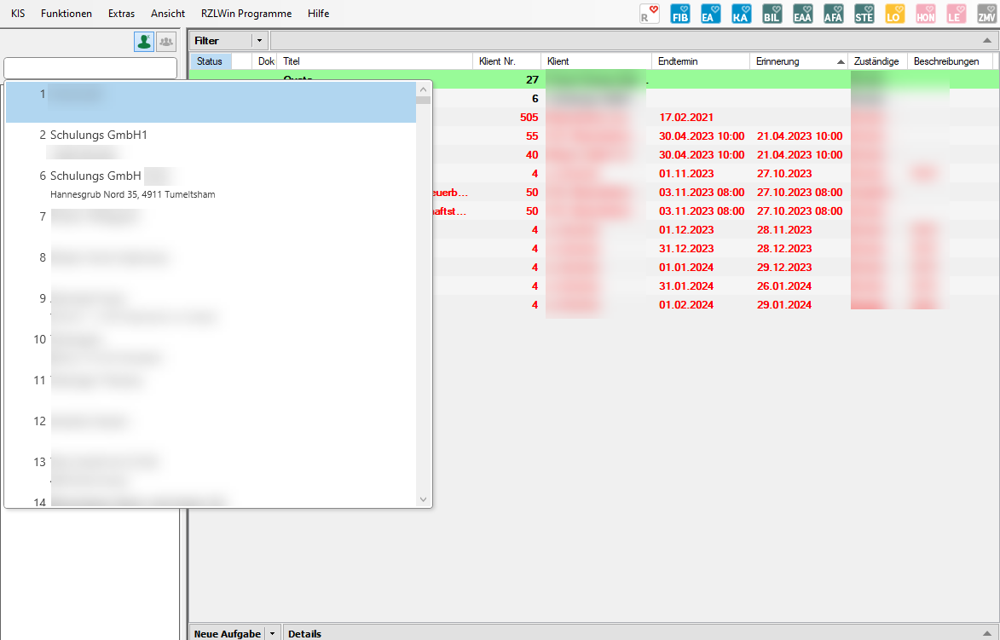

Sie erhalten die Klientenliste angezeigt und können sich innerhalb der
Liste mit dem Scroll-Balken oder den Pfeil-Tasten bewegen. Sie markieren
den gewünschten Klienten entweder mit den Pfeil-Tasten oder der Maus.

Anschließend können Sie den Klienten entweder durch einen Doppelklick
mit der Maus öffnen oder Sie drücken die TABULATOR- oder ENTER-Taste.

#### Suche nach Namen – Match-Code

Sie können im Suchfeld nicht nur Klientennummern eintragen. Sie können
auch durch Eintragung von Wortbestandteilen suchen.

Abb. 3‑34 Suche nach Klientennamen

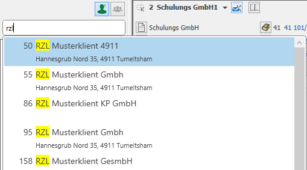

Wenn Sie den Namen oder Teile des Namens des Klienten eintragen,
erhalten Sie vom Programm eine Liste mit Vorschlägen. Diese Suche ist
eine Suche nach Wortbestandteilen. Das bedeutet, dass das eingetragene
Wort nicht unbedingt an erster Stelle stehen muss.

Die Buchstabensuche erfolgt in den Feldern *Kurzbezeichnung* und
*Synonym* in den Klientendaten.

## Automatisches Speichern der Daten

Sie werden im RZL Kanzlei-Informations-System bis auf wenige Ausnahmen
keine Speicher-Buttons finden. Es gibt keine Möglichkeit dem Programm zu
sagen, Sie wollen gerade jetzt speichern.

Das ist für die laufende Arbeit kein Nachteil, da das Programm
selbständig speichert. Ihre Eintragungen können nicht verloren gehen.
Wie gehen Sie vor, wenn Sie versehentlich etwas gespeichert haben? Sie
gehen einfach wieder in den Programmteil hinein und ändern oder löschen
die versehentlich gespeicherten Daten.

Wenn Sie sich in den Klientenstammdaten befinden und Änderungen oder
Ergänzungen vornehmen, erfolgt die Speicherung der Daten automatisch im
Hintergrund, wenn Sie den Klienten wechseln, auf einen anderen
Programmteil (z. B.: von den Dokumenten in zu den Ereignissen) klicken
oder einfach das Programm gesamt schließen.

Wir sind der Überzeugung, dass die von Ihnen eingegebenen Daten in den
meisten Fällen richtig und wertvoll sind, deshalb speichert das Programm
automatisch.

## ESC-Taste - Nicht speichern

Sie befinden Sie in einem Programmteil wie beispielsweise dem
Posteingang und haben bereits Daten erfasst. Wenn Sie den Posteingang
verlassen wird automatisch gespeichert. Wenn Sie die Eintragungen nicht
speichern wollen, drücken Sie einfach die ESC-Taste.

Abb. 3‑35 Änderungen verwerfen

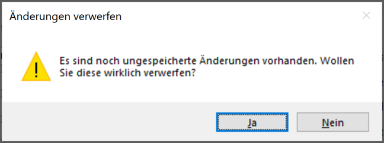

Sie erhalten die Möglichkeit die noch nicht gespeicherten Änderungen zu
verwerfen. Wenn Sie die oben abgebildete Anfrage mit *JA* beantworten,
wird nicht gespeichert. Beantworten Sie diese Frage mit *Nein* kommen
Sie wieder in den ursprünglichen Programmteil hinein und können
weiterarbeiten.
