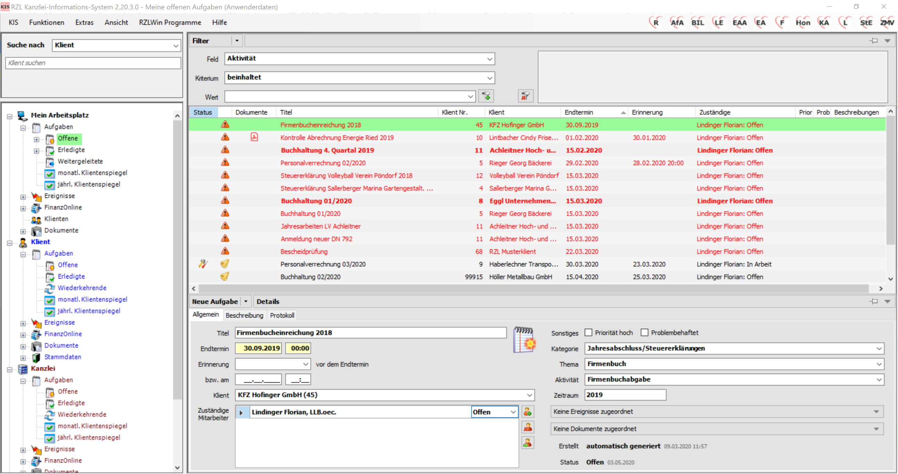
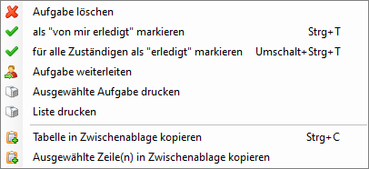

# Anlegen und Bearbeiten von Aufgaben

Das Modul Aufgabenverwaltung bietet Ihnen die Möglichkeit Offene
Aufgaben anzulegen und zu beschreiben. Die Offenen Aufgaben kann der
Mitarbeiter für sich selbst anlegen und/oder anderen Mitarbeiter
zuweisen (weiterleiten). Die Aufgaben können händisch, mit
Aufgabenvorlagen oder automatisch als wiederkehrende Aufgaben angelegt
werden.

Wenn eine Aufgabe einem anderen Mitarbeiter zugeordnet wird, spricht man
von weitergeleiteten Aufgaben, die im Bereich *Mein Arbeitsplatz*
gesondert abgelegt werden. Erledigte Aufgaben werden ebenfalls in einem
eigenen Programmteil aufgelistet.

Die Aufgaben werden je nach Eigenschaft unterschiedlich ausgewiesen bzw.
der Status der Aufgabe wird durch verschiedene Symbole dargestellt. Die
Aufgaben können von verschiedenen Mitarbeitern detailliert und
nachvollziehbar beschrieben werden. Ein Aufgabenprotokoll stellt sicher,
dass sämtliche Änderungen der Aufgabe aufgelistet werden.

Tipp

Was einzelne Mitarbeiter im Zusammenhang mit der Aufgabenverwaltung
dürfen oder nicht kann gezielt im RZL Board unter Stamm/Berechtigungen
angepasst werden.

Abb. 4‑1 Aufgaben

In der Navigation werden die Aufgaben im Bereich *Mein Arbeitsplatz* (an
erster Stelle) *mitarbeiterbezogen* aufgelistet. Den Eintrag
*Weitergeleitete* Aufgaben finden Sie nur im Bereich *Mein
Arbeitsplatz*. Der Mitarbeiter erhält in diesem Bereich durch Anwahl des
Eintrags *Klienten* jene Klienten angezeigt, in deren Stammdaten der
Mitarbeiter als Zuständiger hinterlegt ist (vgl. 9.3.1 *Zuordnungen*).

Im Bereich der Klienten werden die Aufgaben nach Klienten geordnet
angezeigt und im Kanzleibereich finden Sie eine Liste der Aufgaben der
gesamten Kanzlei.

 Abb. 4‑2 Ansicht der Aufgaben
innerhalb der Navigation

Offene Aufgaben können in jedem Bereich des Kanzlei-Informations-Systems
angelegt werden. Wenn die Aufgabe im Klientenbereich angelegt wird, ist
die neue Aufgabe bereits dem ausgewählten Klienten zugeordnet.

##  Anlegen und Bearbeiten von Aufgaben

Neue Aufgaben werden durch Anwahl des Felds
 angelegt. Der
Detailbildschirm wird aufgerufen und Sie können die Eingabefelder der
Aufgaben ausfüllen. Wenn Aufgabenvorlagen (vgl. Kap. 4.2 Arbeiten mit
Aufgabenvorlagen) angelegt sind, können diese ebenfalls ausgewählt
werden.

Die Aufgabenverwaltung bietet rechts oben die Liste mit den Aufgaben,
unterhalb befindet sich der Detailbildschirm mit 3 Registerblättern.
Nachfolgend erhalten Sie eine Beschreibung der Eingabefelder der
einzelnen Registerblätter.

### Registerblatt Allgemein

#### Titel

Im Feld *Titel* bezeichnen Sie auf Aufgabe.

#### Endtermin

Der *Endtermin* für eine Aufgabe wird mit Datum und Uhrzeit eingetragen.
Beginnend mit dem Tag des Endtermins wird die Aufgabe in der Liste mit
roter Schrift angezeigt und zusätzlich mit rotem Warndreieck
gekennzeichnet, damit Sie auf den Termin aufmerksam werden.

#### Erinnerung

Sie können sich durch Eintragung eines Erinnerungsdatums vor Ablauf der
Frist an die Aufgabe erinnern lassen. Im Bereich Erinnerung können Sie
den Erinnerungstermin anhand einer vorgegebenen Liste automatisch
eintragen lassen. Eine Aufgabe die bereits in die Erinnerungsfrist fällt
wird in Ihren offenen Aufgaben mit  gekennzeichnet.

Erinnerungen an fällige Aufgaben und Benachrichtigung über neue Aufgaben
werden mittels Einblendungen dargestellt. Diese Einblendungen erhalten
Sie meist beim Start des Kanzlei-Informations-System, da in diesem
Zusammenhang die Aufgabenverwaltung im Hintergrund aktualisiert wird
(gilt für wiederkehrende Aufgaben – nicht für aus FinanzOnline oder
manuell erstellte Aufgaben).

Abb. 4‑3 Erinnerung an
fällige Aufgabe

Abb. 4‑4 Benachrichtigung über neue Aufgabe

#### Klient

Hier kann die Aufgabe einem Klienten zugeordnet werden. Sie können die
Liste aufschlagen und die Klienten aus der Liste auswählen. Sie können
aber auch die Klientennummer direkt eintippen bzw. durch Eintragung von
Buchstaben nach dem Namen suchen.

Wenn Sie die Eingabe der neuen Aufgabe im Klientenbereich durchführen,
ist die Klienten­nummer fix eingetragen.

#### Zuständige Mitarbeiter – Status der Aufgabe

In diesem Bereich wählen Sie die zuständigen Mitarbeiter aus. Die
Auswahl kann mit Hilfe der Liste erfolgen bzw. durch Eintippen der
Anfangsbuchstaben des Mitarbeiters.

Sie können beim zuständigen Mitarbeiter eine Aufgabe mit *Offen,
Erledigt, In Arbeit* und *Obsolet* kennzeichnen. Nach diesen
unterschiedlichen Eigenschaften einer Aufgabe können Sie filtern. Eine
Aufgabe kann in der Aufgabenliste durch Anwahl der Tastenkombination
STRG + T als Erledigt gekennzeichnet werden.

Abb. 4‑5 Status der noch nicht erledigten Aufgaben

Im Bereich der offenen Aufgaben (**1**) bedeutet kein Eintrag in der
Spalte *Status,* dass die Aufgabe noch offen ist. Wenn die Aufgabe als
*In Arbeit* gekennzeichnet ist, wird diese Eigenschaft in der Spalte
*Status* durch *Werkzeug* symbolisiert.

Aufgaben die als *Erledigt* bzw. *Obsolet* gekennzeichnet sind, werden
nicht mehr im Bereich *Offene Aufgaben* angezeigt, sondern wandern in
den Bereich *Erledigte*.

Abb. 4‑6 Erledigte/Obsolete Aufgaben

Wenn Aufgaben als *Erledigt* gekennzeichnet werden, wird in der Spalte
*Status* ein grünes Häkchen angezeigt. Obsolete Aufgaben werden mit
einem Quadrat gekennzeichnet (**2**).

Wenn ein zuständiger
Mitarbeiter eingetragen und gespeichert ist, kann die Zuordnung nicht
mehr geändert werden, sprich das Feld *Mitarbeiter* kann nicht mehr
bearbeitet werden. Die Anwahl des Kreuz-Symbols löscht eine bestehende
Zuordnung als Ganzes.

TIpp

Soll eine Aufgabe einem anderen Mitarbeiter nachvollziehbar zugeordnet
werden, markieren Sie bitte den Mitarbeiter durch einen Mausklick.
Anschließend wählen Sie bitte das Pfeil-Symbol
 an und Sie haben die
Möglichkeit die Aufgabe einem anderen Mitarbeiter weiterzuleiten.

#### Zuständigkeit \[FinanzOnline\]

Wenn Sie in den FinanzOnline-Zuweisungen (vgl. Kap. 6.3 *Zuordnung von
Thema/Kategorie/Aufgabenvorlage*) innerhalb der Protokolle in der Spalte
*Aufgabenvorlage für zu erledigende Aufgabe* eine Aufgabevorlage (z. B.:
Buchhaltung) verankern, wird diese Aufgabe automatisch geschlossen, wenn
die Übermittlung der XML-Datei (UVA-Datei) funktioniert hat. D.h. der
Mitarbeiter muss die Aufgabe nicht mehr selbst auf erledigt setzen.

#### Sonstiges

Eine Aufgabe kann mit der Eigenschaft *Priorität hoch* und/oder
*Problembehaftet* versehen werden. (vgl. Kap. 3.5 Filterfunktionen).

#### Kategorie

In diesem Bereich wählen Sie zwischen den in der Verwaltung (vgl. Kap.
11.10 Kategorie) angelegten Kategorien aus. Die Kategorie ist ein
wichtiger Eintrag für die strukturierte Ablage und für die Suche
innerhalb der Aufgaben (vgl. Kap. 3.5 Filterfunktionen).

#### Thema

Im Bereich *Thema* wählen Sie zwischen den in der Verwaltung (vgl. Kap.
11.12 Thema) angelegten Themen aus. Das Thema ist ebenfalls ein
wichtiger Eintrag für die strukturierte Ablage und für die Suche
innerhalb der Aufgaben (vgl. Kap. 3.5 Filterfunktionen).

#### Aktivität/Zeitraum

Wenn Sie die Felder *Aktivität* und *Zeitraum* bei einer Aufgabe
zuordnen, wird die Aufgabe in den Klientenspiegel übernommen und dem
aktuellen Status entsprechend dargestellt (nähere Informationen erhalten
Sie im Kapitel 4.5 *Klientenspiegel*).

#### Ereignisse

Wenn keine Ereignisse zugeordnet sind, kann eine Zuordnung durch Anwahl
der Schaltfläche *Keine Ereignisse zugeordnet* erfolgen.

Abb. 4‑7 Ereignisse einer Aufgabe zuordnen

In diesem Bereich kann die Aufgabe mit einem oder mehreren bereits
bestehenden Ereignissen (vgl. Kap. 5 Ereignisse) verknüpft werden.

Abb. 4‑8 Auswahl der Ereignisse

Das oder die Ereignisse die verknüpft werden sollen, werden mit der Maus
markiert und anschließend wird die Schaltfläche hinzufügen angewählt.

Innerhalb der Aufgabe kann die Verknüpfung mit
 wieder entfernt werden.

Der Aufgabe können Sie mit  ebenso ein neues Ereignis
zuordnen.

Aufgrund von Databoxeingängen (vgl. Kap. 6 *FinanzOnline*) werden häufig
Ereignisse automatisch zugeordnet (siehe unten *Bescheide,
Ergänzungsersuchen und Bescheinigungen*) und können mit einem
Doppelklick geöffnet werden.

Abb. 4‑9 Ereignisdetail – in der Aufgabe aufgerufen

#### Exkurs:

Sie können innerhalb eines Ereignisses durch Anwahl der rechten
Maustaste eine neue Aufgabe mit oder ohne Aufgabenvorlage erstellen.

Abb. 4‑10Erstellung einer Aufgabe innerhalb von Ereignissen

#### Dokumente

In diesem Bereich kann die Aufgabe mit einem oder mehreren Dokumenten
verknüpft werden.

Sind keine Dokumente zugeordnet kann eine Zuordnung vorgenommen werden.
Diese Vorgehensweise ist ident mit der den Ereignissen betreffend.

Tipp

Die Beschreibung der Übernahme von Dokumenten in das
Kanzlei-Informations-System finden Sie im Kapitel 8.3 *Hinzufügen von
Dokumenten*.

Dokumente die einer Aufgabe zugeordnet sind, können Sie sehr einfach
durch Anwahl der rechten Maustaste per E-Mail versenden.

Abb. 4‑11 Dokumente per E-Mail versenden

Wenn Sie den Eintrag *Versenden* anwählen, werden die beim Klienten
gespeicherten E-Mail-Adressen angezeigt und können ausgewählt werden.

### Registerblatt Beschreibung

Im Registerblatt *Beschreibung* kann die Aufgabe erläutert werden.

Abb. 4‑12 Beschreibung einer Aufgabe

Die Beschreibungen werden im unteren Teil des Bildschirms im Bereich
*Beschreibung hinzufügen* erfasst und im oberen Bereich angezeigt.

Die einzelnen Einträge werden getrennt angezeigt. Im rechten Bereich
sehen Sie den Ersteller der Einträge und das Datum und die Uhrzeit der
Einträge.

### Registerblatt Protokoll

Abb. 4‑13 Protokollierung einer Aufgabe

Das Registerblatt *Protokoll* zeigt Ihnen alle Arbeitsschritte an, die
im Zusammenhang mit der ausgewählten Aufgabe durchgeführt worden sind.

### Verwaltung der Aufgaben

Abb. 4‑14 Verwaltung der Aufgaben

Innerhalb der Aufgabenlisten können Sie durch Anwahl der rechten
Maustaste die Bearbeitungsmöglichkeiten aufrufen. Die Aufgaben können
einzeln oder auch mehrere gleichzeitig *gelöscht*, als *erledigt*
markiert, *weitergeleitet* und die (Aufgaben-)*Liste* gedruckt werden.
Die Details können nur jeweils von der aktuell markierten Aufgabe
(einzeln) gedruckt werden. Weiters kann die Aufgabenliste vollständig
oder nur die jeweils ausgewählten Zeilen in die Zwischenablage kopiert
werden und beispielsweise im Excel eingefügt werden.

#### Aufgabe löschen

Grundsätzlich können Sie nur die eigenen Aufgaben löschen. Aufgaben die
nicht die eigene Zuständigkeit betreffen, können nur mit den
entsprechenden Rechten (KIS/Aufgabenverwaltung) gelöscht werden. Das
Löschen einer Aufgabe ist unwiderruflich und wird auch nicht
protokolliert.

#### Aufgabe als „von mir erledigt“ markieren (STRG + T)

Damit Sie eine Aufgabe als erledigt markieren können, müssen Sie nicht
unbedingt in das Detail der Aufgabe klicken. Sie können innerhalb der
Aufgabenliste einzelne oder mehrere (eigene) Aufgaben durch Anwahl der
Tastenkombination STRG + T oder der rechten Maustaste als „von mir
erledigt“ kennzeichnen.

#### Aufgabe weiterleiten

Wenn Sie den Eintrag *Aufgabe weiterleiten* anwählen, erhalten Sie
folgenden Bildschirm angezeigt.

Abb. 4‑15 Aufgaben weiterleiten

Hier kann die Aufgabe einem neuen zuständigen Mitarbeiter weitergeleitet
werden. Weitergeleitet werden kann allerdings nur dann, wenn der Status
der Aufgabe „offen“ oder „in Arbeit“ ist.

#### Aufgaben drucken

Aufgaben können einzeln mit Details ausgedruckt werden. Die
Listenansicht der Aufgaben kann ebenfalls ausgedruckt werden.

#### Mehrere Aufgaben gleichzeitig bearbeiten

Wenn Sie in der Aufgabeliste mehrere Aufgaben gleichzeitig bearbeiten
möchte, müssen Sie diese Aufgabe markieren und anschließend wieder die
rechte Maustaste drücken.

Abb. 4‑16 mehrere Aufgaben gleichzeitig bearbeiten

Im Kontextmenü scheint die Anzahl der Aufgaben die bearbeitet werden
können auf. Der Detaildruck ist nur für einzelne Aufgaben möglich und
deshalb in der Liste ausgegraut.

#### Liste drucken

Dieser Programmteil ermöglicht den Ausdruck der gesamten Aufgabenliste.

#### Tabelle in Zwischenablage kopieren/Ausgewählte Zeile(n) in Zwischenablage kopieren

Durch Anwahl des Eintrags *Tabelle in Zwischenablage kopieren* oder der
Tastenkombination STRG + C wird die gesamte Tabelle in den
Zwischenablage kopiert und kann beispielsweise im Excel durch Anwahl der
Tastenkombination STRG + V eingefügt werden.

Wenn Sie in der Liste einzelne Einträge markieren, können Sie diese
durch Anwahl des Eintrags *Ausgewählte Zeile(n) in Zwischenablage*
kopieren ebenfalls kopieren.
